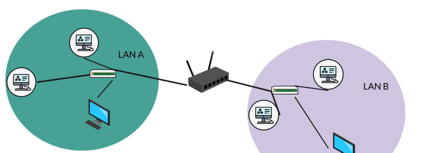

### LAN

통신하는방법 => 유선/무선

네트워크를 만들려면 필요한거 -> 연결해줄 장치 => 허브/ 스위치

스위치를 통해서 어디로 가게 되고 어디에서 오는지 알수있음 + 다른기기도 연결가능

lan => local area network의 약자

LAN의 장점 => 가능성이많다.

스위치를 통해연결

파일서버 프린트서버 인터넷서버

라우터는 각 LAN 의 스위치에 연결

WAN => wide area network

그리고 모뎀이 인터넷에 연결

### 인터넷이란 무엇인가

중앙집중식은 중심이있음

분산네트워크는 중심이없음 이점이 저점이랑 연결되어있고 계속연결되어있음

인터넷이 분산네트워크인 이유의 전략은 보안떄문임=> 중앙제어가없다는것

분산네트워크는 한부분이 무너져도 다 무너지지않고
더많은경로와 연결이있어 성능과 속도가 향상되어 혼잡함이 줄어듦

### 서버와 클라이언트

서버는 다른 컴퓨터나 기기에 자원 서비스 데이터를 제공하는 컴퓨터
서버에의해서비스 받는애들을 클라이언트
