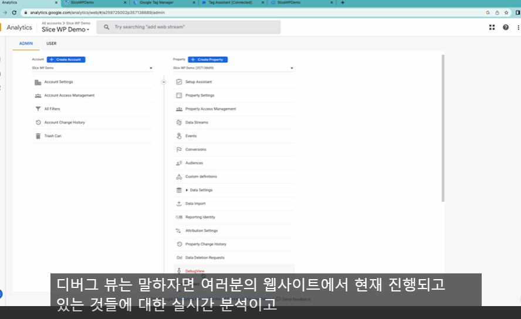
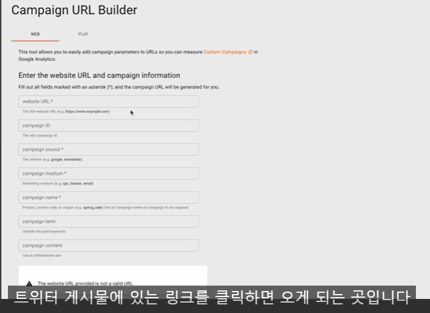
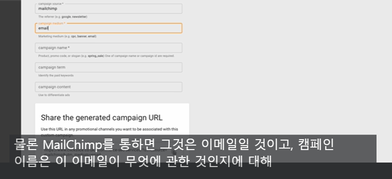
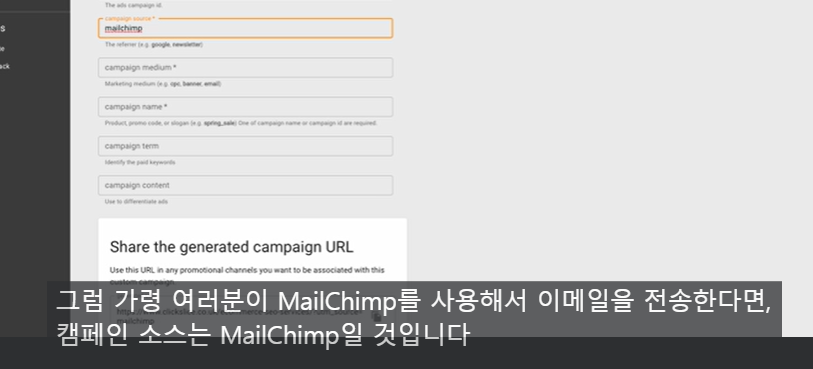
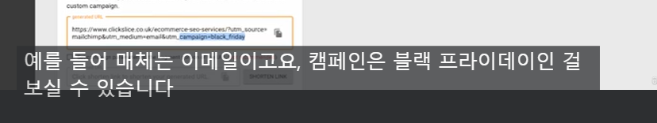
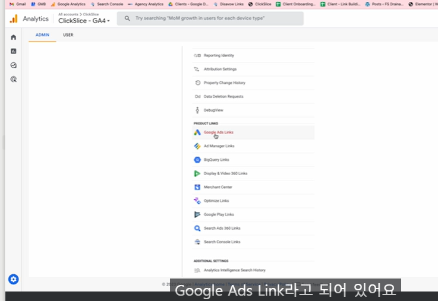
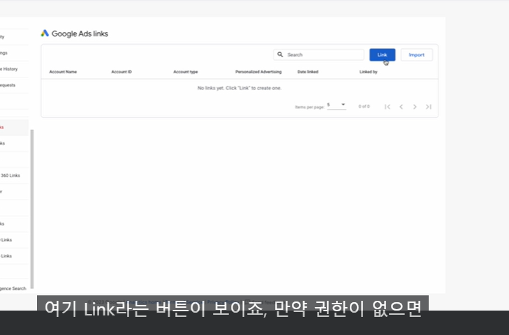
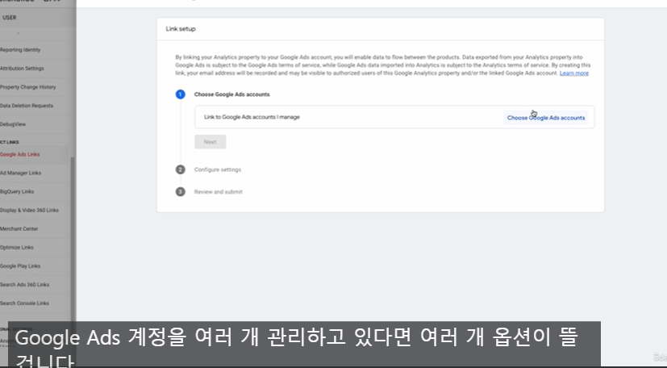
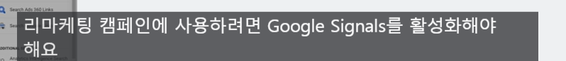

### ga4 setup in next js 13

https://support.google.com/tagmanager/answer/9442095?hl=en

0. 계정 설정

태그 관리자 말고 google 애널리틱스 페이지에서 계정설정부터.

속성이란 실제 웹 사이트를 말함 추적하려고 하는 각 속성

하나의 계정에서 여러 속성을 넣어 추적가능

죽죽 선택하고 만들면 데이터 스트림 설정에서 url 삽입

(데이터를 추적하려면 스트림을 넣어야됨)

향상된 측정은 빼면 성능저하되니까 넣어라

이 다음에 바로 떠는 설치 안내 의 경우 물론 head 에다가 넣으면 잘 작동하지만 웹사이트 전환 추적에 복잡해짐으로 다른 방법을 사용할 것임

내가 보니까 태그 매니저 코드랑 좀 다르게 생김 ga4에서 시작하면 셋업 코드가 윈도우 데이터레이어 부터 시작하고

태그 매니저에서 시작하면 날짜넣는 느낌의 코드 부터 시작됨

1. 기초 셋업

다 했으면

구글 태그 매니저로 ㄱ

구글 태그 매니저는 웹사이트에 여러 태그를 적용하여 다양한 활동 측정

태그 매니저에서도 계정 생성하고 이름 입력 그 다음 셋팅코드 ㄱ

컨테이너에는 url 전체

Script 태그로 감싸고 리터럴 로 처리

<noscript dangerouslySetInnerHTML={{_html:`<iframe>`}}></noscript>

body에 넣어야되는코드는 dangerouslySetInnerHTML로 셋팅

dangerouslySetInnerHTML? => innerHTML 이랑 비슷
DOM에서 innerHTML을 사용하기 위한 React의 대체 방법
innerHTML을 사용하면 DOM노드가 수정되었을때 수정된 것을 알 수 있는 방법이 없다
하지만 이 dangerously~ 를 쓰면 가상 DOM과 실제 DOM을 비교하여 변경된 것이 있다면 리렌더링이 될 수 있도록 함

\*주의사항 : XSS 공격 위험: dangerouslySetInnerHTML을 사용하여 사용자로부터 입력받은 값을 직접적으로 렌더링할 경우, XSS 공격에 취약해질 수 있습니다. 이런 공격은 악의적인 스크립트가 웹 애플리케이션에 삽입되어 다른 사용자들에게 영향을 미칠 수 있다.

아하 가짜폼 삽입 같이 돔 건드려서 하는 것을 이야기하나 보네

아무튼 여기까지 다 됬으면 구글 태그 매니저 관리자에는 연결이 되었으나 애널리틱스에는 연결이 안된 상태

태그 관리자를 애널리틱스에 연결하려면

태그 매니저의 태그 메뉴로 가서 새로만들기

태그 유형 구글 태그 => 이게 원래는 ga4 셋업 이 있었는데 하나로 합쳐짐

태그 ID ?=> ga 애널리틱스에있는 측정 ID

만일 ga 페이지 안보인다 => admin으로 들어가서 데이터 스트림 들어가면 우리가 만든 스트림 볼 수 있음

트리거 하나 설정 => init 모든 페이지 선택 => 웹사이트 조회 될때마다 태그 매니저에게 태그를줘서 애널리틱스에서 추적할 수 있게 함

태그 이름으로 ga4 Tag-측정 id로 보기쉽게참고용 하고 오른쪽 상단에 submit 해줘야됨

하면 듣는 사람이없는것처럼 노래를 부르라는 로딩이뜸

태그 1 변수 5 나옴

그리고 새로고침하고 다시 ga 애널리틱스 쪽으로 가면 사람있는거 볼 수 있...?

없는데

맨처음에 재끼라고 한 head 코드랑 같이 넣어줘야 되는듯

유의 해야될건 두개 아이디가 다름

### 트래픽 부풀리기 막기

모든 페이지 뷰에 들어갈때마다 카운트가 올라간다.

이건 정확한 데이터가 아니기 때문에. 이런 데이터를 원하지는 않을것이다.

내부적인 트래픽은 분석에서 제외되는게 좋다.

관리자 화면=> 데이터 스트림

태그 설정 구성으로 가서 자세히보기 => 내부 트래픽 정의

그리고 내 아이피주소 넣으면됨

데이터 수집 및 수정에 데이터 필터 , 해서 내부필터

내부 필터 연산 동작은 제외로

마지막으로 테스트를 액티브로

직원들의 아이피는 다막고싶으면 같은작업을 계속해야됨

아 사용자가 올라가는건 그대로이고 말그대로 트래픽에서의 보고서를 막아주나 보네

### 데모 컨텐츠 접근

ga에 익숙해지고 실제 데이터를 사용해 실전 경험하는 좋은방법은 ga 데모 계정을 사용하는것 이다

구글에서 자기네들 구글 숍 팬 판매사이트 같은거 열어놔주는거 있음

google analytics demo account 검색

https://support.google.com/analytics/answer/6367342?hl=en#zippy=%2Cin-this-article

access 로 가서 확인 가능

그러면 스토어의 모든 데이터를 볼 수 있다

ㅇ 추가되네

### 구글 애널리틱스 대시보드

현재 웹 사이트에 몇명의 사용자가 있는지 분류별로 볼 수 있음

실시간으로 진행되는 마케팅 같은게있다면 유용하게 사용 가능

획득 참여도 수익창출

획득 보고서는 마케팅 채널의 성능을 보는 데 사용이 된다.

어디로 오는 지 볼수있음 세션 기본 채널 그룹이 어디서오는지네 direct/ search/ email/ social

어떻게 들어오는지보고 싶다 -> 획득보고서

참여도 보고서=> 사람들이 우리의 웹사이트나 앱과 어떻게 상호작용하는지 보여줌

사람들이 페이지 사이를 어떻게 이동하는지

어디가 가장 인기있는지 어떤 페이지를 통해 들어오는지

전환 데이터도 볼 수있음 어떤 페이지가 얼마나 많은 전환을 일궈 내는지

수익창출 : 웹사이트에스토어가있다면 모든 판매관련활동은 여기에서 생성이된다.

이커머스 스토어가 없다면 그닥 필요하진 않음

사용자 보고서 에는 두가지 종류가있다.

인구 보고서 : 사용자들이 누구인지 어느 국가에서 왔고 뭐에 관심이있고 나이는 몇인지

기술 보고서 : 웹사이트에 접속할때 사용하는 기술에 대해서 적혀있음 , 어떤 기기 데탑 ,컴퓨터 , 모바일 ,아이패드

탐색 의 경우 방금 표준 보고서 뒤에서 일어나는 고급 기술들의 모음

마지막은 광고

광고를 쓰고있다면 유용하게 사용할 것임 진행하고있는 광고에 대해 많은 정보를 가져옴

어디서 가장 많은 채널 전환이 이루어지는 등을 알 수 있다.

마케팅 활동에 대해 더 나은 ROI 를 만들고자 특정 광고 채널에 예산을 할당하는 데 도움이 될것임
ROI return on invesetment 투자 대비 수익률

보통은 두번째가 우리가 원하는 대부분의 정보가 있다

80- 20 의 법칙 / 20%의 분석데이터로 80%의 효율을 낸다

그냥 검색바에다가 지난주 내 웹사이트 검색률 같은거 써도 나옴

### 데이터 분석

1. 트래픽 량 파악하는 방법

웹 사이트를 몇명이 봤는지 보려면 보고서 => 획득 보고서 웹에 사용자가 어떻게 들어왔는지 => 설정된 기간동안 얼마나 들어왔는지 인사이트를 보여줌

2. 유저 파악하는방법

이전에 말했던 거랑 같은데 개요 말고 세부사항을 보면 어느나라에서 가장많이 사용하는지 등을 볼 수 있다.

### 사이트 내 최고 인기 페이지 탐색하는 방법

참여도 에서 확인 가능

페이지및 화면에서 어디가 제일 인기있는지등을 볼 수 있다.

탐색 => 탐색 분석 => 일반보고서 에 비해 더 상세한 인사이트 => 자유 형태로 해서 날짜 바꾸고 방문한 사람들이 웹사이트를 떠나기 전에 어떤 페이지를 보고 싶은지 에 대한 것을 보고 싶다. => 세그먼트 (사용자의 부분 집합) 설정

측정 기준: 데이터의 속성 (남/여 특정국가인 , 아이폰 등등)

구글에서는 사용자피드백을 통해서 측정기준을 넣었다 뻈다 함

아무튼 거기서 찾고싶은 페이 제목 및 스크린 클래스를 선택하고 가져오기 하면 된다.

나가는 사용자 대비 들어오는 사용자의 숫자를 보고 싶다고 하면 어떤 페이지를 보는지 검색해서 찾을 수 있다.

오른쪽 차트가 업데이트 되게 하려면 지역기준을 지워버리고 측정기준을 가져오도록 설정하면됨

벨류로 가서 이탈, 방문자수 넣고 리포트 만들면되는거 별거없네

- 어디서 왔는 지 상세하게 보는법

저기를 바꾸면 된다

오가닉은 검색
cpc 는 그거 클릭 해서 온거

실시간 보고서의 경우 일이 계획대로 진행되고있는지에 대한것을 볼 수 있다.

### DAU MAU WAU

DAU: 일일 활성 사용자

WAU: 주간 활성 사용자

MAU : 월간 활성 사용자

일간사용자를 월간사용자로 나누면 지난 24시간의 참여도를 알수있는 등의 사용을 함

참여도의 개요를 보면 맨아래에 나옴

### 이벤트와 전환

ga는 이벤트와 전환이라는 큰 토픽이 있다.

이벤트? => 사용자가 웹사이트나 앱과 상호작용할때 촉발됨

기본값으로 향상된 뭐시기 킨게 바로 그것임

셋팅의 이벤트로 가서 도 볼 수 있음

전환은 비즈니스의 성공에 기여하는 완료된 활동을가리킴 (뭐사거나 그런거겠지)

누군가에게는 폼 제출 , 누군가에게는 전화클릭 , 등등이 있다.

가치가 있는 사용자의 웹사이트에 대한 구체적인 행동을 말함

그래서 이벤트에서 설정할수있다. 어떤 이벤트를 전환으로 간주할 것인가

태그는 : GA로 전송하는 코드고

트리거는 : 언제 애널리틱스에 전송할지를 결정하는 액션

원하는 만큼 태그를 생성할 수 있지만 트리거가 가장 중요한것이 될것임

트리거를 잘못 설정하면 태그를 몇 개나 만들 던지 계정에 안날라감

event name의 경우 구글에서 명명하는걸로 지어야 애널리틱스에서 더욱 쉽게 식별 가능하다

웹사이트로 오는 각각의 문의에 값을 할당하고자한다면 이벤트 매개변수로가서

행을 추가하면 됨

트리거 구성 + => 페이지 뷰

### 양식 제출 트레킹 하는 법

태그 매니저에서 시작

태그로 가서 새로운 태그

ga4이벤트 설정

참고로

이벤트이름은 옆에있는 물음표 눌러서 추천 이름대로 해야 정확한 측정 가능

마지막으로 고급 세션으로 가서 태그 촉발 옵션을 이벤트당 한번에서 페이지당 한번으로 변경

이러면 새로고침했을때 데이터 부풀려지는 것을 막을 수 있다.

트리거에서 페이지뷰설정해서 구글 애널리틱스로 전송하기위해 열람해야할 페이지 설정

트리거 일부페이지 뷰로 변경하고 url 로 변경

주소 따올때 포함 으로해놓고

/주소/주소
페이지 호스트 네임 => member/login 아무튼 뒤에있는거 따옴

오 뭐야 테스트가있네

제출 옆에 테스트 누르고 검사할 페이지 연결

하고 원래 하던 페이지로 가면 파비콘이 깜빡임

적용후 보고서에 드러나기까지는 시간이 24~48시간 가량 걸림

이벤트는 그냥 상호작용이고 전환은 우리가 알 가치가 있는 구체적인 행동

### 전화 추적

구글 태그 매니저의 변수로 가서 구성에가면 기본적으로는 클릭이꺼져있을텐데 그걸 활성화 해라

뭐 테스트모드 열어가지고 링크클릭에 링크클릭 변수들 보면 우리의 클릭정보를 가져오는것을 볼 수 있음

click url에 정보도 있음 이걸로 만들거임 css 뭐 선택자로해도되고

그럼이제 모든클릭을 일부클릭으로 변경

여기까지만하면 추적은해도 정보를 애널리틱스로 가져오는게아니기때문에 태그설정으로 가야됨

이벤트 파라미터 로 아까 봤던 콘솔의 정보들을 가져올 수있음 => 이벤트 매게 변수

옆에는 + 버튼으로 가져오는거

클릭텍스트

이번엔 프리뷰 말고 디버그 뷰 쓴다고함 (태그매니저아니고 구글애널리틱스)

디버그 뷰는 웹사이트에 현재진행되는것들 에 대한 실시간 분석이며

설정한 태그가 웹사이트를 통해 실제로 유입되고있는지 확인하려 할때 유용함

맞춤형 탐색 보고서 => 여기서 보고싶으면

설정의 맞춤 정의로 가서 측정기준 만들기를 클릭하면 됨

단지 측정기준을 만들때 이벤트 매개변수가 실제로 반영되는데에는 48시간이걸릴있지만

형식이동일하면 그게 들어올것이라고함

### 캠페인 태깅

캠페인 url 빌더 또는 캠페인 태깅을 사용하여

개별 마케팅 캠페인의 결과를 추적하는 방법

트래픽으로가면 어디로 유입되는지 확인할수있다.

url에 구성할때 마케팅활동에서 공유할 url 설정 태그 추가할때마냥 출저 추적을 이ㅜ해 내용 추가

캠페인 이메일 빌더를 구글 에서 검색하면 나옴

캠페인 아이디는 광고 또는 캠페인을 통해 연결하는 url을 홍보할 계획일때에만 사용함
십중팔구 이메일 또는 sns 게시물을 통해진행

캠페인 소스는 리퍼러 / 트래픽을 참조하는 플랫폼

medium 방문하게 되는 방법

캠페인 네임에 블랙 프라이데이같은거

캠페인 털이랑 컨텐트는 신경 ㄴ

매체는 이메일 ,

필수값 다 적용하면 url 나옴 shorten 으로 줄일수있음

근데 그냥 구글에서 검색해서 링크 줄여도됨

아무튼 이 트래픽 획득 보고서의 소스 및 매체 (플랫폼) 에서 볼 수있음

### GA 다이내믹

사용자 지정 알림

트래픽 급감 , 다운 보고 (근데 다운을 왜 굳이 ga로?)

애널리틱스 홈에서 가장 하단으로 내리면 통계및 추천이있음

모든 통계보기 , 만들기 가능

뭐 매일의 통계 보내주나 했더니 이상 상황인가봄

뭐 매일 몇명 들어왔는지 같은것도 매일로 받아볼수있게

일단 내꺼 해봄

### 계정에 사용자 추가

계정 액세스 관리 여기서 추가하면됨

이거 설정하면 될듯

대행사 한테는 마케팅 담당자

### 구글 ads 추가하기

구글의 광고 플랫폼

구글 제품 연결시 이점

1. 소비자 사이클 관찰 가능

폭 넓은 인사이트

2. 오토 태깅
   자동으로 캠페인 태그 만들어서 구글 ad url에 다 포함시킴

어디서 클린한건지 이런거 태그할 필요 없음

3. 리마케팅 캠페인을 설정함

잠재적 고객 구축 , 특정 사용자에게 타겟팅된 광고 표시하여 웹사이트로 데려옴

최소한 편집권한은 있어야함

다음 가서 두번 째 옵션은 설정을 해야됨

기본적으로 개인화 광고가 체크되어있음 => 이게 잠재고객 목록 자동 적용

오토 태깅 도 켜졌는지 확인해라. 들어가서 enable되어있는지

그래야 자동으로 정보를 만듦

마지막 옵션도 키고ㅇ

메인 데이터 설정에서 데이터 수집을 선택

시작하고 활성화 하면 알아서 생성

뭐야
