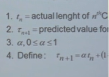

컴퓨터 프로그램이 실행되면

CPU 인스트럭션이 실행되는단계와

오래걸리는 IO 단계 가 번걸아가며실행되는게

모든 프로그램의 경로다.

물론 프로그램마다 다르긴하다.

CPU 인스트럭션 실행단계 CPU버스트 (CPU연속적으로쓰는것)

CPU버스트가짧다 -> IO가 많이 필요하다.

CPU버스트가 길다 -> IO 가 거의 끼어들지않는다.

누구한테 줄건지가 CPU 스케쥴링

크게 두가지문제

1.여럿이 있는데 누구한테 당장 줄건가

2.프로그램이 CPU다쓰고 나갈떄까지 계속주냐 아니면 너무기니까 중간에 뻇어서 넘겨주냐는 두 가지 이슈

특히 두번째 이슈는 CPU 버스트가 긴 애한테 한번 넘어가면 IO 바운드 잡 이 조금만 CPU 쓰고 바로 나갈것임에도 불구하고 뒤에가 다밀려버리는 일이 생겨버림

1. 강제로 CPU를 뺴앗지않는 방법

자진반납할떄까지 보장하는것 그것을 넌프린티브한 스케쥴링이라고 함

=> 번역체로 비선점형 이라는 말을 쓴다.

2. 강제로 빼앗는 방법

강제로 빼앗는 수단으로 timer 인터럽트가있다는것을 이미 설명함(선점형)

현대적인 CPU 스케쥴링은 선점형을 쓰고있음

### 스케쥴링 알고리즘

어떤게 좋은지 어떻게 아는가? => 성능척도 => CPU를 위한 성능척도임

CPU스케쥴링의 성능 척도로는

1. 시스템입장에서의 성능 척도

시스템입장에서는 CPU하나가지고 최대한 일을 많이시키면 좋은 것
=> 이용률, 처리량

CPU이용률은 전체시간 중 CPU가 놀지않고 일한 비율

처리량 은 주어진시간에 몇개의 일을 했느냐 를 나타냄

2. 프로그램 입장에서의 성능 척도
   CPU를 빨리얻어서 빨리 끝나는것
   => 소요시간, 대기시간, 응답시간 같은 시간과 관련된 성능 지표

시간관련 세가지는 고객입장.

가능하면 내가 먼저 잡아서 io를 나가는

프로세스입장에서의 성능은 시간. turnaround time 소요시간 반환 시간

순수하게 줄 서서 기다린 시간 웨이팅 타임

응답 시간 => readyQueue 에 들어와서 처음으로 CPU를 얻는데 까지 걸린 시간

CPU를 얻었다 뺐었다 하는 것의 경우 CPU를 처음으로 얻는시간 이 굉장히 의미있어서 응답시간이 별도로있다.

중국집에 비유하면

중국집 주인이면 주방장 일을 많이시키는게 좋다

주방장이 놀지않고 일하는게 이용률 , 중국집에서 손님 몇명이나 시간당 내보내는가 가 처리량

손님입장에서 중국집에 밥먹으러 들어와서 주문하고 다먹고 나가면 반환시간, 소요시간

손님이 기다리는 시간 웨이팅 타임

첫번째 음식이 나올떄까지 기다리는 시간 이 응답시간(단무지라도 하나 주면 그걸 먹고 허기를 달래는)

### FCFS

first-comt-first-served

먼저온 고객을 먼저 서비스해주는 스케쥴링 방법

사실 스케쥴링 방법이라고 하기도 민망

그냥 먼저온 순서대로 처리한다.
?

FIFO?

이건 비선점형 . 강제롱 안뺐음

FCFS는 그래서 별로 썩 효율적이지는 않다.

앞에 녀석이 뭘하냐에따라서 기다리는 시간에 영향이 간다.

이런현상을 Convoy Effect라고 부른다.

굳이 우리 말로 번역하면 호의 효과

queue에서 오래기다리는 현상을 아무튼 컴퓨터 시스템에서 convoy effect라고 부른다.

### SJF

cpu를 짧게 주는 애한테 먼저주는 스케쥴링

shortest- job -first

cpu사용하는 시간이 cpu 버스트가 제일 짧은 애한테 cpu를 주는 스케쥴링

이러면 전체적으로 행복한 결과가 나온다.

평균 웨이팅 타임을 최소화 하는 알고리즘

SJF 방식도 두가지를 나눠서 생각해볼 수 있다.

SJF도 비선점형 방식으로 하면 더 짧은 애가 오더라도 안넘겨줌

넌프린티브

프림티브한 방법은 선점형 CPU를 줬더라도 더 짧은 애가 오면 걔한테 넘겨줌

SJF 안에서 비선점 선점 두개 다 잇다.
preemtive

nonpreemtive

CPU스케쥴링이 언제 이루어지는가?

논 프린티브의 경우는 CPU를 다쓰고 나가는 시점에 할지 안할지 결정한다.

프림티브 의 경우 새로운 프로세스가 도착하면 언제든지 스케쥴링이 이루어질 수 가 있는 그런 차이가있다.

그러면 CPU 스케쥴링에서 SJF를 쓰면 제일 좋겠다고 생각할수있으나

두가지 문제점이있다.

1. 스타베이션

SJF는 극단적으로 CPU 사용시간이 짧은 애를 선호함 그래서 CPU사용시간이 긴 애들은 영원히 못받을 수 도있음

그래서 스타베이션 을 우리말로 말해보자면 굶어죽는것

스타베이션을 해결하기위해 aging 기법이있다
aging = 나이먹는거 = 노화

아무리 우선순위가 낮더라도 오래기다리게 되면 우선순위를 조금씩 높이는것

아주 오래기다리면 대단히 우선순위가 높아져서 스타베이션을 막을 수 있음

2. 다음 CPU Burst Time 의 예측이 안된다

실제로는 본인이 얼마나 쓰고 나가는지 조차 알수가없기때문에.

CPU사용시간을 미리 알 수는 없지만 추정은 할 수있다.

과거의 CPU 버스트 타임을 이용해서 . 추정

주로 사용하는 방법? = exponential averaging

T랑 타우가 있는데 T는 실제 CPU 사용 시간이고 타우는 CPU 사용을 예측한 시간임

t n 하면 n번째 실제 사용시간이고 타우 n 하면 타우 n번째 사용 예측 시간

미래를 예측하려고하는데 과거에 똑같은 행동이있으면 그걸 가지고 미래를 예측

3. priority Scheduling

우선순위 스케쥴링 추상적으로 설명하자면 우선순위가 제일 높은 프로세스에게 cpu를 주겠다고 하는 개념

이것도 preemitve non~ 가 있음

우선순위가 더 높은 애가 오면 빼았을수있으면 preemtive

한번 주면 못뺏는다 => non~

SJF 는 일종ㅇ의 prioirty scheduling 이다.

### Round Robin

수업 초반 부터 늘 설명한 cpu를 줄때는 그냥 주는게 아니라 할당시간 세팅해서 넘겨주고

끝나면 타이머 인터럽트로 뻇기고 이런게 전부다 라운드 로빈 스케쥴링에 기반하며

선점형임 (빼앗기는거)

라운드로빈의 가장 좋은점 => response time 응답시간이 빨라짐

누구든지 아주 짧은 시간만 기다리면 한번씩 cpu를 맛보는 시간이 생긴다.

굳이 누가 cpu를 오래 쓸지 예상할 필요없이 빨리쓰고 나갈 수있게 해주는것이 바로 라운드로 로빈 스케쥴링의 중요한 장점

대기시간이 본인이 cpu를 사용하려는 시간에 비례함

짧으면 짧게 대기 길면 길게 대기

q를 잘게 짤라놓으면 계속 cpu를 얻었다 뻇기는 일이 생기는데 라운드 로빈의 측면에서는 매우좋지만

컨텍스트 스위치가 자주 걸림 이것도 오버헤드라서 시스템 전체의 저하가 일어날수있어서

적당한 규모의 타임퀀텀을 하는것이 중요하다

58:05 보통은 그시간이
