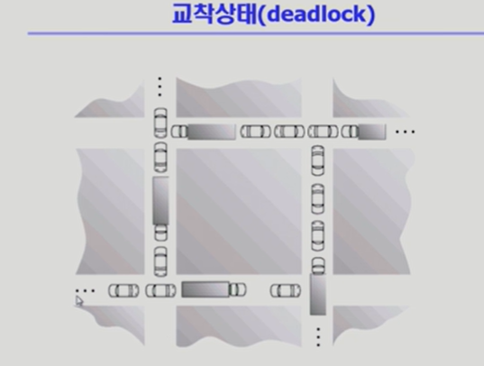
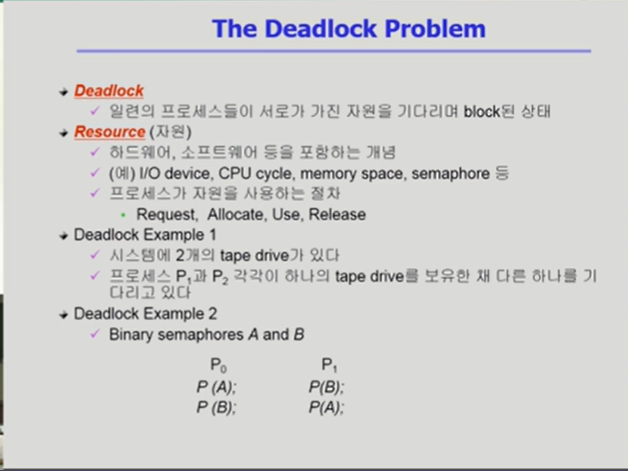
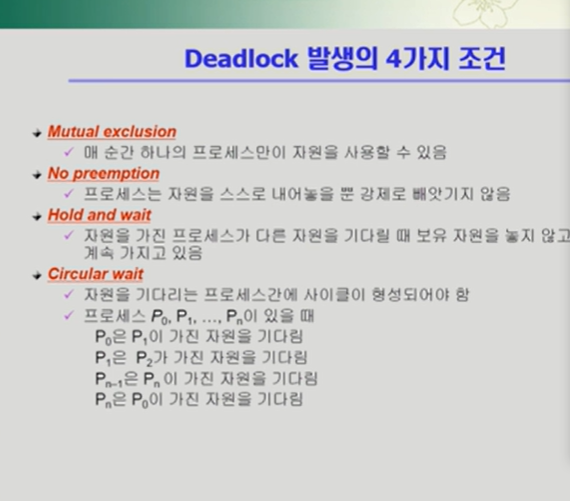
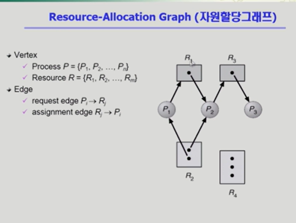
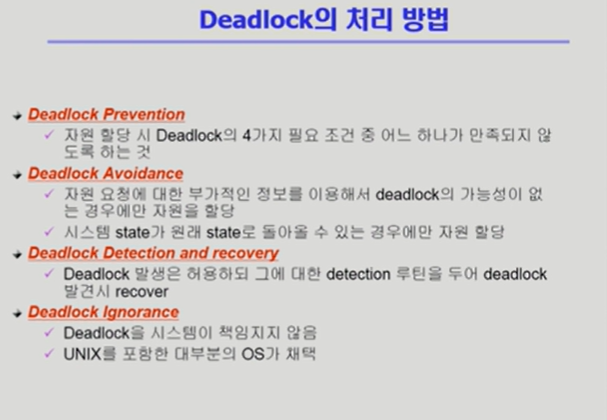
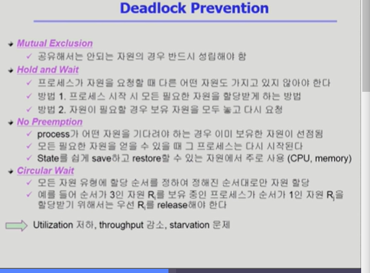
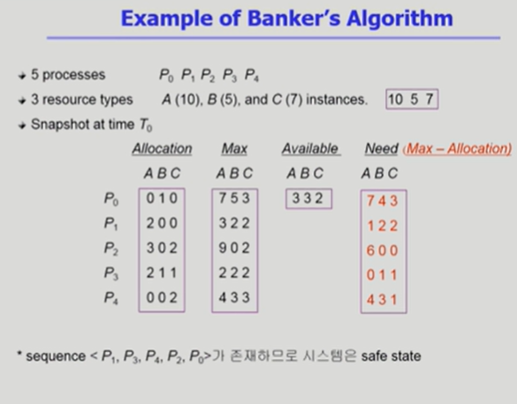

### Deadlock1

우리말로는 교착상태

일련의 프로세스들이 서로가 가진 자원을 기다리며 블락된 상태

여기서 자원은 하드웨어 소프트웨어를 포함함

IO디바이스 로 해서 프로세스 A가 테입 드라이브 하나 읽어서 다른 테잎드라이브에 카피한다고 하면

두프로세스가 각각을 가져야되는데

서로 하나씩 가지고있고 내놔만 시전하면 아무도 못가지는

세마포어나 공유데이터도 자원에 포함됨

프로세스가 자원을 사용하는 절차는 크게 4단계

요청 , 획득, 사용, 반납

### 데드락이 발생하는 조건 4가지

1. 상호배제 mutual exclusion
   자원을 얻어쓰면 독점적으로 쓴다는 이야기 같이 쓰면 그럴일이없는데

자원을 혼자쓰다보니 생김

2. No preemption 비선점
   빼앗기지않음

3. Hold and wait

보유대기

내가 가진걸 안내놓으면서 추가자원 요청

4. circular wait 순환대기

하나쓰고 하나기다리고 하다가 서로가 가진자원을 기다리면서 사이클을 형성하는경우

데드락이 발생했는지 알아보기 위해서 자원할당 그래프를 통해 알아낸다.

동그라미는 프로세스

네모는 자원

화살표의 종류도 두가지

자원에서 프로세스쪽으로 가는거 하나

프로세스에서 자원으로 가는거 하나

화살표를 따라가서 사이클이 없으면 데드락이 아님

자원의 인스턴스가 하나씩 밖에없을때 그래프안에 사이클이 생겼다=> 데드락이있다.

자원에 인스턴스가 여러개다 => 데드락일수도아닐수도있다.

### Deadlock의 처리방법

위 두개는 미연에 방지하는 방법

밑의 두 방법은 생기도록 놔둠 그러다가 있으면 하는게 세번째이고

네번쨰는 아무것도 안함 => 현재운영체제는 대부분 4번째를 채택한다.

운영체제가 관여를 안하면 => 사람이 알아서 프로세스를 죽임

현대에서 데드락을 미연에 방지하는게 오버해드라서 안한다.

### Deadlock Prevention

가장 강력한 데드락 막는 방법

데드락 발생하는 네가지 조건중하나의 원천을 차단함

Mutual Exclusion 의경우에는 배제할수있는 조건은 아님 애초에 여럿이쓸수있으면 문제 ㄴ

내가 가지고있으면서 안내놓는것을=>Hold and wait 을 해결하려면=> 1. 프로세스 시작시 모든 필요한 자원을 할당받게한다.=> 중간에 받을일이없음 그러나 이렇게 되면 종료될때까지 매시점마다 다를텐데 전부다 보유하고있어서 비효율적임

2. 자원이 필요할 경우 보유 자원을 모두 놓고 다시 요청시킴

No Preeemption
선점 자유 뺏을 수있도록 만들면 해결

=> 타이머 인터럽트 같은거가있으면 데드락은 생기지않음

CPU나 메모리는 왜 막뺏어도되냐? => 자원의 현재상태를 세이브하고 복원이 가능한애들임 이런애들은 빼앗는걸로 데드락을 막을 수 있다.

Circular Wait

필요한 자원들이 꼬리에 꼬리를 물어 사이클 형성된거
막는법 => 순서 할당해서 순서대로 만 자원할당

이런 방법을 데드락 프리벤션이라하는데

원천적으로 막을 순있으나 시스템의 성능저하, starvation문제가 발생할 수 있다.
생기지도않을 데드락을 미리생각해서 제약을 걸어서 비효율적이됨

### Deadlock Avoidance

미연에 deadlock을 방지하는 방법 (2)

자원 요청에 대한 부가적인 정보를 활용해서 deadlock의 가능성이 없는 경우에만 자원을 할당한다.

1. 자원의 인스턴스가 하나씩 밖에없으면 자원할당 그래프를 통해 avoidance
2. 여러개가있다 => Banker's Algorithm
   

## Deadlocks2

데드락의 처리방법 4가지중 2개했었음 정확히느 두번째꺼 하다끝

데드락 프리벤션 => 4가지 필요조건중 하나 막는거
데드락 어보이던스 => 요청에 대한 부가적인 정보활용해서 확실한경우에만 요청받는거 => 최대로 사용할 자원을 미리 정의

정의된걸 바탕으로 데드락 가능성이있으면 자원이남아있다해도 할당안해주고 안전할때만해줌

자원당 인스턴스 한개밖에없으면 그래프 사용

자원당 인스턴스 여러개이면 뱅커스 알고리즘 사용

최대로 사용되는건 알아도 언제쯤 사용될지는 모르는 상태

뱅커스알고리즘은 프로세스들이 자원을 요청했을때 받아들일것인지 아닐지를 결정하는것.

이런식으로 하면 항상 안전함

데드락은 안생겨도 혹시모를 상황에 대비해서 자원을 안줘서 효율적이지는 않다.

뱅커스알고리즘은 시퀀스를 확인할 필요도없음

데드락 어보이던스라는건 항상 safe를 유지한다는게 결국 이런이야기.

safe라는건 현재남아있는것만으로도 프로세스를 끝낼수있는 애들이야기.

### Deadlock Detection and Recovery
자원을 요청하면 다 주다가 시스템이 이상하다 그러면 이제 detection을 해서 발견이되면 recovery를 하는 방법 

20:53