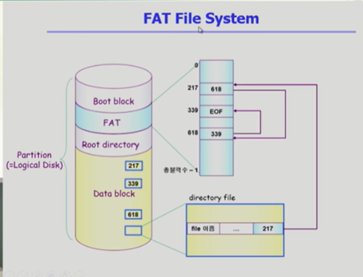

# Allocation of File Data in Disk

순차적인 접근 , 직접 접근 등이 있다.

디스크에 파일 데이터를 저장하는 방식은 다음의 세가지

1. Contiguos Allocation

연속할당
하나의 파일이 디스크에 연속되게 저장되는 방식

디렉토리라는 파일은 디렉토리 밑에있는 파일 메타데이터를 갖고있다고했는데

그 디렉토리에 파일이 5개가 있는셈.

파일의 이름/ 위치 등등 이 메타데이터로있음

단점 : 외부조각이 생길 수 있음.
중간중간 내용이 들어있지않은 프리블럭들의 균일하지않음

또 파일이라는건 중간중간 크기가 바뀔수있는데. 일정이상 클수가없음 / 연속할당때문에 비는거까진 되어도 그이상은 불가

외부조각은 아무도 사용안하는거

내부조각은 할당이됬는데 사용되지않은거

또 균일하게 생기지않았다보니 중간중간 hole이 생김

장점: Fast i/o  
실제로 데이터를 읽거나쓸때 크기는 별로 상관이없음
한번의 Seek으로많은 바이트 transfer

swap area는 파일을 저장하는게 아니라 프로세스의 주소공간중일부를 물리적인곳으로 쫓아내고 필요할떄 올려놓는 용도. => 프로세스가 끝나면 의미가없는정보
임시로 저장해놓고 대용량을 빠르게 쫓아냈다가 가져왔다가.속도가 더 중요한.

리얼타임용 으로 (데드라인이 있는경우)

직접접근 가능

예를들면 메일이라는 데이터의 앞에서부터 5번째를 보고싶다그러면 연속할당의 경우 start/length 있으면 19에그냥 숫자 더해서 중간위치의 블럭을 미리알 수있다.

2. Linked Allocation

링크된 연결할당

start/end

파일의 시작위치만 갖고있고 그다음위치는 실제로 그 위치에 가봐서 기록.

이렇게 하면 장점 : 외부조각이발생하지않음

단점 : 직접접근이 안됨 특정파일에서 앞에서 네번째에 접근하고싶다 => 일일이가봐야함.

변형 : FAT 파일시스템
file allocation table 포인터를 별도의 위치에 보관하여 reliablility와 공간효율성 문제 해결

3. Indexed Allocation

인덱스를 두는 할당방법

직접접근이 가능하게 하기 위해서 디렉토리에 파일위치정보를 바로 저장하는게 아니라 인덱스를 가리키게 함.

장점 : 다이렉트 엑세스가능

장점: 파일이작을경우 공간낭비

##UNIX파일시스템의 구조

부트블럭은 어떤 파일시스템이건 제일 앞에있음.

두번쨰 슈퍼블럭은 이 파일시스템에 관한 총체적인 정보를 말함.

파일의 메타데이터는 파일을 가지고있는 디렉토리에가면 파일의 메타데이터가있다고배움

실제 파일 시스템을 구현해보면 디렉토리가 메타데이터를 다가지고있지는않음.

별도에 위치에 뺴놓는데 그게 바로 Inode list임

Inode 라고하는게 인덱스노드임

빨간색으로 표시된 아이노드 하나가 파일하나당 아이노드가 하나씩할당이되는것

아이노드는 이파일의 메타데이터를 가지고있음.

메타데이터는 파일의 소유주나 접근권한 위치정보 등을 가지고있음

파일의 이름만큼은 디렉토리가 직접가지고있고 나머지 메타데이터는 아이노드.

디렉토리는 아이노드 번호를 가지고있는. 이런형태.

파일의 위치정보는 어떻게 저장하냐 ?=> 유닉스는 기본적으로 indexd location을 변형해서 사용함.

아이노드라는건 어짜피 크기가 고정되어있음.

대단히 큰 파일은 인다이렉트를 이용.

부트블럭 슈퍼 블럭 아이노드 리스트 데이터 블럭 이런 구조다.

### FAT File System

마이크로소프트사가 ms dos 만들었을때 . 처음만듦

부트블럭 펫 루트 리렉터리 데이터 블럭의 구조를 가지고있음.

부트블럭: 부팅관련

펫: 메타데이터중에 일부를 fat에 저장. 위치정보 나머지 메타데이터는 디렉터리가 가지고있음

파일이름이랑 파일의 첫번째 위치등등을 가지고있음

데이터블럭이 n개가있다 그럼 fat의 배열도 n개가 됨
fat파일의 장점 : 직접 접근이 가능하다.

fat이라는건 작은 테이블 이미 메모리에 올라가있고 이파일의 4번째를 보겠다하면 217부터 쭉 따라가면 바로 4번째 파악가능.

실제 데이터블럭에서 2,3번째를 봐야아는게 아니라 바로 알수있다는이야기.

Linked allocation의 모든 단점을 극복함.

39:53 좀더 구체적으로 어떻게해결하는가
