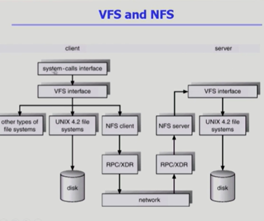

# Allocation of File Data in Disk

순차적인 접근 , 직접 접근 등이 있다.

디스크에 파일 데이터를 저장하는 방식은 다음의 세가지

1. Contiguos Allocation

연속할당
하나의 파일이 디스크에 연속되게 저장되는 방식

디렉토리라는 파일은 디렉토리 밑에있는 파일 메타데이터를 갖고있다고했는데

그 디렉토리에 파일이 5개가 있는셈.

파일의 이름/ 위치 등등 이 메타데이터로있음

단점 : 외부조각이 생길 수 있음.
중간중간 내용이 들어있지않은 프리블럭들의 균일하지않음

또 파일이라는건 중간중간 크기가 바뀔수있는데. 일정이상 클수가없음 / 연속할당때문에 비는거까진 되어도 그이상은 불가

외부조각은 아무도 사용안하는거

내부조각은 할당이됬는데 사용되지않은거

또 균일하게 생기지않았다보니 중간중간 hole이 생김

장점: Fast i/o  
실제로 데이터를 읽거나쓸때 크기는 별로 상관이없음
한번의 Seek으로많은 바이트 transfer

swap area는 파일을 저장하는게 아니라 프로세스의 주소공간중일부를 물리적인곳으로 쫓아내고 필요할떄 올려놓는 용도. => 프로세스가 끝나면 의미가없는정보
임시로 저장해놓고 대용량을 빠르게 쫓아냈다가 가져왔다가.속도가 더 중요한.

리얼타임용 으로 (데드라인이 있는경우)

직접접근 가능

예를들면 메일이라는 데이터의 앞에서부터 5번째를 보고싶다그러면 연속할당의 경우 start/length 있으면 19에그냥 숫자 더해서 중간위치의 블럭을 미리알 수있다.

2. Linked Allocation

링크된 연결할당

start/end

파일의 시작위치만 갖고있고 그다음위치는 실제로 그 위치에 가봐서 기록.

이렇게 하면 장점 : 외부조각이발생하지않음

단점 : 직접접근이 안됨 특정파일에서 앞에서 네번째에 접근하고싶다 => 일일이가봐야함.

변형 : FAT 파일시스템
file allocation table 포인터를 별도의 위치에 보관하여 reliablility와 공간효율성 문제 해결

3. Indexed Allocation

인덱스를 두는 할당방법

직접접근이 가능하게 하기 위해서 디렉토리에 파일위치정보를 바로 저장하는게 아니라 인덱스를 가리키게 함.

장점 : 다이렉트 엑세스가능

장점: 파일이작을경우 공간낭비

##UNIX파일시스템의 구조

부트블럭은 어떤 파일시스템이건 제일 앞에있음.

두번쨰 슈퍼블럭은 이 파일시스템에 관한 총체적인 정보를 말함.

파일의 메타데이터는 파일을 가지고있는 디렉토리에가면 파일의 메타데이터가있다고배움

실제 파일 시스템을 구현해보면 디렉토리가 메타데이터를 다가지고있지는않음.

별도에 위치에 뺴놓는데 그게 바로 Inode list임

Inode 라고하는게 인덱스노드임

빨간색으로 표시된 아이노드 하나가 파일하나당 아이노드가 하나씩할당이되는것

아이노드는 이파일의 메타데이터를 가지고있음.

메타데이터는 파일의 소유주나 접근권한 위치정보 등을 가지고있음

파일의 이름만큼은 디렉토리가 직접가지고있고 나머지 메타데이터는 아이노드.

디렉토리는 아이노드 번호를 가지고있는. 이런형태.

파일의 위치정보는 어떻게 저장하냐 ?=> 유닉스는 기본적으로 indexd location을 변형해서 사용함.

아이노드라는건 어짜피 크기가 고정되어있음.

대단히 큰 파일은 인다이렉트를 이용.

부트블럭 슈퍼 블럭 아이노드 리스트 데이터 블럭 이런 구조다.

### FAT File System

마이크로소프트사가 ms dos 만들었을때 . 처음만듦

부트블럭 펫 루트 리렉터리 데이터 블럭의 구조를 가지고있음.

부트블럭: 부팅관련

펫: 메타데이터중에 일부를 fat에 저장. 위치정보 나머지 메타데이터는 디렉터리가 가지고있음

파일이름이랑 파일의 첫번째 위치등등을 가지고있음

데이터블럭이 n개가있다 그럼 fat의 배열도 n개가 됨
fat파일의 장점 : 직접 접근이 가능하다.

fat이라는건 작은 테이블 이미 메모리에 올라가있고 이파일의 4번째를 보겠다하면 217부터 쭉 따라가면 바로 4번째 파악가능.

실제 데이터블럭에서 2,3번째를 봐야아는게 아니라 바로 알수있다는이야기.

Linked allocation의 모든 단점을 극복함.

FAT은 대단히 중요한 정보라서 한카피가아니라 두카피이상을 가지고있음

### Free Space Management

비어있는 블럭을 관리하는방법 ? => 비트맨 링크드 리스트 그룹핑 카운팅

- 비트맵

각각의 블럭별로 번호가있으면 비트를둬서 첫번쨰블럭이 사용중이냐 비어있느냐를 0과1로 구분

그래서 파일이 삭제되면 0으로바꾸고 비어있는공간은 채우는

비트맵은 디스크의 부가적인 공간을 필요로한다는것이 특징임

연속적인 n개의 free block을 찾는데 효과적임.

- 링크드 리스트

비어있는 블럭들을 서로연결 다음에 비어있는 건 어딘지.

연속적인 가용공간을 찾는것은 쉽지않다.

공간의 낭비가없음.

- 그루핑
  링크드 리스트 방법의 변형
  첫번쨰 블럭이 N개의 포인터를 가지고
  n-1 포인터는 free data block을 가리킴

이것도 연속적인 거 찾기에썩 효과적이진않음

- 카운팅
  이 방법은 연속적인 거 찾기에 좋음
  프로그램들이 종종 여러개의 연속적인 block을 할당하고 반납한다는 성질에 착안함.

  ### Directory Implementation

  디렉토리는 파일의 메타데이터를 관리하는 파일임
  저장하는방법

  1. 리니어리스트
     파일의 이름과 meta데이터 를 순차적으로 저장
     구현은 간단한데 연산에 시간이 필요

  2. 해시 테이블
     리니어 리스트 + 해시
     그냥저장하는게 아니라 해시함수를 사용

fat에서는 다음위치정도 unix에서는 inode에 정보 ㅇ

긴파일이름을 지원하는 방식

디렉토리가 파일의 메타데이터를 저장할때 파일이름길이가 어떤 건 길고 짧고하면 위치가 들쭉날쭉하지않고

고정시켜서 딱딱 그 위치만 찾아보도록.

파일이름을 제한할수도있음. 그러나 그렇게하는것도 비효율적임.
저장이다안되면 마지막을 포인터가 가리키게끔

### VFS and NFS

버츄얼 파일 시스템

사용자가 파일시스템에 접근할떄에는 시스템콜을 해야됨

파일 시스템 종류별로 서로 다른 시스템콜 인터페이스를 써야된다면 사용자가 굉장히 혼란스러울것임

그래서 뭘쓰던 상관없이. VFS라는 파일시스템을 하나둠

사용자가 파일시스템 접근할떄는 개별 파일시스템 종류랑 상관없이 VFS 사용

사용자입장에서는 동일한 API 를 사용하게 해주는OS의 layer

네트워크 파일시스템

로컬 과 원격에 다른 컴퓨터에있는 파일시스템에 접근하느것도 지원 그게 NFS

서버 컴퓨터에는 파일시스템이 유닉스가 사용되고있는 모습이 사진.

RPC => 원격접근하는 프로토콜

NFS가 마치 자기사용자가 이용하는것처럼 VFS 인터페이스 사용하게끔 그래서 다시전달받아서 또 클라이언트쪽으로 받아 사용자에게 전달하는 플로우

## Page Cache and Buffer Cache

- Page Cache
  가상메모리의 페이징 시스템에서 사용하는 페이지 프레임을 캐싱의 관점에서 설명

- Buffer Cache
  파일시스템을 통한 io 연산은 메모리의 특정영역인 버퍼 캐시 사용
  파일시스템관점사용

- Unified Buffer Cache
  최근의 OS에서는 기존의 buffer cache가 page cache에통합됨
  페이지랑 버퍼캐시가 합쳐진

- memory mapped i/o
  파일의 일부를 버츄얼 메모리에 맵핑시킴
  매핑시킨 영역에 대한 메모리 접근 연산은 파일의 입출력을 수행하게함
  파일의 일정 부분을 매핑해놓고 나면 그다음 부터는 리드 라이트 시스템콜이아니라 메모리에 변수를 둬서
  그게 실제 파일을 읽고쓰는효과가나게

# File System Implementation2

페이지 캐시라는건 메모리관리할때 페이지 프레임들을 두고 페이지프레임에 당장 필요한 메모리를 올려놓고

필요하지않은 내용을 쫓아내는 걸 캐시의 관점에서 페이지캐시라 불렀고

버퍼 캐시라는건 프로그램이 실행되면 파일을 출력하는경우가있음

리드시스템콜을 하면 디스크에있는 파일시스템 에서 대신 파일의 내용을 읽어서 메모리영역에 카피해놓고

전달해주는 => 버퍼 캐시

운영체제가 파일 입출력을 할 때 사용자프로그램의 요청을 받아서 읽어온내용을 그냥 전달하고 끝나는게 아니라 버퍼캐시라는 영역에 올려놓고. 사용자 프로그램한테 카피해서 넘겨줌

페이지캐시의 단위는 페이지단위

버퍼캐시의 단위는 디스크에서 파일의 블럭을 읽어와라 하면 블럭이라는것은 논리적인 블럭 디스크에서는 '섹터'단위를 말함

최근에는 버퍼와 페이지가 통합됨 => Unified

그래서 단위도 페이지단위로 사용 그게 달라진점

파일의 내용을 시스템콜을 이용해서 읽어와서 사용자한테 카피해서주는게아니라

주소공간중 일부를 파일에 매핑하는게 메모리 mapped i/o

### Page Cache and Buffer Cache

06:43
