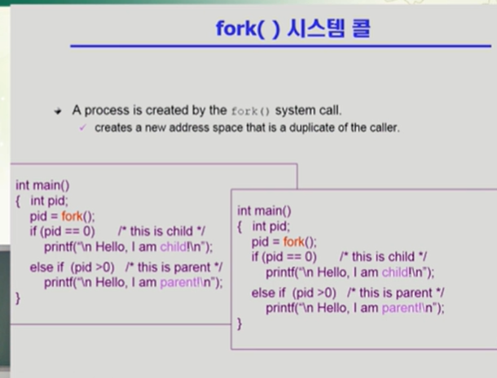
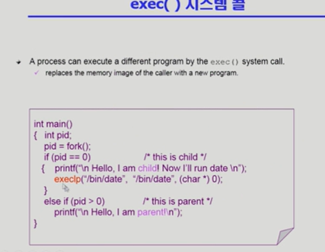

## 프로세스 관리

### 프로세스가 어떻게 만들어지는가?

부모 프로세스가 자식 프로세스 생성

보통 복제생성하게 됨

프로세스의 트리 (계층 구조) 형성 => 부모가 자식낳고 낳고 그런 느낌

프로세스가 실행되려면 자원이 있어야됨 => CPU, Memory 같은것 => 이 자원은 운영체제로 부터 받고 부모랑 공유하는 경우도 아닌 경우도 있음

원칙적으로 자원을 공유하지는 않음 => 자식을 하나 낳으면 그때부터 별도의 프로세스라서 서로 cpu를 얻으려고 경쟁하는 관계가됨

프로세스가 실행될때 부모 자식이 공존하면서 실행되는 경우가 있고 자식이 종료 될때까지 부모가 기다리는 경우가있다.

프로세스의 생성은 부모가 자식을 생성하고 복제생성을한다.

복제생성?=> 부모 프로세스의 주소공간을 자식이 그대로 복사함 자식은 그 공간에 새로운 프로그램을 올림

유닉스로 예를 들면 fork() 시스템 콜이 새로운 프로세스를 생성하고 부모 복사하고 주소공간할당을 한다

fork 다음 exec() 시스템콜을 통해 새로운 프로그램을 메모리에 올린다.

독립적이기때문에 복제해놓고 덮어씌우지않을수도있다.

내가 자식 프로세스를 만들지않고 exec()을 하면 완전히 새로운 프로세스로 바뀔 수 도있다.

지금까지 살아온게 맘에안들면 다른 걸 갖다 붙여서 새로운 인생을사는게 exec()임

부모가 자식을 생성한다 말했지만 사용자 프로세스가 직접 다른 것을 생성하는게아니라 운영체제를 통해서만 가능함. 그래서 시스템콜이라 말한 것

운영체제에게 자식을 낳아달라고 부탁하는것

### 프로세스 종료

보통은 exit이라는 시스템 콜로 종료를 함

c언어로 함수를 작성했다고하면.

명시적으로 exit을 안했더라도 컴파일러가 자동으로 넣어줌

부모 프로세스가 자식의 수행을 종료시킴(abort)

부모프로세스가 자식을 종료시킴

프로세스의 세계에선 자식보다 부모가 더 오래산다.

그래서 종료될때는 자식이 부모에게 output data를 보낸다. (via wait)

자발적 종료는 exit

비자발적은 abort

강제종료되는 경우 ?

1.자식이 할당 자원의 한계치를 넘어섰을 때

2.일시켜먹을려고 자식을만드는데 자식에게 할당된 태스크가 더 이상 필요하지 않을 때

3.부모 프로세스가 종료되는 경우

자식먼저 가야되는데 부모가 종료될때 자식먼저 다죽이고 부모도 간다.

---

복제 => 프로세스의 문맥을 모두 복사하는 것

메모리 즉 주소공간을 그대로 복사해서 자식을 만든다.

cpu 문맥

cpu에서 인스트럭션을 어디까지 실행했는가 그걸 나타내는 레지스터가 프로그램카운터 pc register

프로세스가 하나 만들어지게 되면 그때부터는 독립적인 프로세스기 때문에 자원을 공유하기 때문에 부모와 자식은 서로 경쟁하면서 서로 많이 차지하려는 관계가 된다.

자식 프로세스가 부모 프로세스 걸 그대로 copy 를 하다보니 메모리 낭비가 되는 것

리눅스나 일부 모델은 모든걸 카피하지않고 공유할수있는건 가능한 공유한다. (효율적)

프로그램 카운터만 하나 카피해서 똑같은위치를 가리키다가

별개의 프로세스라서 위치가 달라졌을 경우

결국 각자의 길을 가게됨

그럼 그제서야 부모의 일부를 카피해서 자식이 받는것

이런 기법을 카피 온 라이트 라고 하는데 줄임말로 COW라고 한다.

파일시스템 같은데서 굉장히 많이나옴

뭔뜻? => write가 발생하면 그때 copy 하겠다

=> 내용이 바뀔 때 카피해서 새로 만들겠다

프로세스를 만드는건 보통일이 아니기에 os 한테 시스템콜을 통해서 만든다.

그게 fork()

포크하게 되면 부모를 그대로 복사

### fork() 시스템 콜

프로 프로세스가 fork를 하면 새로운 자식이 만들어지고 또 fork 하고 또 새로운 자식 fork 하면

fork 가 한번하면 무한하게 일어나겠네요? => fork를 하게되면 fork 가 이루어진 그 다음시점부터 자식프로세스가 실행 => 부모프로세스의문맥을 가져오기떄문 (정확히는 프로그램 카운터)

그래서 메인함수의 시작부터가아님

그래서 어디 복제를 하러 들어가서 복제를 하게되면 애기를 낳는게 아니고 본인과 똑같이 생긴 사람이 나오게 되는 것

한가지문제? => 복제를 해놨더니 지가 원본이라고 주장하는 것

그래서 부모프로세스를 복제본 취급

세상의 프로그램들은 모두다 똑같은 제어 흐름을 따라가야될것같고 이런게 복제되었을때 생성될수있는 문제점

이런 문제를 막기위해서 복제할땐 fork라는것을 통해서 만들고 자식과 부모를 구분해줌

구분 방법? =>fork라는 함수의 리턴값이 다름

부모는 양수가 얻어짐 정확히는 자식프로세스의 pid 자식프로세스의 주민번호를 알게됨

자식프로세스는 fork의 결과값으로 0을 받음

그래서 이걸로 자기가 자식인지 부모인지를 알 수 있게 된다.

### exec() 시스템 콜

어떤 프로그램을 완전히 새로운 프로세스로 태어나게 하는 역할을 함

execlp 는결국 exec()을 함

프로그램이 실행이되다가 exec()을 만나게되면 기억은 잊어버리고 exclp 안에있는 새로운 프로그램으로 완전히 덮어씌우는것

18:54 예를들어
