설명하기 앞서 데이터의 접근 패턴에 대해서 설명

### 데이터의 접근

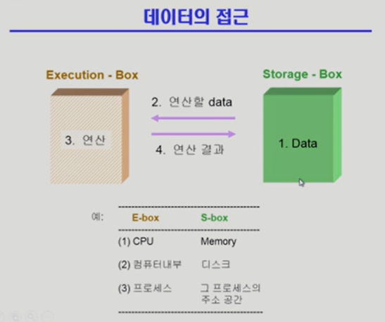

저장된 데이터를 읽어와서 연산된 결과를 다시 원래 위치에 저장을 하는.

데이터가 저장되어있는 위치를 추상적으로 Execution Box Storage Box 로 한다.

데이터를 읽어와서 연산을 하고 수정을 한다음에 결과를 다시 저장하는 방식에서는

누가 먼저 읽어왔냐에 따라 결과가 달라질수도있고

### Race Condition

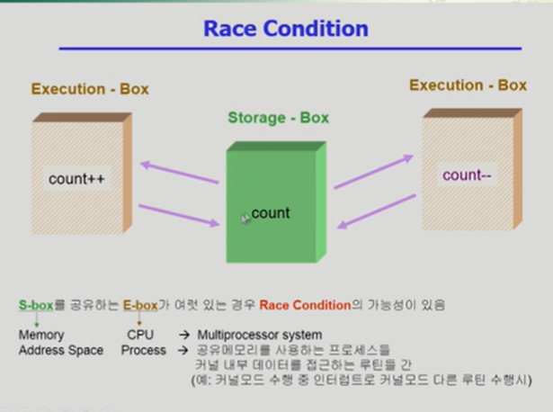

스토리지 박스를 공유하는 익스큐선 박스가 여러게있으면

Race Conditio 의 가능성이 있다.

깃같은거지 뭐 버젼관리

여러 주체가 하나의 데이터를 동시에 접근하려고할때 를 레이스컨디션 (=경쟁상태) 라고 부름

그래서 이걸 조율해주는 방법이 필요하다.

연산을 하는 주체는 CPU라고 하고 데이터가 저장된곳을 메모리라고하면

연산하는곳을 컴퓨터라고 하면 저장되는곳은 하드 디스크

완전히 다르게 생각 해서 프로세스가 연산의 주체고 프로세스가 관리하는 주소공간이 저장되어있는 위치 이렇게 생각해볼수도있음

프로세스는 실행하면서 자기주소공간에있는 주소공간을 가져다가 연산하고 다시 결과 저장

각 프로세스의 공유메모리를 사용하는 방법도있음

하나의 프로세스가 공유메모리 읽고 또다른애가 읽고하면 문제가 생김

더 중요한 문제는 운영체제 커널과 관련되서 생기는 문제들

프로세스는 일반적인 경우라면 자기 주소공간만 접근하기때문에 RaceCondition 이 일어날 일이없음

근데 운영체제한테 대신 요청해야되는 부분에 대해서는 시스템 콜을 하게됨 커널이 그 프로세스를 대신 실행.

커널이 실행이된다는소리 ? = 커널에 있는 데이터에 접근한다는 소리

이런 상황에서 cpu를 뻇겨서 또 다른애를 줬는데 얘도 시스템 콜해서 커널의 코드가 실행되면서 커널에 데이터에 접근하게되면 Race Condition문제가 실행 될 수있음

또 커널 모드 수행중 인터럽트가 들어올 수 도있음

그러면 지금 하던 일을 잠시 잊고 인터럽트를 할 수있는데 그것도 커널 코드일수있다.

유저레벨에선 문제가안생기는데 커널로 들어가면 공유데이터라 문제가 생긴다.
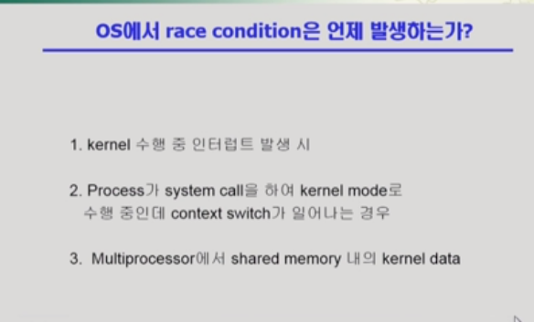

그래서 운영체제의 레이스 컨디션은 다음의 경우에 생긴다.
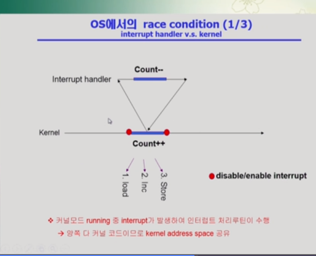

커널이 CPU에서 실행을 하고있을때 Count의 값을 증가를 시키고 있는데

1증가시키는게 고급언어는 cpu내부에서 여러인스트럭션이 실행됨

레지스터값 불러오고 하나올리고 다시 저장.

문제는 레지스터를 읽어들인 이 상태에서 인터럽트가들어오면 지금의 작업을 잠시 멈추고 인터럽트 처리 루틴으로 넘어간다.

인터럽트 핸들러도 사실 커널에 있는 코드

문제를 해결하기위해서 중요한값의 경우에는 인터럽트 처리를 안함

인터럽트를 disable시켰다가 작업이 끝난다음에 넘겨서 race condition이 일어나지않는 방식으로 문제 해결

결국에는 순서를 정해주면됨.

단지 무작정 막다보면 비효율적일수있어서 그걸어떻게 처리할지.
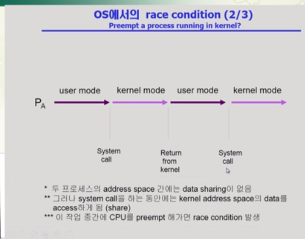

두번쨰의 경우 프로세스가 실행이 된다는게 본인의 코드만 실행하는게 아니라 시스템콜을 통해서 서비스를 대신해달라고 요청하게 되는경우가 있음

그럼 유저모드랑 커널 모드를 번걸아가면서 쓰며

cpu 할당시간이있고 시간이 끝나면 반납하게 되어있음
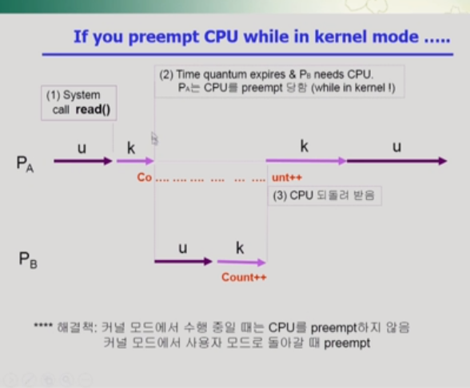

a의 할당시간 쓰다가 끝나서 b에게넘기고 b도 끝나서 a에게 돌리는 그림

근데 할당이 끝난 시점이 유저레벨에있다가 스위치가되면 상관없는데 시스템콜해서 커널의 코드가 실행중인데 거기서 카운트값 올리던 도중에 할당시간이 끝나고 다른 프로세스에서 카운트를 +1 하고다시 원래의 프로세스한테 cpu가 오면. 요기에서는 두번 1증가시킨것되어야되나. 두번쨰에서 증가된값은 반영이 안됨

왜냐면 컨텍스트의 차이. 그 전의 문맥을 받아썼기떄문
그래서이런 동기화문제가 생김

해결법 : 커널모드에서 수행중일떄는 CPU를 preempt 하지않음 (뺏지않음) 이러면 할당시간이 정확하게 지켜지지는 않을것

근데 어쩌피 타임쉐어링은 리얼타임이아니라서 조금 시간 바뀐다해도 괜찮음
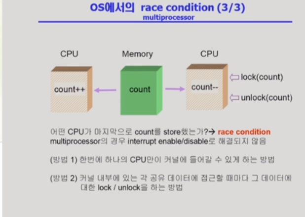

이거는 앞에서의 어떤 방법으로도 해결되지않음

cpu가 2개라서 작업주체가 여럿이 있기때문에.

데이터를 접근할때 락을 걸면 됨

다른 cpu가 접근할때 락 풀어주고 락걸고 ㅇ

커널에접근하는 cpu를 매번 하나만 들어가게

커널 전체를 락으로 막고 커널을 빠져나올떄 락을 푸는 ㅇ
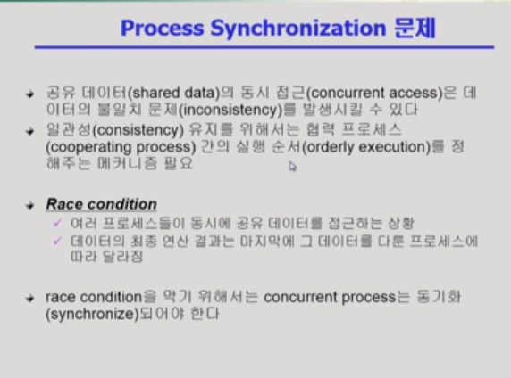
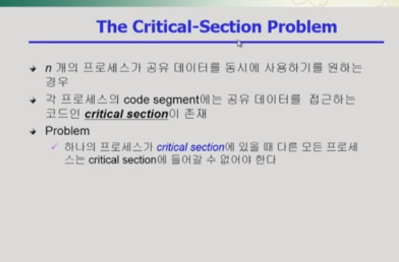

우리말로는 임계구역 이런 번역 critical section 이라는것은 공유데이터를 접근하는 코드.

2. Process Synchronization 1
   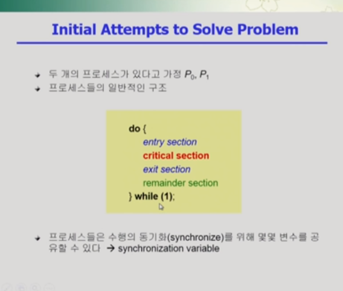

공유데이터를 그냥 접근 시키면 문제가있을수있으니

엔트리 섹션으로 락을 걸고

exit section에서 락을 풀어 크리티컬 섹션에 들어갈 수있게.

### 프로그램적 해결법의 충족 조건

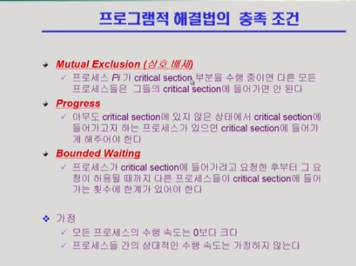

Mutual Exclusion (상호배제)

=> 어떤 프로세스가 들어가있으면 다른건 못들어가게 하는거

Progress (진행)

=> 아무도 크리티컬 섹션에 있지않은 상태에서 들어가고자 하는 프로세스가있으면 들어가게 해주는 것

Bounded Waiting(유한 대기)

=> 프로세스가 critical section에 들어가려고 요청한 후부터 그 요청이 허용될 때까지 들어가는 횟수에 한계가 있는것
기다리는 시간이 유한해야된다.

지나치게 오래 기다리는 스타베이션이 생기지않게하는것

4:00
