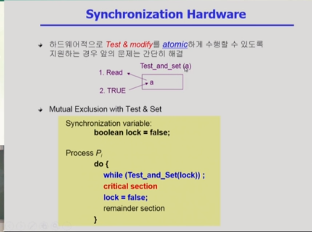

설명하기 앞서 데이터의 접근 패턴에 대해서 설명

### 데이터의 접근

저장된 데이터를 읽어와서 연산된 결과를 다시 원래 위치에 저장을 하는.

데이터가 저장되어있는 위치를 추상적으로 Execution Box Storage Box 로 한다.

데이터를 읽어와서 연산을 하고 수정을 한다음에 결과를 다시 저장하는 방식에서는

누가 먼저 읽어왔냐에 따라 결과가 달라질수도있고

### Race Condition

스토리지 박스를 공유하는 익스큐선 박스가 여러게있으면

Race Conditio 의 가능성이 있다.

깃같은거지 뭐 버젼관리

여러 주체가 하나의 데이터를 동시에 접근하려고할때 를 레이스컨디션 (=경쟁상태) 라고 부름

그래서 이걸 조율해주는 방법이 필요하다.

연산을 하는 주체는 CPU라고 하고 데이터가 저장된곳을 메모리라고하면

연산하는곳을 컴퓨터라고 하면 저장되는곳은 하드 디스크

완전히 다르게 생각 해서 프로세스가 연산의 주체고 프로세스가 관리하는 주소공간이 저장되어있는 위치 이렇게 생각해볼수도있음

프로세스는 실행하면서 자기주소공간에있는 주소공간을 가져다가 연산하고 다시 결과 저장

각 프로세스의 공유메모리를 사용하는 방법도있음

하나의 프로세스가 공유메모리 읽고 또다른애가 읽고하면 문제가 생김

더 중요한 문제는 운영체제 커널과 관련되서 생기는 문제들

프로세스는 일반적인 경우라면 자기 주소공간만 접근하기때문에 RaceCondition 이 일어날 일이없음

근데 운영체제한테 대신 요청해야되는 부분에 대해서는 시스템 콜을 하게됨 커널이 그 프로세스를 대신 실행.

커널이 실행이된다는소리 ? = 커널에 있는 데이터에 접근한다는 소리

이런 상황에서 cpu를 뻇겨서 또 다른애를 줬는데 얘도 시스템 콜해서 커널의 코드가 실행되면서 커널에 데이터에 접근하게되면 Race Condition문제가 실행 될 수있음

또 커널 모드 수행중 인터럽트가 들어올 수 도있음

그러면 지금 하던 일을 잠시 잊고 인터럽트를 할 수있는데 그것도 커널 코드일수있다.

유저레벨에선 문제가안생기는데 커널로 들어가면 공유데이터라 문제가 생긴다.

그래서 운영체제의 레이스 컨디션은 다음의 경우에 생긴다.

커널이 CPU에서 실행을 하고있을때 Count의 값을 증가를 시키고 있는데

1증가시키는게 고급언어는 cpu내부에서 여러인스트럭션이 실행됨

레지스터값 불러오고 하나올리고 다시 저장.

문제는 레지스터를 읽어들인 이 상태에서 인터럽트가들어오면 지금의 작업을 잠시 멈추고 인터럽트 처리 루틴으로 넘어간다.

인터럽트 핸들러도 사실 커널에 있는 코드

문제를 해결하기위해서 중요한값의 경우에는 인터럽트 처리를 안함

인터럽트를 disable시켰다가 작업이 끝난다음에 넘겨서 race condition이 일어나지않는 방식으로 문제 해결

결국에는 순서를 정해주면됨.

단지 무작정 막다보면 비효율적일수있어서 그걸어떻게 처리할지.

두번쨰의 경우 프로세스가 실행이 된다는게 본인의 코드만 실행하는게 아니라 시스템콜을 통해서 서비스를 대신해달라고 요청하게 되는경우가 있음

그럼 유저모드랑 커널 모드를 번걸아가면서 쓰며

cpu 할당시간이있고 시간이 끝나면 반납하게 되어있음

a의 할당시간 쓰다가 끝나서 b에게넘기고 b도 끝나서 a에게 돌리는 그림

근데 할당이 끝난 시점이 유저레벨에있다가 스위치가되면 상관없는데 시스템콜해서 커널의 코드가 실행중인데 거기서 카운트값 올리던 도중에 할당시간이 끝나고 다른 프로세스에서 카운트를 +1 하고다시 원래의 프로세스한테 cpu가 오면. 요기에서는 두번 1증가시킨것되어야되나. 두번쨰에서 증가된값은 반영이 안됨

왜냐면 컨텍스트의 차이. 그 전의 문맥을 받아썼기떄문
그래서이런 동기화문제가 생김

해결법 : 커널모드에서 수행중일떄는 CPU를 preempt 하지않음 (뺏지않음) 이러면 할당시간이 정확하게 지켜지지는 않을것

근데 어쩌피 타임쉐어링은 리얼타임이아니라서 조금 시간 바뀐다해도 괜찮음

이거는 앞에서의 어떤 방법으로도 해결되지않음

cpu가 2개라서 작업주체가 여럿이 있기때문에.

데이터를 접근할때 락을 걸면 됨

다른 cpu가 접근할때 락 풀어주고 락걸고 ㅇ

커널에접근하는 cpu를 매번 하나만 들어가게

커널 전체를 락으로 막고 커널을 빠져나올떄 락을 푸는 ㅇ

우리말로는 임계구역 이런 번역 critical section 이라는것은 공유데이터를 접근하는 코드.

2. Process Synchronization 1
   

공유데이터를 그냥 접근 시키면 문제가있을수있으니

엔트리 섹션으로 락을 걸고

exit section에서 락을 풀어 크리티컬 섹션에 들어갈 수있게.

### 프로그램적 해결법의 충족 조건

Mutual Exclusion (상호배제)

=> 어떤 프로세스가 들어가있으면 다른건 못들어가게 하는거

Progress (진행)

=> 아무도 크리티컬 섹션에 있지않은 상태에서 들어가고자 하는 프로세스가있으면 들어가게 해주는 것

Bounded Waiting(유한 대기)

=> 프로세스가 critical section에 들어가려고 요청한 후부터 그 요청이 허용될 때까지 들어가는 횟수에 한계가 있는것
기다리는 시간이 유한해야된다.

지나치게 오래 기다리는 스타베이션이 생기지않게하는것

락을 잘 걸었다가 푸는 알고리즘 소개

코드를 가만 보면 크리티컬 섹션은 반드시 교대로 들어가게되어있음

상대편이 한번 들어갔다 나와야 자기차례가오는.

이런 프로세스들이 크리티컬 섹션이 들어가는 빈도가 동일하지않을수있는데

그렇다하더라도 다른애가 갔다와야 자기차례가되는것.

극단적으로 프로세스 1은 한번가고 0은 계속들어가야된다고하면

0도 영원히 못들어가는것

그래서 이 알고리즘은 progress는 동작 못하기때문에 잘 풀지 못한 케이스

플래스는 크리티컬 섹션에 들어가고자하는 의중을 표시한 것

본인이 들어가고자한다면 본인의 플래그를 true로 바꾸고

상대방이 셋팅해놓았는지 물어본다.

상대방이 셋팅안되어있으면 들어가고

나올떄 false 로 만드는.

요방식도 두개다 못들어가는 일이 생김

그래서 온전치 못하다

피터슨 알고리즘

앞에 설명한 턴과 플래그 둘 다 사용함

프로세스 i 가 크리티컬 섹션에 들어가고자할때 제일먼저 자신의 깃발을 들어서 의사표현을 하고 그다음에 turn 을 상대방 턴으로 바꿔놓음

그리고 들어가기전에 상대방이 깃발을 들고 있고 turn 이 맞는 지

상대방이 깃발이나 turn이 아니면 critical 섹션에감

만약 깃발 들려있어도 컨이아니면 내가 들어감

빠져나올떄는 깃발을 내려놓음.

이 방법은 cpu를 빼앗긴다 하더라도 3가지 조건을 모두 만족함

그러나 이코드도 busy waiting 문제가있음 다른말로는 spin lock이라는 표현을 쓰기도함 => 락을 계속 걸어서 다른 애가 못들어가게 막는. 와일문을 돌면서 락을 걸어서 상대가 못들어가게 막는.

어떤 프로세스가 크리티컬 섹션에 들어간 상태에서 다른애가 잡으면 와일문에서 빠져나갈수없고 계속 도는데 본인의 cpu 시간에 체크를 계속하지만 체크만 계속한다고 당연히만족할리가없음 상대방이 안바뀌니까 ㅇ

그래서 본인이 다쓰고 반납 을 해서 비효율적인 방법이다

크리티컬 섹션관련문제에서 락을 걸고 풀면되는데 코드가 복잡하고 커진 이유는

고급언어의 문장 하나가 실행되는 도중에 cpu를 빼앗길 수 있기 때문에

빼앗길 수 있다는 가정하에 하다보니 복잡한 코드가 생기는 것

어떤 데이터를 읽는것과 쓰는것을 하나의 인스트럭션으로 처리할 수 없기때문에 이런 문제가 생긴것

어떤 데이터를 읽으면서 동시에 쓰는 이게 하나의 인스트럭션으로 실행이 가능하다면 적어도 cpu를 빼앗기지는 않을것이다.

데이터를 읽는 작업과 쓰는 작업을 동시에할수있다면 대단히 간단하게 락을걸고 푸는 문제해결 ㅇ

## Process Synchronization 2

추상 자료형? : 오브젝트 와 오퍼레이션으로 구성 정수 추상자료형 하면 정수 숫자들이있고 그 숫자들에 대해서 정의된 연산이 뭐가있느냐 인것처럼

논리적으로 정의를 하는거지 어떻게 구현되는거냐 하고는 별개의 자료형을 말함

세마포어도 추상

세마포어 S는 정수 값을 가질수있고 연산이 필요한데

P 연산과 V 연산 두 가지가 정의가 된다.

간단하게 요약하면 세마포어는 락을 걸고 풀고 를 간단하게 제공

공유자원을 획득하고 반납하는 것을 세마포어가 처리를 해줌

그래서 세마포어 변수에 대해서 정의되는 연산이 P V 가있는데 P의 경우 세마포어 를 획득하는 과정이고 (공유데이터를 획득하는)
V연산은 다 사용하고 나서 반납하는 과정이라고 생각하면 됨.

변수값 S가 5다 그러면 자원이 5개있는거고

P연산하면 하면 그자원하나 가져가는것 그래서 4개가됨

P는 락을걸고 V는 락을 푸는 연산

변수 S에 대해서 P 연산을 하면서 기다리다가 S가 양수가되면 --

그리고 사용이 다끝나면 v연산을 해서 반납

P연산과 V연산은 atomic 하게 연산이 되는것을 가정함

추상적으로 연산을 정의하는것이기때문에 어떤식으로 하는지는 이야기하지않는다.

P연산은 자원이 있으면 하나 가져가고 없을때는 while문 돌면서 기다리는것인데 그게 atomic 하게 기다리는것

크리티컬 섹션 문제에 세마포어 를 사용하면 자연스럽게 해결이된다.

프로그래머는 세마포어라는게 지원이되면 P와 V연산만 해주면되고

어떻게 구현할지는 그때그때 구현하는 시스템에서 생각해야할 몫이다.

비지웨이팅 말고도 다른 방식으로 세마포어를 구현 할 수 있다.

블럭 버젼 구현 방식

일반적으로 block / wakeup이 더좋다.

크리티컬 섹션이 길면 낭비되는 cpu시간이 많아진다.

어느정도이상 길면 block /wakeup이 필수가 됨

### 세마포어 타입

자원의 갯수가 하나일 경우 (락을 걸때 보통 하나로)
이런것을 바이너리 세마포어라고 해서 0또는 1
뮤튜얼 exclusion 에 사용함

세마포어의 변수값이 5,10 이러면 counting 세마포어
자원의 갯수가 여러개 ㅇ

세마포어 쓸 떄 주의할점 => 원치 않는 문제가 생길 수 있다.

데드락 문제

예를들어
S와 Q가 있는데 두개를 다 획득해야만 일을 할 수 있는 상황이다.

cpu를 먼저 획득하고 뺏길때 다음 프로세스가 얻고 Q라는 세마포어 획득
Q를 획득하고 나서 S를 획득하려고 봤더니 첫번째 얘가 S를 갖고있음

근데 영원히 기다려야됨

S라는것을 획득하려면 프로세스가 S를 내놓아야되는데 S를 내놓는 시점이 Q까지 다쓰고 반환할때 내놓기떄문

둘이서 하나씩 쥐고 놓지는 않고 영원히 조건을 충족하지 못하는 상태가 발생을 함

어떻게 해결하느냐?

자원을 획득하는것을 똑같이 맞춰주면됨 SS
Q를 획득하려면 S부터 획득하고나서 해라

스타베이션 문제

한명이 영원히 자원을 못 받음

근데 데드락도 어떻게보면 스타베이션이라고 볼 수도있겠음

일종의 스타베이션으로

여기서의 스타베이션은

Indefinite blocking

### 식사하는 철학자 문제

젓가락을 쉐어하는 상황

철학자가 식사를 할려면 왼쪽과 오른쪽 젓가락을잡아야되는데 한명이 먼저 식사.

그래서 기다렸다가 다음사람 먹고 해야겠다 했는데 다음 얘가 또 밥을먹고

그러면 한 사람이 굶어죽는것 이게 스타베이션

데드락이라고한다면 5명이 전부 배고파서 다 같이 왼쪽 젓가락을 잡으면 아무도 오른쪽을 못잡아서 다같이 굶어죽는것

## Process Synchronization 3

작업을 동시에 할수없는 상황에서 소프트웨어적으로 해결하는 알고리즘과

Test modify 로 하드웨어적으로 해결하는 경우 두가지가 있었음

세마포어 변수는 정수값을 가지고있고 연산은 두가지 atomic연산에 의해서만 접근 가능 p 연산과 v연산

세마포어 는 블럭앤 웨이크업 방식으로 구현이 가능하다.

### Classical Problems of Synchronization

### Bounded-Buffer Problem

버퍼라는거 => 임시로 데이터를 저장하는 공간

유한한 환경에서 생성자 소비자 문제 producer-consumer problem

이문제에는 프로세스가 두가지종류가있음

1. 생성자 프로세스
2. 소비자 프로세스

그리고 각각 하나씩 만있는게 아니고 생성자 여러개 소비자 여러개 이런 느낌

이 상황에서 생성자는 공유 버퍼에 데이터를 하나 만들어서 집어 넣는 역할을 하게 됨

회색으로 구멍이뚫린건 비어있는 버퍼

주황색은 생성자가 데이터만들어서 넣어놓은상태

구멍 뚫린건 애초부터 비어있었던지 생성자가 데이터 넣었는데 소비자가썼던지.

여기서 어떤 문제가 발생하냐?

1. 공유 버퍼이기때문에 생성자가 동시에 도착해서 비어있는 버퍼를 둘이 도착 그래서 동시에 데이터를 만들어서 집어넣으면 안되기떄문에

락을 걸어서 프로세스 접근 막고 비어있는거에 넣고 나가면 락을 푼다.

소비자도 마찬가지. 둘이 동시에 꺼내가면 안되니까. 버퍼에 락을걸어서 꺼내가겠다 라고 하고 꺼내가고 락을 풀고.

공유 데이터에 대한 싱크로나이제이션 문제

2. 버퍼가 유한해서 생기는 문제 bounded buffer 라 생기는 문제

생성자가 버퍼를 다 채웠는데 생산자는 계속 도착하면

생산자입장에서는 사용할수있는 자원이 없게됨

세마포어가 자원의 갯수를 세는 용도로 사용될수있다고했는데

소비자가 사용해야 넣을수있음

소비자입장에서는 꺼내갈게 없을떄. 기다리는것에 해당

그래서 해야될일이 크게 두가지가있음

1. 둘이 동시에 접근하는것을 막는것과

2. 버퍼가 가득차거나 비었을때 가용자원의 갯수를 세는 카운팅 세마포어가필요

소비자 프로세스는 생산자가 나타나서 하나만들어서 하나 증가할때까지 기다림

그러다 꺼내먹을게 생기면 공유데이터 전체에 lock을 걸고 꺼내가고 다음으로 바꿈

락을 걸고 푸는 용도로 세마포어 변수 사용이 필요함

자원의 갯수를 카운팅하는 용도로도 세마포어 변수가 필요함

생산자입장에서 자원의 갯수라함은 비어있는거

소비자입장에서는 들어있는 버퍼의 갯수

생산자 소비자 문제를 세마포어 형태로 표현하면 다음과같음 의사코드 ㅇ

### Readers-Writers-Problem

한 프로세스가 디비에 write 중일때 다른 프로세스가 접근하면 안됨

read는 동시에 여럿이 해도된다.

리드카운트도 공유변수라서 문제가 생길수있다.

리드카운트를 바꾸기 위해서도 락을 걸 필요가있고

뮤텍스라는 세마포어 변수가 그것임

리더가 락을 걸어놓은 상태에서 이 뒤에 도착한 리더들은 전부다 볼 수있도록 구현되어있음

그러나 라이터의 경우에는 마지막 리더가 나가서 락을 풀어주기전까진 대기해야되는.

스타베이션도가능 ㅇ

이코드상에선 ㅇ

신호등이 없음. 그래서 차들이 계속 지나다녀서 지나갈수가없는.

### Dining- Philoshophers Problem

철학자 문제 ㅇ 저번에 끝나기전에 잠깐 이야기했던

철학자가 하는 일 두가지

1. 생각하는일
2. 밥먹는 일

다섯명의 철학자가 생각하는 시간과 배고파 지는 주기가 각각 다름

배가 고파지면 자신의 왼쪽 오른쪽 에 있는 젓가락으로 먹고

놓고

ㅇ 젓가락 다쓰면 생기는 스타베이션 거기까지 기억남

데드락의 가능성 이 있다.

모든 철학자가 동시에 배가 고파져서 왼쪽 젓가락을 잡으면 다같이 죽는거

데드락이 발생하는 잘못된 코드라는 의미

해결 방안: 4명의 철학자 만이 테이블에 동시에 앉을 수 있도록 한다.

젓가락을 두 개 모두 집을 수 있을떄에만 젓가락을 잡을 수 있게 함

비대칭

짝수 철학자는 왼쪽 부터 잡도록.

철학자는 들고 놓는거랑 먹는거 생각하는거 .

세마포어는 5개인데 5명의 철학자가 권한을 줄까 말까를 나타내는 세마포어 변수 => 세마포어 셀프

셀프 3이 1이다하면 3번 철학자는 젓가락을 잡을 권리가있다.

mutex=1 은 5명의 철학자를 본인만 바꾸는게 아니라 옆의 철학자도 바꿀수있기에

락을 의미하는 뮤텍스 변수를 하나 두고있음

젓가락을 잡는코드 => 상태를 건드리기때문에 락을걸고 나갈때 푸는
상태를 hungry로 만들고

두개의 젓가락을 다 잡을 수 있는지 test 하는 함수.

세마포어는 원래 자원의 갯수를 세는데

조금 세마포어의 철학과는 다른 코드임

### 모니터

비교적 쉽게 만들어주긴했지만. 버그를 잡기가 어렵다.

예를들어 크리티컬 섹션에 들어가기전에 V연산을 실수로하고 나올때P를 하는 (거꾸로 해버림)

그러면 Mutual exclusion이 꺠짐

P연산끝나고 V해야되는데 또 실수로 P연산을 하면 영원히 못 빠져나오기도함.

세마포어의 문제점

코딩하기가 힘들다

정확성 입증이 어려움

자발적 협력이 필요함

한 번의 실수가 모든 시스템에 침여적 영향을 끼침

그래서 싱크로나이제이션을 위해서 모니터라는것을 제공한다.

모니터를 쓰면 프로그램언어차원에서 싱크로나이제이션을 해결함

하이레벨 싱크로나이제이션 construct

공유된것을 접근할려면 내부의 프로시져를 통해서만 접근하게끔

공유데이터가있으면 공유데이터를 밖에서 하는게아니라 모니터안에

공유데이터와 공유데이터 접근하는 프로시저를 만들고

그 프로시저를 통해서만 접근할 수 있도록

그리고 동시에 여러개가 실행이안되도록

이렇게하면 프로그래머입장에선 락을 걸필요가없음

그게 세마포어와의 차이점

자원이 없으면 기다리게 하는것 은 여전히필요함

그게 컨디션 베리어블

x,y 가여분이있으면 바로하게해주고

없으면 기다리게하는

모니터에선 변수가 큐에있는걸 꺠워주고 뭐 이런형태

### Process Synchronizatoin 4

프로세스 동기화

다른 표현으로는 동시성 제어

P는 세마포어에서 자원얻는연산

V는 반납하는 연산

모니터에서는 원칙적으로 락을걸고 푸는게 필요없음 그래서 프로그래머입장에선 편리

언어마다 모니터를 어떻게 지원할지 다름

안에 데이터가 정의됨

모니터 이름을 적고 어떤 모니터인지는 옆에

모니터에선 컨디션 변수를 둘 수 있음

갯수를 카운트하거나 그런 의미를 둔것은아님

컨디션 베리어블은 웨이트와 시그널 연산에 의해서만 접근 가능

웨이트는 오래기다릴때 잠들게 하는용도
x.wait()
x라는 포지션에 가서 줄서있게되는

x.signal => 누군가가 x를 다쓰고 빠져나가서 잠들어있는프로세스가있으면 꺠워주는

생산자소비자는 집어넣어주느 거하나 / 꺼내주는거하나

참고로 생산자 소비자 문제를 해결하는 모니터 코드 는 다음과 같다

공유데이터에대한 동시접근은 막아주고 조건에 안맞으면 줄세워주는 프로그래머에겐자연스러운 코드이지만

세마포어의 경우에는 각각을 알아야되서 조금 더 어려운.

모니터와 세마포어는 쉽게 컨버젼이 가능하다.

세마포어의 코드와 비교해보면 세마포어에선 락을 걸어야됬고 락 변수가있었음

그리고 접근 전 락을 걸고 푸는 과정이있었다.

모니터버젼에서는 이 락을거는코드가없고

세마포어에도 빈 버퍼의 갯수나 들어있는버퍼의 갯수를 세는 게있었고

모니터에서는 조건이 만족되지않으면 컨디션 으로.

그래서 거의 비슷하다.

시그널은 잠든게있으면 꺠워주지만 없으면 아무것도안함

철학자 문제 모니터에서 해결

