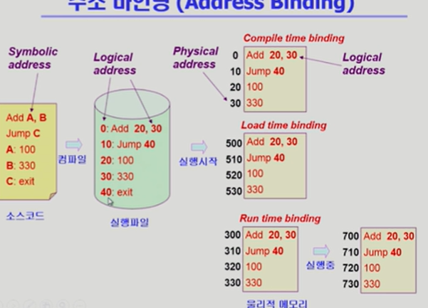
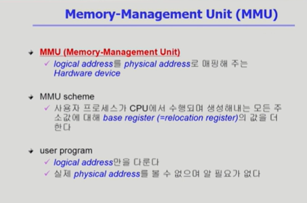
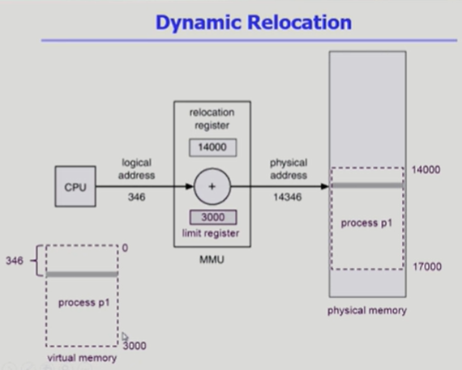
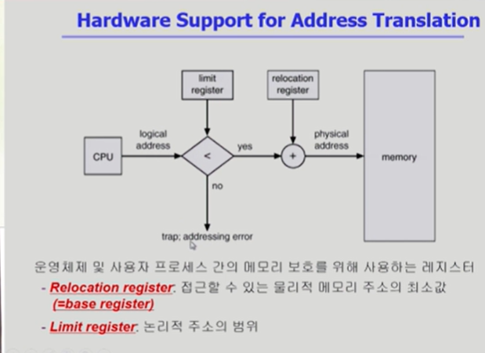

### 메모리 관리

메모리라는건 주소를 통해서 접근하는 매체.

메모리에는 주소가 매겨짐.

주소를 크게 두가지로 나누면 첫번째가 논리적인 주소이고
두번째는 물리적인 주소.

프로그램이 실행되면 독자적인 주소공간이 형성된다.

이런식으로 프로그램마다 가지고있는게 가상주소이고 동시에 논리적인 주소라고 말함.

프로그램이 실행되면 논리주소를 가지고있음 물리주소는 실제 물리적인 주소 메모리에 프로그램이 어디로올라가느냐 이게 물리

어짜피 물리는 하나로 관리되기때문에.

실행이 되려면 물리적인 메모리 어딘가로 가야되고.

이런 주소를 결정하는것을 주소 바인딩이라고하기도함.

로지컬에서 물리적으로 넘어가는 이 시점이 언제인가?

프로그래밍을 할때 메모리 특정위치에 변수를 저장하지만 메모리 몇번지에다가 저장하는게 아니라 어떤 이름에 변수 뭐를 저장해라.

이런식으로 저장한다.

프로그래머 입장에서는 숫자로 된 주소를 사용하지않고 심볼로 된 주소를 사용함

이걸 심볼릭 어드레스 라고한다.

이게 컴파일 되면 숫자로 된 주소로 바뀐다.

주소 변환이 이루어지는 시점이 3가지 가 있다.

컴파일 타임 바인딩=> 이건 컴파일 시점

로드 타임 바인딩 => 실행 시작될때

익스큐션 타임 바인딩 => 혹은 런타임 바인딩

심볼릭 어드레스 였던 소스코드가 컴파일 되면 실행파일에서는 로지컬 어드레스가 된다.

컴파일 시점에 이미 물리적인 주소는 정해지는 것임.

컴파일 타임 바인딩을 쓰게되면 프로그램을 물리적인 메모리에 올릴떄는 항상 이미 결정된 주소로 올려야된다.

물리적인 메모리에 다른 주소는 비어있음에도 불구하고 항상 이프로그램은 같은 위치에만 걸려야되는게 컴파일 타임에서 미리 결정되어서 대단히 비효율적임.

지금의 컴퓨터 시스템에선 컴파일 타임 바인딩을 하진않지만 예전에 컴터안에서 하나만 실행되던떄는 물리적인메모리를 컴파일할때 확정시키곤했다.

두번째가 로드 타임 바인딩.

프로그램이 시작되서 메모리에 올라갈때 물리적인 메모리 주소가 결정되는것.

컴파일타임에는 논리적인주소만 결정하고 실행시작하면 500이 비어있더라하면 500부터 넣는.

세번쨰 런타임 바인딩은. 로드타임처럼 실행시에 주소가 결정되는건 똑같은데
주소가 실행도중아 바뀔 수있음.

지금의 컴퓨터 시스템은 런타임 바인딩

컴파일 타임 바인딩을 사용할 때는 논리적이면서도 물리적인 주소에 픽스되는것이기때문에

컴파일 타임 바인딩에 의해서 생긴코드를 절대로드라고 말함 (absolute code)

load time binding 은 재배치 가능 코드 라고 해서 항상 수정 위치에 올라가는게 아니라 실행시에 어느위치든지 올라갈수있는코드라는것.

컴파일이나 로드는 실행될떄 주소가 결정되는데

런타임은 실행중에도 주소가 바뀜

그래서 메모리 주소를 요청할때마다 주소를 체크해야됨.

cpu가 바라보는 주소는 로지컬 어드레스임.

컴파일된 코드 자체에 들어간 것 까지는 못바꿈.

메모리에 올라갈떄 시작위치는 바뀌지만 안에있는 코드상의 주소는 로지컬 어드레스로 남아있으 수밖에없다.

즉 cpu가 바라보는것도 로지컬일수밖에없음.

몇번지 달라고하면 그때 주소변환해서 cpu 한테 전달을함.

런타임 바인딩부터는 그때마다 주소변환이 필요해서 주소변환용 하드웨어가 필요함.

이걸 MMU 라고 한다

### MMU

os의 모듈이 아니고 하드웨어임

프로그램이 메모리에 올라갈때 통째로 올라가는걸 설명한게 여지껏했던것들.

주소변환을 할때에는 기본적인 mmu에서는 레지스터 2개를 활용해서 주소변환을 하게된다.

cpu가 메모리 346번쨰에있는 내용을 달라 하면 이게 로지컬 어드레스

주소변환이 필요한데 이 주소변환을 해주는게 mmu고 가장 간단한게 레지스터 2개

그 두개는 리로케이션 레지스터(베이스 레지스터) 와 리미트 레지스터 두개를 이용해서 주소변환을한다.

주소변환은 어떻게해주면되느냐.

시작위치 -> 14000 하고논리주소를 더해주면됨
14000이 버츄얼의 0 이기떄문에 14346

그림상으로는 그렇다.

리미트 레지스터는 이 프로그램의 크기를 담고있는것(3000)

이프로그램이 악의적인 프로그램이라서 3000임에도 불구하고 인스트럭션을 통해서 메모리 4000번쨰 달라고하면

프로그램 p1 이 아니라 그바깥이 될것임.

있지도 않은 4000을 달라고할시에 ㅇ

다른 프로그램 메모리 위치를 요청하게됨. 그런경우에는? 주면안됨 남의프로그램 메모리를 보려고하는 악의적인 프로개름이기떄문

그래서 cpu가 주게되면 리미트 레지스터 가 프로그램 크기보다 큰지. 확인하고 틀리면 트랩이걸리게됨

운영체제는 트랩이 왜 걸렸는지 확인해보고 응징을한다.

로지컬 어드레스가 크기이내에 있는것이였다면 리로케이션 거쳣 cpu 에 ㅈㄴ달

그게 바로 mmu scheme

사용자 프로그램은 로지컬 어드레스만 다루며 실제 물리주소를 볼 수없으며 알 필요도 없음

### Dynamic Loading

동적로딩

프로그램을 메모리에 올려야 실행이되는데 메모리에 동적으로 올린다.는것은? => 그때그때 필요할 떄마다 메모리에 올리는것

대게 프로그램은 방어적으로 만들어지기떄문에
좋은 소프트웨어일수록 이상한것이 들어와도 처리가 잘됨

미리 올려놓는게 아니라 그런 상황이 생기면 그때 올려놓는 것을 활용

페이징 시스템은 운영체제가 직접관리

보통 다이나믹 로딩이라함은 운영체제가하는게 아니고 프로그래머가 직접함

운영체제가 다이나믹 로딩을 쉽게할수있게 제공하면 라이브러리 써서 만듦

### Overlays

내용만 보면 다이나믹 로딩이랑 비슷한데

다른것은 ? =>역사적으로 다름

초창기 컴퓨터시스템에 메모리 크기가 워낙 작아서 프로그램하나를 올려놓는것조차 불가능했다.

그래서 초창기에 프로그래머가 수작업으로 구현함.
그래서 매우 복잡하고 다른말로 매뉴얼오버레이라고함

다이나믹은 프로그래머가 라이브러리로 해서 자세히알필요없고
오버레이는 다알아야되고

### Swapping

프로세스를 메모리에서 통째로 쫓아내는 것
