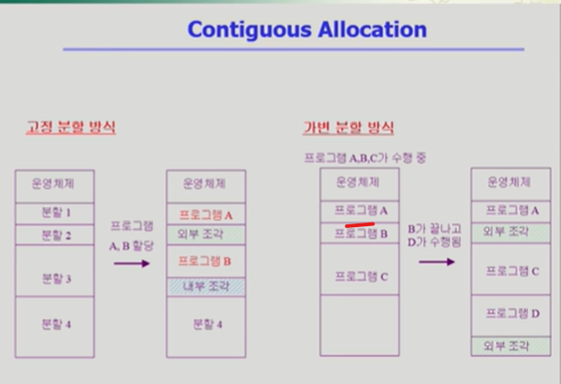
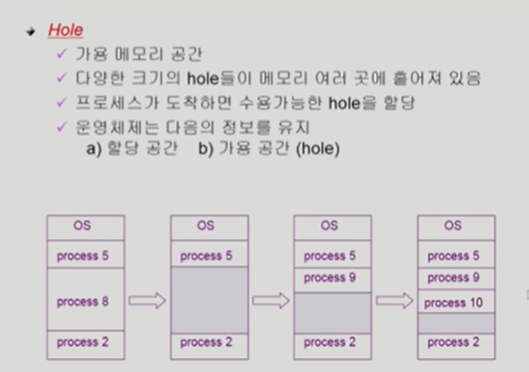
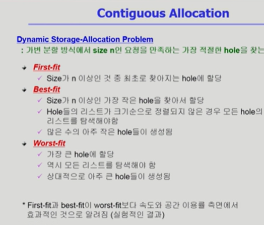
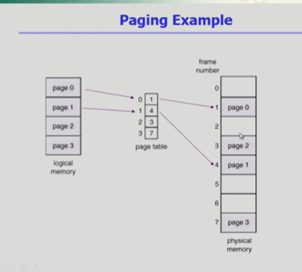
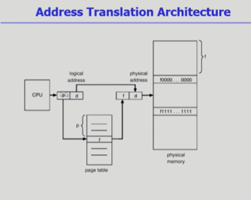
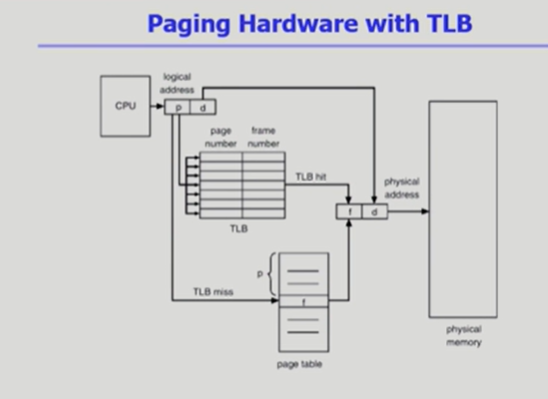
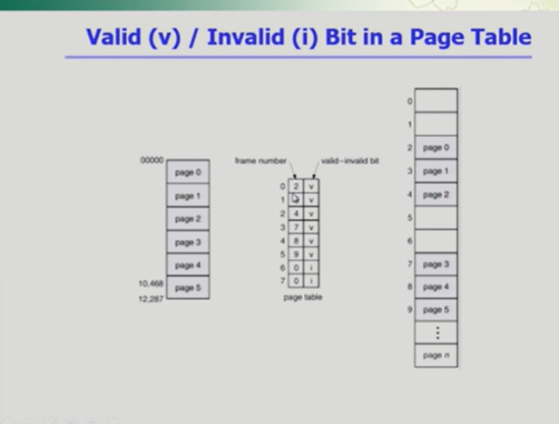
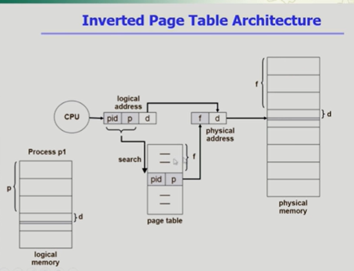
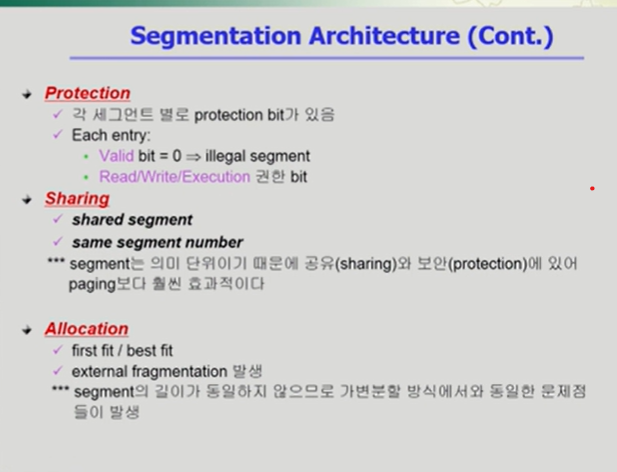
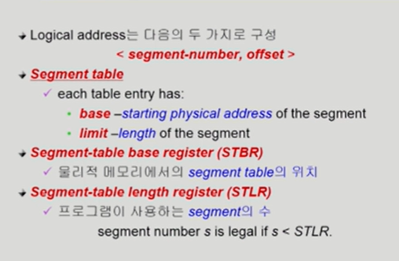

### 메모리 관리

메모리라는건 주소를 통해서 접근하는 매체.

메모리에는 주소가 매겨짐.

주소를 크게 두가지로 나누면 첫번째가 논리적인 주소이고
두번째는 물리적인 주소.

프로그램이 실행되면 독자적인 주소공간이 형성된다.

이런식으로 프로그램마다 가지고있는게 가상주소이고 동시에 논리적인 주소라고 말함.

프로그램이 실행되면 논리주소를 가지고있음 물리주소는 실제 물리적인 주소 메모리에 프로그램이 어디로올라가느냐 이게 물리

어짜피 물리는 하나로 관리되기때문에.

실행이 되려면 물리적인 메모리 어딘가로 가야되고.

이런 주소를 결정하는것을 주소 바인딩이라고하기도함.

로지컬에서 물리적으로 넘어가는 이 시점이 언제인가?

프로그래밍을 할때 메모리 특정위치에 변수를 저장하지만 메모리 몇번지에다가 저장하는게 아니라 어떤 이름에 변수 뭐를 저장해라.

이런식으로 저장한다.

프로그래머 입장에서는 숫자로 된 주소를 사용하지않고 심볼로 된 주소를 사용함

이걸 심볼릭 어드레스 라고한다.

이게 컴파일 되면 숫자로 된 주소로 바뀐다.

주소 변환이 이루어지는 시점이 3가지 가 있다.

컴파일 타임 바인딩=> 이건 컴파일 시점

로드 타임 바인딩 => 실행 시작될때

익스큐션 타임 바인딩 => 혹은 런타임 바인딩

심볼릭 어드레스 였던 소스코드가 컴파일 되면 실행파일에서는 로지컬 어드레스가 된다.

컴파일 시점에 이미 물리적인 주소는 정해지는 것임.

컴파일 타임 바인딩을 쓰게되면 프로그램을 물리적인 메모리에 올릴떄는 항상 이미 결정된 주소로 올려야된다.

물리적인 메모리에 다른 주소는 비어있음에도 불구하고 항상 이프로그램은 같은 위치에만 걸려야되는게 컴파일 타임에서 미리 결정되어서 대단히 비효율적임.

지금의 컴퓨터 시스템에선 컴파일 타임 바인딩을 하진않지만 예전에 컴터안에서 하나만 실행되던떄는 물리적인메모리를 컴파일할때 확정시키곤했다.

두번째가 로드 타임 바인딩.

프로그램이 시작되서 메모리에 올라갈때 물리적인 메모리 주소가 결정되는것.

컴파일타임에는 논리적인주소만 결정하고 실행시작하면 500이 비어있더라하면 500부터 넣는.

세번쨰 런타임 바인딩은. 로드타임처럼 실행시에 주소가 결정되는건 똑같은데
주소가 실행도중아 바뀔 수있음.

지금의 컴퓨터 시스템은 런타임 바인딩

컴파일 타임 바인딩을 사용할 때는 논리적이면서도 물리적인 주소에 픽스되는것이기때문에

컴파일 타임 바인딩에 의해서 생긴코드를 절대로드라고 말함 (absolute code)

load time binding 은 재배치 가능 코드 라고 해서 항상 수정 위치에 올라가는게 아니라 실행시에 어느위치든지 올라갈수있는코드라는것.

컴파일이나 로드는 실행될떄 주소가 결정되는데

런타임은 실행중에도 주소가 바뀜

그래서 메모리 주소를 요청할때마다 주소를 체크해야됨.

cpu가 바라보는 주소는 로지컬 어드레스임.

컴파일된 코드 자체에 들어간 것 까지는 못바꿈.

메모리에 올라갈떄 시작위치는 바뀌지만 안에있는 코드상의 주소는 로지컬 어드레스로 남아있으 수밖에없다.

즉 cpu가 바라보는것도 로지컬일수밖에없음.

몇번지 달라고하면 그때 주소변환해서 cpu 한테 전달을함.

런타임 바인딩부터는 그때마다 주소변환이 필요해서 주소변환용 하드웨어가 필요함.

이걸 MMU 라고 한다

### MMU

os의 모듈이 아니고 하드웨어임

프로그램이 메모리에 올라갈때 통째로 올라가는걸 설명한게 여지껏했던것들.

주소변환을 할때에는 기본적인 mmu에서는 레지스터 2개를 활용해서 주소변환을 하게된다.

cpu가 메모리 346번쨰에있는 내용을 달라 하면 이게 로지컬 어드레스

주소변환이 필요한데 이 주소변환을 해주는게 mmu고 가장 간단한게 레지스터 2개

그 두개는 리로케이션 레지스터(베이스 레지스터) 와 리미트 레지스터 두개를 이용해서 주소변환을한다.

주소변환은 어떻게해주면되느냐.

시작위치 -> 14000 하고논리주소를 더해주면됨
14000이 버츄얼의 0 이기떄문에 14346

그림상으로는 그렇다.

리미트 레지스터는 이 프로그램의 크기를 담고있는것(3000)

이프로그램이 악의적인 프로그램이라서 3000임에도 불구하고 인스트럭션을 통해서 메모리 4000번쨰 달라고하면

프로그램 p1 이 아니라 그바깥이 될것임.

있지도 않은 4000을 달라고할시에 ㅇ

다른 프로그램 메모리 위치를 요청하게됨. 그런경우에는? 주면안됨 남의프로그램 메모리를 보려고하는 악의적인 프로개름이기떄문

그래서 cpu가 주게되면 리미트 레지스터 가 프로그램 크기보다 큰지. 확인하고 틀리면 트랩이걸리게됨

운영체제는 트랩이 왜 걸렸는지 확인해보고 응징을한다.

로지컬 어드레스가 크기이내에 있는것이였다면 리로케이션 거쳣 cpu 에 ㅈㄴ달

그게 바로 mmu scheme

사용자 프로그램은 로지컬 어드레스만 다루며 실제 물리주소를 볼 수없으며 알 필요도 없음

### Dynamic Loading

동적로딩

프로그램을 메모리에 올려야 실행이되는데 메모리에 동적으로 올린다.는것은? => 그때그때 필요할 떄마다 메모리에 올리는것

대게 프로그램은 방어적으로 만들어지기떄문에
좋은 소프트웨어일수록 이상한것이 들어와도 처리가 잘됨

미리 올려놓는게 아니라 그런 상황이 생기면 그때 올려놓는 것을 활용

페이징 시스템은 운영체제가 직접관리

보통 다이나믹 로딩이라함은 운영체제가하는게 아니고 프로그래머가 직접함

운영체제가 다이나믹 로딩을 쉽게할수있게 제공하면 라이브러리 써서 만듦

### Overlays

내용만 보면 다이나믹 로딩이랑 비슷한데

다른것은 ? =>역사적으로 다름

초창기 컴퓨터시스템에 메모리 크기가 워낙 작아서 프로그램하나를 올려놓는것조차 불가능했다.

그래서 초창기에 프로그래머가 수작업으로 구현함.
그래서 매우 복잡하고 다른말로 매뉴얼오버레이라고함

다이나믹은 프로그래머가 라이브러리로 해서 자세히알필요없고
오버레이는 다알아야되고

### Swapping

프로세스를 메모리에서 통째로 쫓아내는 것
어디로? => 하드디스크로
이걸 backing store , swap area라고도 부른다.

메모리에서 쫓겨나서 백킹스토어로 내려가는걸 스왑 아웃이라고하고
백킹 스토어에서 올라오는걸 스왑인이라고함.

중기스케쥴러를 다른말로 스왑퍼 라고 부르기도함.

메모리에 너무많은 프로그램이 올라와있으면 시스템이 굉장히 비효율적이 되기때문에. 중기 스케쥴러가 일부 프로그램을 골라서 통째로 메모리에서 쫓아내는 일을 하게됨

어떤 프로그램을 쫓아내야한다면 cpu 소요가능성이낮은 애를 스왑아웃시키는게 효율적일것.

스와핑 시스템이 지원이 되기위해선 바인딩과 연결해서 생각해봐야됨

컴파일 타임 바인딩이나 로드 타임 바인딩이 사용이 되고있다면
스와핑에서 쫓겨났다가 메모리로 돌아올때는 원래위치로 와야된다.

스와핑이 좀더 효율적으로 동작하려면 런타임바인딩이 지원이되어야됨.

300에서 쫓겨나면 나중에 메모리에 올라갈때 다른위치로도 갈수있어야.

디스크 접근 시간이 대부분 양에 비례함.

본연의 스와핑의 의미는 전부 쫓겨나는거고

최근에는 페이징시스템으로 전체가 쫓겨나는게아니라 잘개 쪼개서 일부만 나가고 올라가는것도 스왑아웃됬다고 표현.

### Dynamic Linking

Linking을 실행시간 까지 미루는 기법

링킹? => 프로그램을 작성한다음에 컴파일하고 링크에서 실행파일을 만들게되는데 링크라는건 여러군대 존재하는 컴파일된 파일들을 하나로 묶는거

소스파일을 여러개 따로 코딩을해서 링킹을 하기도하고. 내가 작성안한 함수지만 필요할때 내가 불러다 쓰는 라이브러리들도 결국 링킹이되어서 실행파일이 만들어지면 내 코드안에 라이브러리가 포함되기도함.
이런식의 링킹을 Static linking이라고함

- Static linking
  라이브러리가 프로그램의 실행 파일 코드에 포함됨
  실행 파일의 크기가 커짐
  동일한 라이브러리를 각각의 프로세스가 메모리에 올리므로 메모리 낭비

- Dynamic linking
  라이브러리가 실행시 연결됨
  라이브러리 호출 부분에 라이브러리 루틴의 위치를 찾기위한 stub이라는 작은 코드를 둠
  라이브러리가 이미 메모리에 있으면 그 루틴의 주소로 가고 없으면 디스크에서 읽어옴
  운영체제의 도움이 필요함

라이브러리 위치 찾는것만 내거에다가 넣어두는것
다이나믹 링킹을 해주는것을 shared library 라고함

### Allocation of physical memory

물리적인 메모리를 어떻게 관리할 것인가.

물리적인 메모리는 낮은 주소영역에는 운영체제 커널이 항상 상주하고있고

높은 주소영역에는 사용자 프로그램이 올라가있다.

사용자 프로세스 영역의 할당방법에는 두가지가있는데

1. Contiguous allocation
   연속할당
   앞에서 봤던것들이 연속할당에 해당함.

2. Noncontiguous allocation
   불연속할당

주소공간을 잘게 쪼개서 일부는 이쪽 일부는 저쪽 그게 가능해지는것

프로그램의 주소공간을 페이지로 짤라가지고 하는게 페이징기법임

- 연속할당

연속할다도 크게 두가지가있음

1. 고정 분할

프로그램이 들어갈 사용자 메모리영역에 미리 파티션으로 나누어놓는것
낭비되는 메모리 조각이 생기게되는데

이걸외부조각 내부조각으로 나눠서 설명함.

외부조각? => 이프로그램을 메모리에 올리고싶은데 올릴려는 프록램보다 메모리 조각의 크기가 더 작아서 사용이안되면 . 프로그램이 들어갈수있는공간임에도 불구하고 너무작아서 못들어가면 외부조각

내부조각? => 프로그램의 크기가 할당되었지만 남는. 그러면 내부조각 할당은 되어있지만 사용은안되는.

지금은 외부조각이되어있지만 나중에 아주 작은 프로그램이 나와서 들어가면 또 외부조각이아닌.
그래서 그때그때마다 조각에대한 시각이달라짐.

고정분할에는 이렇게 외부와 내부조각의 문제가있다.

그러면 굳이 이렇게 고정 분할방식으로 나눌 필요가있는가?

2. 가변 분할 방식
   

사용자 프로그램이 들어갈 영역을 미리 안나눠놓는것

프로그램이 실행될때마다 차곡차곡 메모리에 올려놓는 방법

프로그램을 올려놓고 실행하다가 b가 끝나면 D가 수행되는.

가변 분할 방식을 쓰더라도 프로그램 크기가 균일하지않기때문에 . 외부조각 이 생길수가있다.

연속할당은 고정과 가변분할로 나눌수있고

각각의 방법중 고정은 융통성이 없다. 외부 내부 조각이 발생.
가변은 외부 조각이 발생

가변 분할 방식을쓰게되면 hole이 생김

여기서 홀이라는건 가용 메모리 공간.

Dynamit Storage-Allocation Problem
가변분할방식에서 가장 적절한 hole을 찾는 문제.

홀의 크기가 프로그램의 크기인 n 보다는 커야됨.

3가지 알고리즘

- First-fit
  처음 발견되는 홀에다가 그냥 할당

- Best-fit
  프로그램 크기랑 가장 잘 맞는 hole에 할당

- Worst-fit
  가장 큰 hole에 할당 (어리석은방법)

여러군대에있는 hole을 한군대에 몰아넣는걸 compaction 이라고함

그럼 홀이작아서 활용못하는걸 사용가능해짐

디스크 조각모음 => 디스크에있는 데이터를 이동시키는 방법
compaction은 실행중이 메모리를 한군대로 밀기때문에 매우 비용이 많이듦 (전체 프로그램의 바인딩과 관련되기때문에 비용이 많이 든다)

실제 현대 에서 사용하는 방법은 불연속 할당이기때문에 위의 문제들로부터 자유롭다.

1. 페이징 기법
   하나의 프로그램을 구성하는 주소공간을 같은 크기의 페이지로 짤라서 페이지 단위로 물리적인 메모리에 올려놓거나 backing스토어에 내려놓거나하는게 페이징 기법
   이걸 쓰면 홀들의 크기가 균일하지않거나 컴팩션 하는 일들이 필요없음. 비어있는건 페이지 프레임이라서 위치는 아무대나 들어갈수있다.

   대신 불연속할당을 쓰면 주소 변환이 복잡해진다. 주소변환을 페이지 별로 해야되기때문에 바인딩이 복잡해진다.

2. 세크맨테이션

프로그램 주소공간을 의미있는 단위로 짜르는거. 같은공간이아니라.
프로그램을 구성하는 주소공간이라는게 코드 데이터 스택으로 ㄱ구성되는데

세그멘테이션은 각각 코드 세그멘 테이션 데이터세그멘테이션 스택세그멘테이션으로

세그멘테이션이 의미 단위이기떄문에 각각의 함수를 다른 세그먼트로 나누면 다른곳에서도 올릴수있고 세그멘테이션 단위로 주소변환

3. paged segmatiation
   위에 두개 합친거

---

### Memory Management 2

통쨰로 올려놓는 방법에 대해서 설명했었고

물리적인 메모리에 올려놓을때 통째로 올려놓기때문에 변환하는게 간단했다.

몇번지에 올라가는지 시작주소만알면 주소변환이 쉬웠다.

페이징기법은 동일한크기로 잘려서 각각의 페이지가 어디든지 올라갈수있는 방법
이런 경우에는 주소변환이 단지 시작위치만 가지고 이루어지는게 아니라

각각의 페이지가 어디에 올라가있는지 알기위해선

페이지별로 주소변환하는과정이 필요함.

논리적인 페이지 0 번이 물리적인 페이지 몇번에 올라가있는가.

그 주소변환을 위한게 바로 페이지테이블

그래서 페이지테이블은 논리적인 주소만큼 있다.

자료구조시간에 굳이 테이블이라는 말을쓰진않고 배열이라고 함

0번페이지는 1번 페이지에 올라가있다는것을 사진의 테이블이 알려주는형태.

cpu 가논리적인 주소를 주면 이걸 물리적인 주소로 바꿔야되는데

페이지기법에서는 이를 위해 페이지테이블을 사용.

논리적인 페이지 번호에 해당하는 엔트리를 p번째 찾아가면 f라는 페이지 프레임 번호가나오는것.
그럼 논리적인 주소를 물리적인 주소로 바꾸게되는데 이건 몇번째프레임인지를 가리킨다.

메모리에 접근하기위해서는 주소변환을 해야되고 주소변환을 위해선 페이지테이블.

메모리 접근을 위해서는 2번의 메모리 접근이 필요함. 한번은 주소변환 / 한번은 실제 접ㅂ근.

레지스터 두개가 페이징 기법에서는 페이지 테이블 베이스랑 렝스 용도로 사용됨.

시작위치를 레지스터가 가리키고있고, 페이지테이블의 길이를 PTLR이라는 애가 가지고있음.

메모리 접근에 두번이 필요하다는건 비용이큰것임.

그래서 별도의 하드웨어를 사용하는데 TLB 라고 하는 일종의 캐시를 사용.

메인메모리보다 빠른 메인메모리와 cpu 사이에 존재하는.

cpu가 주는 논리주소에 대해서 메모리상에 존재하는 페이지 테이블 통해 주소변환하고 변환된 주소로 물리적인 메모리 접근.

이 속도를 개선하기위한게 TLB라는 별도의 하드웨어를 들인다.

메인메모리안에 캐시메모리가있는데

이 캐시메모리는 운영체제한테는 감추어진 계층임

메인 메모리에서 빈번히 사용되는 데이터를 캐시메모리에 넣어서 사용 ㅇ

주소변환을 위한 별도의 캐시를 갖는게 같은 맥락의 TLB

용도가 조금 다름 ㅇ 얘는 주소변환

빈번히 참조되는 일부 엔트리를 캐싱한다.

주소변환을 위해서 TLB에 있는 지 확인할려면 전부다TLB를 전부 훑어야됨

그래서 없으면 페이지테이블로.

TLB는 특정하나가 아니라 전체를서치해야됨.

그런걸 막기위해서 TBL는 병렬 서치가 가능함.

페이지테이블이라는게 각각의 프로세스 마다 존재.

tlb도 프로세스 마다 다른정보가된다.

2단계 테이블을 쓰는 이유 ? => 속도는 줄어들지않는데 페이지테이블을 위한 공간이 줄어드는게 그 이유임

현대 컴퓨터는 메모리 주소체계가 굉장히 큼.

최근에는 64비트까지 사용

논리주소는 프로그램마다 독자적으로 가지고있는 주소.

메모리에는 주소가 바이트단위로 매겨짐.
2의 30승 이 기가

2의 10승이 킬로

2의20승이 메가

2 32승이 32메모리 주소에서 활용할수있는 공간이고 이는 4기가바이트가된다.

32비트 주소체계는 2의32승으로 4기가.

4기가 로 표시할수있는 총공간을 페이지단위로 끊어내는데 페이지당 4키로바이트 임

페이지는 총 1m개의 페이지 갯수가 나옴.

페이지테이블 엔트리가 백만개이상 (1메가)가 필요

페이지테이블도 메모리에 들어가고 , 각프로그램마다 페이지테이블이따로있는데 이걸 다 메모리에 넣으면 공간낭비가 심함.

각각의 페이지테이블 엔트리가 보통 4 바이트 정도된다.

이런 공간낭비가 심해서 2단계 테이블을 쓴다.

전체메모리 주소공간중 실제 프로그램이 사용하는건 굉장히 일부분

코드데이터스택 위에 코드데이터가있고 아래에 스택이있는.

중간에는 논리주소.

2단계 페이지에서 테이블에서 중요한건

안쪽 페이지 테이블 크기가 페이지 크기와 똑같음

안쪽 페이지 테이블은 테이블 자체가 페이지화 되서 페이지 어딘가에 들어가 있게 되는것임.

페이지 테이블이 프로그램마다 엔트리가 백만개이상 필요한데 이단계 페이지 테이블을 쓰면 안쪽테이블은 여전히 백만개가 필요하고 공간적으로도 1단계보다 손해인데

왜 2단계를 쓰게되는가?

프로그램을 구성하는 부분중에서 상당부분을 사용하지않는데 페이지테이블로 만들때는 안만들수가없음.

사용이 안되더라도 페이지테이블 엔트리는 맥시멈로지컬 메모리 크기만큼 만들어져야된다.

그리고 2단계 페이지테이블을 쓰면

바깥쪽테이블은 전체 논리적인 메모리 크기만큼 만들어지지만.

실제로 사용이 안되는 주소에 대해서 안쪽 테이블이 안만들어지고 null 이되는것임.

상당부분이 실제로 안쓰는것이기때문에 이런ㄴ식으로 null로 만들면 안쪽테이블공간을 안만들어도된다.

### Memory Management 3

페이지 테이블을 다단계로 사용할수도있음.

이렇게하면 테이블을 위한 공간을 더 많이 줄일수 있지만, 더많은 테이블을 거쳐야되고 주소변환을 위해서 메모리에 n번접근해야됨.

시간은 오래걸려도 대부분은 TLB에서 이루어지기떄문에 시간이 지나치게 오래걸리지는 않음.

프로그램에 주소공간이 가질수있는 맥시멈 사이즈만큼 페이지테이블이 생겨야된다고 전에 이야기했었음.

valid => 실제로 올라와있다.

1 번페이지가 2번에 실제로 올라가있다의 표시

valid inValid 는 각 주소 정보가 맞다 아니다.

invalid 의 경우에는 의미가 두가지인데 아예 그 주소가 사용되지않거나 / 물리적인 메모리가아니라 swap area( 백킹스토어) 에 올라가있는것.

valid, invalid 외에 Protection bit 이라하여
page에 대한 저근 권한이있다.

여기서의 protection의 의미는 페이지에 대한 읽기권한이있냐 쓰기권한이 있느냐

### Inverted Page Table

페이지 테이블의 문제: 많은 용량을 차지한다.

페이지 테이블 자체가 많은 공간을 차지해버림

그래서 공간오버헤드가 굉장히 컸다.

그걸 막기위한게 inverted page table

inverted page table은 각페이지 마다 테이블이있는게 아니라 시스템안에 하나의 테이블이있음.

페이지테이블의 엔트리가 프로세스의 테이블 갯수만큼이아니라

물리적인 메모리의 페이지 프레임 갯수만큼있는것.

주소변환이라는건 로지컬 어드레스를 피지컬 어드레스로 바꾸는건데

지금 테이블은 피지컬을 보고 로지컬로 바꿀수있는 테이블임

테이블의 묘미 배열의 인덱스처럼 바로 찾는게 묘미인데 인버티드 테이블은 그런 묘미가 없고 전부 검색해야.

결국 페이지테이블을위한 공간을 줄일려고쓰는것.

문제는 시간적인 오버헤드가있다.

### Shared Page Example

p1 p2 가 각각 같은코드를 쓴다고하면 페이지테이블은 따로있겠지만 맵핑은 오른쪽과 같이 되어있다.

공유할수있는 코드는 별도로 올리는게아니라 같은 프레임으로 맵핑시켜서 메모리에 올릴수있다.

다른말로는 re-entrant code(pure code) / 재진입 가능한 코드라고한다.

read-only로만 올려야됨.

- Private code and data
  프로세스마다 별도로 가져야되는 페이지들은 각각 다른 프레임으로 매핑되도록함.

  여기서 중요한건 Shared code는 두가지를 만족해야됨

  1. readonly
  2. 동일한 logical address에 위치해야됨

### Segmentation

페이징 기법이라는것 은 프로그램을 구성하는 주소 를 같은 크기의페이지단위로 짜른거고

세그멘테이션은 의미단위로 . (코드/데이터/스택)

로지컬 어드레스는 다음의 두 가지로 구성 => 세그먼트 넘버, offset

cpu가 논리주소를 주게되면 이걸 세그먼트번호랑 오프셋으로 나눔
시작위치는 레지스터. => 세그먼트 번호만큼 떨어진 엔트리로가면 세그먼트가 물리적 메모리의 어떤 변수에 올라가있는지 가지고있음.

물리적 메모리의 시작위치외에 limit 이라는 길이를가지고있음

페이징 기법은 전부 길이가 동일했지만 세그먼트는 그렇지 않기때문.

주소변환을 할때 크게 두가지를 확인해야되는데

1. 논리주소의 세그먼트 번호가 세그멘트 테이블 length 보다 작은갓인지 확인해야됨
   그것보다 크면 잘못된 시도

2. 세그먼트 길이가 1000인데 떨어진길이(offset)이 더 크진않은가.

세그먼트도 크기가 동일하지않아서 중간중간 홀이 생긴다

그게 세그멘테이션의 단점.

크기가 동일하지않기때문에 가변분할 방식에서와 동일한 문제점들이 발생

### Memory Management 4

세그멘테이션 기법은 프로세스의 주소공간을 동일한 단위가아니라 의미단위로 관리하는 방법

물리적인 메모리에는 세그멘트 단위로 올라갈수있기때문에.

주소변환도 세그멘트 별로 이루어질수있다.

앞부분은 세그먼트 번호 뒷부분은 떨어진 거리 (offset)

페이지 테이블의 경우 엔트리 갯수가정해져있음. 최대영역만큼

세그먼트의 경우 엔트리갯수가. 프로그램을 사용하는 세그먼트 갯수로 정해짐.

세그먼트가 몇있느냐에따라 엔트리갯수가만들어진다.

페이징 기법과 다르게 세그먼트는 균일하지않음.

세그먼트의 길이가 얼마인지.

테이블의 엔트리에 같이 담고있다.

### 세그멘테이션 아키텍쳐

STBR, STLR

이두개의 레지스터는 원래 주소변환을 위해서 제공되던 cpu안의 레지스터가 두개있을것

연속할당기법에서는 어짜피 프로그램 통쨰로 메모리에 올라가니까.

프로그램시작위치를 베이스 레지스터에 담고 길이를 리미트 레지스터에 담아 사용.
페이징기법에 오면 그 두개의 레지스터를 페이지 테이블 시작위치와 길이를 담았음.

세그먼트 테이블이 메모리의 어디에 올라가있는지를 알아야.

세그먼트의 엔트리갯수가 몇개인지 STLR이 담고있다.

원리는 크게 다르지않다.

비교하라고하면 공간낭비가 심하다는것. 과 의미단위로 나뉜다느것.

의미단위로 나누다보니 공유와 보안에있어 페이징 보다 훨씬 효과적이다.

세그멘테이션은 allocation 문제가있다.=>공간 할당(가변할당과 같은 문제)

페이지는 갯수많고 세그먼트는 갯수가 많지않다.

### 세그멘테이션과 페이징의 혼합

Paged Segmantation 이 혼합된것

세그먼트를 여러개의 페이지로 구성하는 기법.

세그먼트 하나가 여러개의 페이지를 구성.

먼저 세그먼트에 대한 주소변환을 하게됨. 세그먼트 번호와 오프셋으로 구성이되고

세그먼트 테이블을 이제 찾음.

레지스터에 세그먼트 시작위치 , s만큼의거리에 가게되면

오리지날에선 세그멘트가 통쨰로 올라가지만

지금 기법은 세그먼트하나가 여러개의 페이지로 구성이됨.

메모리에 올라갈때는 페이지단으로 쪼개서 올라가게된다.

장단점으로 보면 크기가달라서 allocation 문제가 생기는건 사라진다.

의미단위로 해야되는공유나 보안업무는 세그먼테이션 레벨에서 진행.

그래서 두가지방법의 장점을 다 누릴수있다.
이렇게 두가지를 같이 써야 관리가 수월하다.

주소변환도 두단계를 거쳐야.

세그먼테이션을 주소변환하면 페이지테이블의 시작위치가 나옴.

세그먼트당 페이지 테이블이 존재

이전에 프로세스당 페이지 테이블이 존재하던것을 생각.

메모리관리에 운영체제의 역할? 주소변환

이챕터에서 주소변환을 위한 운영체제의 역할은없음. 다 하드웨어가함 (MMU)

세그먼테이션이나 페이징의 일련의 과정에서 운영체제의 역할은없음. 전부다 하드웨어의 역할임.

운영체제가 끼어들어야되는경우? => io 장치 접근.

운영체제도 사실상 하나의 프로그램
