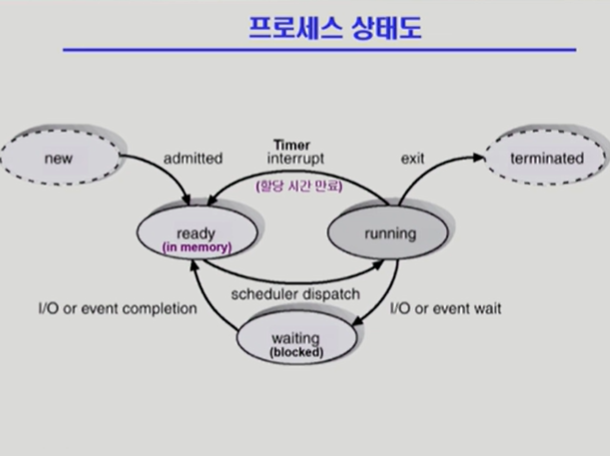
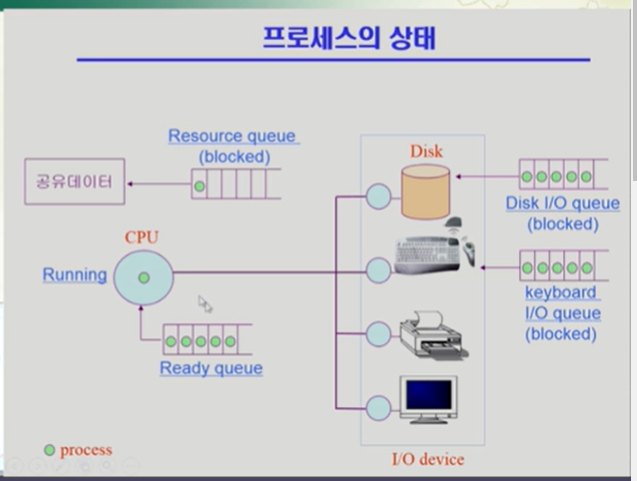
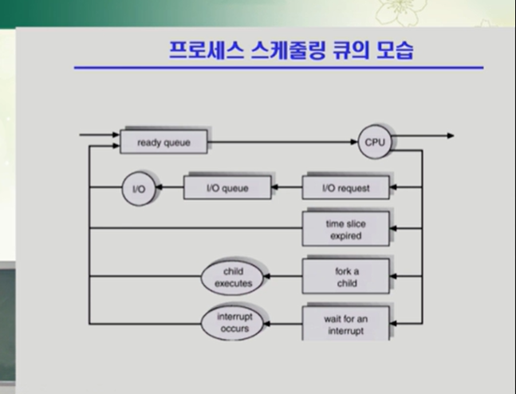
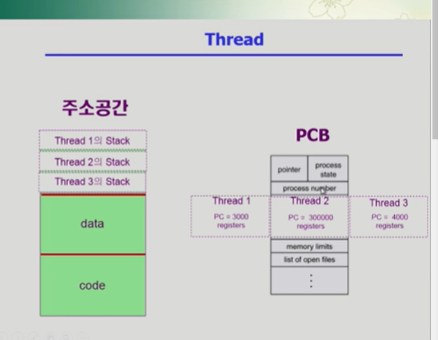
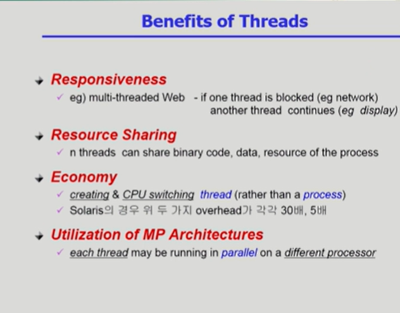
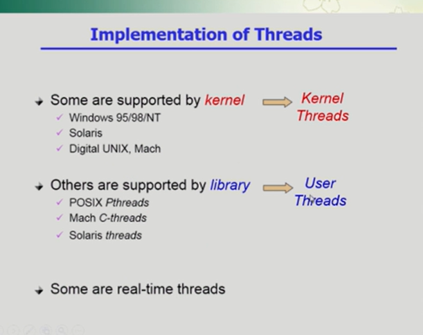

#프로세스

프로세스라는건 한마디로 하자면 실행중인 프로그램을 말함

Process is a grogram in execution

프로세스에서 프로세스의 문맥이 중요하다.

단어가 도대체 어떤 의미로 사용됬는지 이런걸 정확히 알려면 문맥을 봐야되듯.

프로세스에서도 마찬가지임

프로그램이 태어나서 언젠가 종료가 될텐데 문맥이라함은 그 중간어느시점을 탁 짤라놓고 보았을때 이 프로그램이 뭘 어떻게 실행했는지 어떤 시점에 있는지를 정확하게 나타내기위해 사용되는게 문맥임

프로세스의 문맥이라함은 특정시점에 됬을때 이프로세스가 어디까지 실행을했는지.

프로세스라는건 실행이 시작이되면 그프로세스만의 독자적인 주소공간을 형성한다고 했음
=> 코드 / 데이터/ 스택

그러고 난다음에 프로그램 카운터라는 레지스터가 프로세스의 코드 어느부분을 가리키고있고

매순간 인스트럭션을 하나씩 읽어 cpu안으로 넣는다 -> 레지스터로 해서 -> ALU -> 메모리에 저장

이런 식으로 진행하다가 어느시점에 어디까지 와있는지 규명을 하는요소가 프로세스 문맥

현재 시점에 프로세스의문맥을 나타내기 위해서는 프로그램 카운터가 어딜 가리키고있는가 어느부분까지 실행을 했는가 를 알아야 됨

그리고 메모리에 어떤 내용을 담고있는가 도 알아야됨

코드가 실행되면서 함수같은걸 호출했으면 스택에 내용이 쌓여있으니

무슨 내용을 어디까지 쌓아놨는지

그리고 데이타 안에 변수같은게 바뀌고 그랬을것 그래서 지금 변수의 값은 얼마이며 이 프로그램이 실행되면서 레지스터에 어떤값을 넣고 어떤 값을 실행했는가 하는 모든 요소를 알아야

이프로세스의 현재 상태를 나타낼 수 있을것 .

이런식으로 프로세스의 현재 상태를 나타내는 데 필요한 모든 요소를 프로세스의 문맥이라고 함

지금 태어나서 제각각의 문맥은 얼마인가 지식은 얼마나 있고 그런 부분들

현재상태를 쭉 스크리닝해서 알아내듯 . 프로세스 도 마찬가지다.

상태 규명을 위해 필요한 것이 문맥이다.

프로세스의 문맥=>
CPU 수행 상태를 나타내는 하드웨어 문맥
주로 레지스터가 현재 어떤 값을 가지고 있었는가를 나타내게 될 것.

현재시점의 코드 데이터 스택에 어떤 내용이 있는가

프로세스 관련 커널 구조 (PCB => process control block , Kernal stack)
프로세스를 관리하기 위해서 자신의 데이터 영역에 자료구조를 하나가지고있는게 프로세스 컨트롤 블럭

프로세스 하나가 실행될때마다 운영체제는 PCB를 하나씩들고있으며 얼마나 cpu를 주고 메모리를 줄지 나쁜짓을 하진 않는지 관리하는 역할을 한다.

프로세스의 현재상태를 알려면 cpu나 메모리 상태도 알아야되지만

어떤 값을 가지고있느냐 이런것도 알고있어야된다는 이야기

커널이 가지고있는 PCB와 커널 스택이라는게 있다

각 프로세스가 자기 자신의 코드를 실행중일 때는 만일 함수호출이 이루어진다면 본인의 스택에다가 호출하고 리턴하고 관련 정보를 쌓아놓게됨

근데 프로세스가 실행되다가 못하는 일은 운영체제에게 요청을 하는게 시스템콜인데

시스템콜을 하게되면 프로그램 카운터가 커널 주소공간 어딘가를 가리키며 커널의 코드를 실행할것이다.

커널도 함수로 이루어져있고 커널에서 함수호출이 이루어지면 스택에다가 또 관련 정보를 쌓아둠

커널이라는것은 여러 프로세스들이 공유하는 코드라고 할 수 있음

어떤 프로세스 건 간에 운영체제한테 요청을 (서비스를 해달라고 부탁을) 할때

커널의 코드를 실행하게 되고 그러면 커널이 누구의 부탁을 받고실행하는지 매번 다름

커널에서 함수호출이 이루어져서 스택에 정보를 쌓을 때는 프로세스별로 커널을 어떤 프로세스가 호출했는지에 따라 스택을 별도로 들고있음

그렇게 해야 정보가 꼬이는 문제를 막을 수 있음.

프로세스의 현재상태를 규명하기 위해서는 유저스택말고 커널스택도 본인이 어떤 내용을 쌓고있는지에 대한 정보가 필요하다.

이런 일련의 정보를 가지고있으면 현재 프로세스가 어떤 상태에있는지 정확한 규명이된다.

프로세스 혼자 실행이 된다면 알필요가없으나

현대의 컨트롤 시스템에서는 time sharing multi tasking 같이 번갈아가면서 실행이되기떄문에

그러면 현재 어떤값을 넣고 실행했는지 문맥을 알고있지않으면

다음번 cpu를 잡았을때 앞부분 부터 다시실행해야된다거나하는문제가있음

그래서 항상 문맥을 파악하다가 어느시점부터까지했는지 알아야 다음 을 할수있다.

### 프로세스의 상태

프로세스는 상태(state)가 변경되며 수행된다

Running = cpu를 잡고 instruction을 수행중인 상태
Ready = cpu를 기다리는 상태 (메모리 등 다른 조건을 모두 만족하고) => 당장 필요한 부분은 다 끝난 상태라서 cpu만 얻으면 실행할수있을텐데 하는 상태 보통은 Ready 상태에있는것들이 번갈아가며 cpu를 잡았다 놨다 하며 타임 쉐어링을 진행한다.
Blocked (wait, sleep) = CPU를 주어도 당장 instruction을 수행할 수 없는 상태=>
오래걸리는 io 작업을 한다던지 디스크에서 뭘읽어와야되는데 그 읽어온 내용을 보고 나서야 다음 인스트럭션을 싱행할수있다 고 하는것들 / cpu를 얻어봐야 당장 못하는것

코드를 실행할려고 했는데 이부분이 메모리에 올라와있지않고 디스크에 내려가있다. 하는 떄에도 당장 cpu 줘봤자 실행이안됨 . 그런 프로세스도 blocked

process 자신이 요청한 event(I/O) 가 즉시 만족되지 않아 이를 기다리는 상태

경우에 따라 하단의 두가지도 추가

New: 프로세스가 생성중인 상태
Terminated : 수행(execution) 이 끝난 상태

### 프로세스 상태도

처음에생성중이였다가 생성되면 레디 (최소한의 메모리를 갖고있음) 여기서 본인차레가 되면 러닝

여기서 내려놓는것은 1. 자진해서 내놓음 (오래걸리는 작업이라서 가지고있어봐야 못한다 그럴때) 블럭 2. cpu를 계속 쓰고싶은데 Timer interrupt(이번에 할당된시간을 뺏김)= 이건 다시 레디로 대기 3. 다해서 종료

### 프로세스의 상태

보다시피 queue 가 여러개

cpu는 빠르고 여럿이 공유하기때문에 연두색으로 된 곳이 process 이다.

하나의 프로세스가 cpu에서 런닝을 하고있다가 타이머 인터럽트가 들어오면 다시 줄서고

디스크에서 읽어오는게 끝나면 디스크 컨트롤러가 cpu에게.

io요청 -> cpu 인터럽트 -> 커널

운영체제 커널이 하는일 ?

io를 요청했던 프로세스의 io 작업이끝났으면 그 프로세스의 메모리영역에 해당하는 데이터를 넘겨주는 일도 할 것이고 이 프로세스의 상태를 bloked해서 ready로 바꾼뒤 cpu를 얻을 수 있는 자격을 주기도함

이렇게 해서 상태가 바뀌고 줄 서있게 된다.

꼭 하드웨어의 서비스를 기다리는 줄에가서 기다리는건아님 소프트웨어 자원도 있다.

예를 들면 공유데이터

공유데이터는 여러 프로세스가 동시에 접근하면 접근하는 도중에 접근 하고 그러면 일관성이 꺠어지는 문제가 생길 수 있다. 그걸 막아주는게 경우에 따라 필요한데

그럴때도 오래걸리는 프로세스가 이 데이터를 내어놓지않으면 뒤에가서 줄을 서야되기때문에

그럴떄에도 block상태

그게 뭐냐에따라 그 종류에따라 해당 queue 에 대기하게된다.

그리고 그 작업이 완료되면 레디큐로 .

-2

### 동기식 입출력과 비동기식 입출력

동기식 입출력

프로세스가 입출력 요청을 했는데 이건 본인이 직접하는게 아니라 os를 통해서 해야되기에 사용자 프로세스는 운영체제에게 입출력을 요청함

입출력은 좀 오래걸려서 수행이됨

수행되는 동안 입출력을 요청한 프로세스가 기다려야되면. (끝날때까지 아무것도안한다면) 그것은 동기식

입출력 요청을 한다음에 그동안에 바로 cpu를 잡아서 뭔가 인스트럭션을 실행하면 비동기식

동기식 입출력은 io 요청을 한다음 완료될때까지 일을 못함

그동안에 cpu를 가지고있으면서 기다리면 구현방법 1 (낭비 / 매시점 io하나만 일어남)

구현방법 2는 완료될때까지 해당프로그램에게서 cpu를 빼았고 io 처리를 기다리는 줄에 프로그램을 다시 대기 하고 다른 프로그램에게 cpu를 준다.

### Thread

쓰레드는 프로세스 내부의 cpu 수행단위가 여러가있는경우에 그걸 스레드라고 부름

프로세스가 하나 주어지면 코드 데이터 스택으로 구성된 주소공간이 프로세스마다 만들어짐

이프로세스를 관리하기 위해 운영체제 내부에 PCB가있음

PCB에는 프로세스 상태 , ID , 프로그램 카운터 (메모리의 어느부분을 실행하고있는지를 가리킴 ) , 레지스터, 레지스터 셋 메모리리밋 등이있다.

쓰레드라는건 프로세스는 하나 띄워놓고 현재 CPU가 코드의 어느곳을 실행하고있는가

즉 프로그램카운터를 여러개 둠

CPU수행단위만 여러개 두는것을 스레드라고 함

인스트럭션을 실행하려면 어디를 실행하는지 가리키는 프로그램카운터가있어야되고

cpu를 실행되면서 메모리 레지스터 값을 세팅되고 실행될것임

각 cpu 수행단위 (스레드마다) 마다 현재 레지스터에 어떤값을 넣고 코드 어느부분을 가리키면서 실행하고있는지를 명시함

스레드하나가 코드 어느부분을 가리키다가 함수를 실행하면

함수에 대한 정보는 스택에 쌓아둠

cpu수행단위가 여러개있으면 스택도 별도로.

stack이라는건 프로세스 하나에서 공유할수있는건 최대한 공유함

이 프로세스가 쓰는 각종 자원들도 스레드끼리는 공유하고있음

프로세스 상태도 공유

다만 별도로 가지고있는건 cpu 수행과 관련된 정보 (프로그램 카운터, 레지스터 스택 )

쓰레드라는건 CPU를 실행하는 단위

Thread 의 구성

프로그램 카운터
레지스터 셋
스텍 스페이스

Thread 가 동료 Thread 와 공유하는 부분 (=task)

code section
data section
OS resources

즉 하나의 프로세스안에는 thread가 여러개있으면 task 는 한개만있는 뭐 그런느낌

thread는 다른 이름으로 lightweight process라고도 함

전통적인 프로세스는 heavyweight process라고 함

Thread의 장점

하나의 프로세스 안에 스레드를 여러개 두개되면 스레드 하나가 blocked 이면 다른 스레드가 cpu를 잡아서 실행되어서 빠른 처리를 할 수 있다.

예를 들면 웹브라우저에서 네이버를 본다 -> 네트워크를 통해 불러오는 작업 (=io임) 오래걸리기때문에 웹브라우저는 blocked상태가됨 => 사용자입장에선 답답 불러올때까지 화면에 아무것도없으니 => 다중 스레드로 웹브라우저를 만들면 하나가 불러오는 동안 block 안시키고 다른 스레드가 이미 불러온 거 만이라도 보여주면 사용자입장에선 결과를 빨리 볼 수 있어 답답함이 덜하다.

같은 일을 하는 작업을 별도의 프로세스로 만들어 놓게 되면 메모리가 이런 자원들이 낭비가됨 독자적인 주소 로 메모리를 차지하기 때문. 그러니 스레드를 쓰면 다중 스레드가 협력을 하여 높은 처리율(throughput)과 성능향상을 얻을 수 있다.

cpu가 여러개달린 컴퓨터의 경우 스레드를 사용해서 병렬성을 높일 수 있다.

예를 들면 각행과 열을 곱하는 것이 cpu가 하나밖에없으면 순차적 실행하지만 여러개있으면 각행과 열을 곱하는 일을 서로다른 cpu에서 실행하고 합쳐주면 더 빨리 결과가 나올 수 있다.

그래서 쓰레드를 이용하게 되면 빠른 응답성과 자원을 절약함

각 스레드가마다 CPU관련정보 를 가지고있다.

프로세스라는 간 코드 데이터 스텍 (스텍안엔 각 스레드의 스택이 존재)

PCB안에는 프로세스 스테이트 등이있고 스레드는 독자적인 정보만 가지고있음 카운터, 레지스터

데이터랑 코드는 공유하고 스택만 별도로 프로세스안에 가지고있는 것

### 쓰레드의 장점 4가지 요약

1. 응답성 -> multi-threaded-web

2. 리소스 공유

똑같은 일을 하는 프로그램이 여러개 있는데 별도의 프로세스로 사용하는 것 보다는 하나의 프로세스를 만들고 그 안에 cpu 수행단위만 여러개 두개되면 코드 데이터 각종 자원을 공유한다.

그래서 효율적으로 자원을 쓰는 효과를 누림

3. 경제적임

= 좀 더 빠르다 / 프로세스를 하나 만드는것도 오버헤드가 상당히 큼 그런데 프로세스 하나에 스레드하나를 추가하는건 오버헤드가 크지 않다.

context switch 가 일어날때 하나의 프로세스로 부터 또 다른 프로세스로 cpu 가 넘어가는 문맥교환은 오버헤드가 상당히 큼 (cpu 관련 정보 저장 등등)

프로세스 내부에서 스레드간의 cpu 스위치가 일어나는건 대단히 간단함 동일한 주소공간을 쓰고있기때문에 대부분의 문맥을 그대로 사용 가능

Solaris(unix) 의 경우 두 가지 overhead가 각각 30배 5배

1,2,3 의 경우 cpu가 하나에 있는 환경에서도 적용가능한 일반적인 내용

4. MP아키텍쳐의 활용

cpu가 여러개 있을 때 얻을 수 있는 장점

MP ? => multi procesaor

각각의 스레드가 서로다른 cpu에서 병렬적으로 일을 할 수 있음 => 결과를 더 빨리 얻을 수 있다 (행렬 곱하기)

프로세스 구현 방법 ? =>

어떤 건 커널 어떤건 라이브러리 각각 커널 스레드 유저 스레드라고 부른다.

커널 스레드는 스레드가 여러가있다는걸 운영체제 가 알고있음 그래서 cpu가 넘어가는것도 커널이 cpu 스케쥴링 하듯 넘겨줌

유저스레드는 프로세스 안에 스레드가 여러개 있다는 사실을 운영체제는 모르고 유저프로그램이 스스로 여러개를 관리하는 것

유저레벨 스레드는 커널이 모르고있고 커널이 보기엔 일반적인 프로세스로 보이는데

프로세스 본인이 내부에서 cpu 수행단위를 여러개 두면서 관리하는것이기때문에 구현상의 제약점들은 있을 수 있다.

커널이 알면 커널스레드 아니면 유저스레드

어떤 쓰레드는 리얼타임을 지원하는 스레드도 있다.
