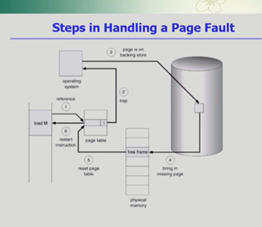
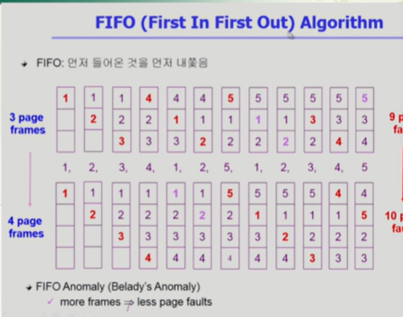
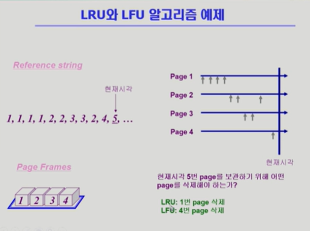
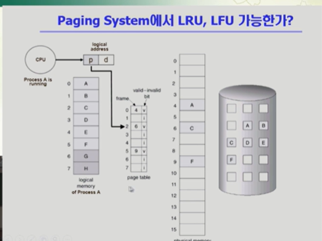

# virtual memory 1

### Demand Paging

virtual memory는 운영체제에서 관여를 한다.

디멘드 페이징 기법을 사용해서 그페이지가 요청됬을때 그때 메모리에 올려놓음

이렇게하면 장점? => I/O양의 감소

좋은 소프트웨어일수록 방어적

디멘드를 쓰면 필요한것만 올려서 io양이 줄어듦

빠른응답시간이라는건 한정된 메모리공간에 여러프로그램이 동시에 실행되고

메모리에 더 빈번하게 사용된, 의미있는 정보를 올려놓을려면 디멘드 페이징을 쓰는게 나음.

cpu가 논리주소를 주고 메모리 몇번지를 보겠다고하면 먼저 주소변환을 하러옴.

invalid면 메모리에 없다 그러면 어떻게? => 디스크에서 메모리로올려야됨 (io작업)

주소변환을 할려고했는데 invalid로 된 페이지에 대해선 "page fault" 라는현상이 발생함

"page fault" 라는현상이 발생하면 cpu는 자동적으로 운영체제에게 넘어감

이게 page trap이 걸린다고표현 일종의 소프트웨어 인터럽트에 해당.

fault난 페이지를 메모리에 올리는 작업!

[alt text](image-79.png)

정상적인 메모리 요청이라고하면 페이지를 디스크에서 메모리로 올려줌. 근데 꽉차있으면 페이지하나를 쪼까내야됨

빈페이지를 하나 획득해야됨

그뒤에 디스크에서 메모리로 올려놓음. (대단히 느린작업)

페이지 폴트가 낫을떄 디스크에 접근하는것은 굉장히 오래걸리는 작업이기떄문에.

페이지 폴트가 얼마나 나느냐에 따라 메모리접근 시간이 크게 좌우가된다.

페이지 폴트의 비율을 0에서 1 사이로

0이면절대 페이지폴트가 안일어나고

1이면 매번 페이지폴트가난다.

페이지 폴트를 처리하는데 운영체제에서 하드웨어로 처리하는 오버헤드가발생.

빈페이지가 없는 경우 뭔가를 쫓아냄.

그걸 page replacement 라고함

os가 하는일.

이걸 해주는 알고리즘을 replacement algorithm
이 알고리즘은 가능하면 페이지폴트가 나지않고 메모리에서 직접처리할수있게ㅇ
뭔가 페이지를 쫓겨냈더니 그게 다시 참조가 된다고하면 그게 엄청난 시간을 겪기때문에

가능한 page Fault Rate 가 낮도록 설정 .

가급적이면 0 에 가깝도록 해줘야되는것이 이 알고리즘의 목표.

Replacement Algorithm

일단 Victim이 설정되면 쫓아내고 그자리에 새로운 페이지를 올려놓음.

쫓겨낸 페이지에는 invalid 로 하고 올라오면 valid로 이역할을 운영체제가 한다.

### Optimal Algorithm

가장 좋은 알고리즘이 옵티말 알고리즘 => 페이지 폴트를 가장 적게하는 알고리즘.

실제 시스템에서는 미래를 알 수없다.

미래의 참조를 어떻게 하는가?=> Offline algorithm
미리알고있다는 가정하에 이 알고리즘을 운영하는것.

가장 먼 미래에 참조되는 page를 쫓아내는게 이 알고리즘의 작동방식

이알고리즘은 미래를 다 안다고 가정하기때문에.
실제 시스템에서는 사용은 못하고 다른 알고리즘의 성능에 대한 Upper bound를제공 (아무리좋은걸만들어도 이거보다 좋을수없음 그래서 비슷한 성능이 나왔다 그러면 굳 전투력측정기)

belady's optimal algorithm , MIN, OPT등으로 불리기도함.

이다음부터는 미래를 모르는상태에서 시작하는 알고리즘들

미래를 고를때 제일 참고할만한 것? => 과거를 보면 된다.

메모리에 먼저들어온것을 먼저 쫓아내는.

이 알고리즘은 특이한 성질이있으니.

메모리를 늘려주면 보통은 성능이 좋아져야되는데. 이건 성능이 더 나빠짐.

이러한 현상을 FIFO Anomaly라고 부름

more frames => less page faults

### LRU 알고리즘

Least Recently Used
가장 덜 최근에 사용된. 제일 오래전에 사용된걸 쪼까내겠다는것

미래를 모르면 과거가 중요하다고했었음.

### LFU 알고리즘

Least Frequnetly Used
가장 참조횟수가 적은 페이지를 쪼까냄

LRU 와 LFU 알고리즘 예제

LFU는 4를 삭제하고 LRU는 1번 을 삭제

# virtual memory 2

## 캐슁 기법

한정된 빠른 공간이 캐쉬 인데

거기에 데이터 저장했다가 후속 요청시 캐쉬로부터 직접 서비스하는거

virtual memory의 paging system외에도 다양한 분야에서 사용함.

그중에서 캐시메모리 라는것이있는데.

일반적인 메모리 참조에서도 사용

cpu와 메인 메모리 사이에 캐시메모리라는 계층이존재.

버퍼캐싱이라는게 있는데 파일시스템에 대한 리드 라이트 요청을 메모리에서 빠르게 서비스하는 방식

매체는 동일함 빠른게 물리적인 메모리 느린게 디스크

페이징 시스템에선 디스크의 스왑에어리어 버퍼에서는 파일 시스템

웹캐싱이라는것도 있음 어떤 웹페이지를 볼떄 웹 페이지에대한 요청을 하면 웹브라우저 화면에 표시를 해줘야되는데 동일한 url에 대한 요청 캐싱

### Paging System에서 LRU ,LFU 가능한가?

백킹스토어에있는게 페이지폴트이고 그렇게되면 디스크에 접근해야되서 io가 필요하게됨 그래서 trap이 발생

cpu의 제어권이 프로세스로부터 운영체로 넘어감.

그럼 운영체제가 디스크에 있는 페이지를 읽어서 물리적인 메모리에 올려놓게됨.

그 과정에서 필요없는 걸 하나 쪼까내는 리플레이스먼트를 해야됨

어떤 걸 쪼까내는지 운영체제가 보게되는데.

LRU를 쓴다면 가장 오래전 참조된 애를 쪼까내야되는데.

과연 운영체제가 가장 오래전에 참조된 애를 알 수 있는가

LFU는 참조된 횟수가 적은애를 해야되는데 운영체제가 알수있는가.
답은 알수없다.

이 프로세스가 사용하는 페이지가 이미 메모리에 올라가있는 경우에는 운영체제한테 cpu가 안넘어감.

그러면 이친구의 접근 시간을 운영체제는 모르는 것

페이지폴트가 나면. 그러면 cpu 제어권이 운영체제로 넘어가니까 알수있음

페이징 시스템에서는 운영체제에게 주어진 정보가 반쪽만 주어지는 것임

메모리에 이미있으면 모르고 없어서 페이지 폴트가 나면 운영체제가 알 수있음.

### Clock Algorithm

페이징 시스템에서는 쫓아낸걸 결정하기위해서 LRU 나 LFU 같은걸 사용할 수 없고 클락 알고리즘이라는것을 사용함.

LRU의 근사 알고리즘

Second Chance algorithm / NUR NRU

세컨드 찬스라는건 기회를 한번 더 준다는 의미로 그렇게 부름

시계처럼 돌아가서 클락알고리즘이라고 일반적으로 부름

NRU:최근에 사용되지않은 페이지를 쫓아내는

20:14
