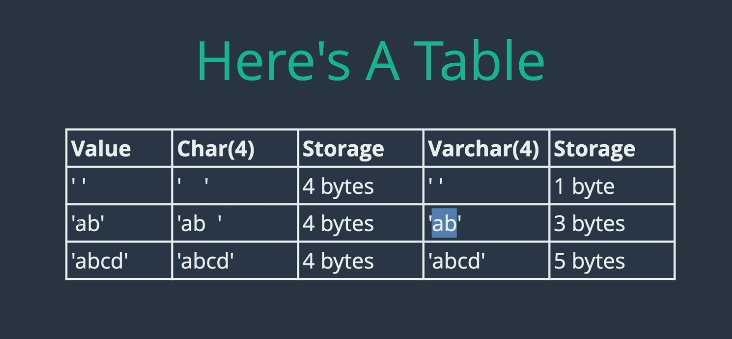
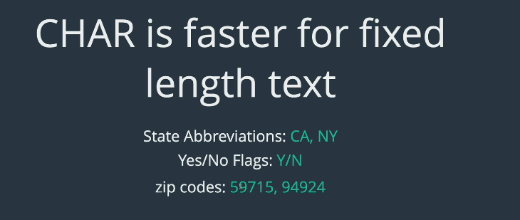

# 데이터유형(자료형)

### CHAR , VARCHAR

varchar를 이용하면 최대길이 지정가능
varchar는 다양한 크기의 텍스트를 최상의 방식으로 저장할 수 있도록 최적화되어있음

fixed length => char
char has a fixed length

달라진건 길이를 고정시켰을때 백그라운드에서 최적화 되어있다.

char(3) only 3 characters "allowed"

value from 0 to 255

어떤 value를 입력해서 같은 메모리 차지.

저장하는 문자 유형에따라 storage같은건 달라짐

데이터의 길이가 다양하면 공간을 덜차지할수있지만 1자정도 차이밖에안나면 그냥 char쓰는게 나을수있음 /

작업하는 텍스트의 크기가 고정되어있으면 char 아니면 varchar

### INT , TINYINT , BIGINT

결국 핵심은 저장공간 최적화와 얼마나 큰 정수를 저장할 수 있냐 그 차이임

일반적인 INT 는 4바이트
TINY INT 는 1 바이트 127 / -128

BIGINT 는 8바이트 차지

TINY INT UNSIGNED 하고 음수 부호 넣으면 음수 못넣음.그러면 맥시멈은 255가됨

### DECIMAL

금융이나 모기지 금리같은건 소수를 지정할수없으니 INT 는 적합하지않음

DECIMAL을 사용하면 정확한 소수 지정 가능

거의 항상 정확하게 저장된다고 보장가능

소수를 저장하는건 까다로운 일이다.

DECIMAL이 가장 정확함
DEMICAL(5,2) 첫번째 수는 digit 두번쨰는 자릿수
5개중 2개는 소수점이다 라는 소리
=>999.99
8347.1 ? 안됨 소수점앞에 4개 이런경우가 주로 햇갈리는 경우임

### FLOAT & DOUBLE

float 나 double을 사용하면 적은 공간을 사용하지만 덜 정확함.

대부분의 경우는 double과 float로 충분함

decimal은 십진수로 저장하고 float과 double은 그렇지않음

float 4바이트 double 8qkdlxm

float 7자리 double은 15 digit

초과하는걸 넣으면 알아서 짤라버리네

### DATE,TIME 과 DATETIME

DATE 그냥 날짜임 시간포함안함
YYYY MM DD 형태임

TIME은 조금더 flexible하다. 하루를 더 다양하게 나타냄

시간의 양이나 시간의 간격을 나타낼 수도있다.
HH:MM:SS

DATETIME

yyyy-mm-dd hh:mm:ss
특정 날짜 시간 원하면 DATETIME
