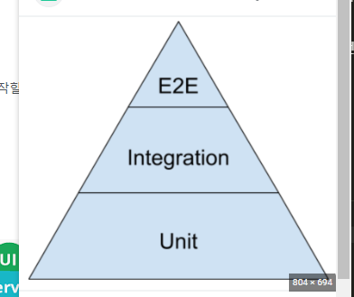

### 더 빠른 실행 시간으로 현명한 테스트를 수행하는 방법

애자일에서는 기본적으로 앱 품질에 대한 빠른 피드백이 필요.

2주마다 릴리즈 하고 변경사항이 있으면 어떻게 반응하는 빨리 알아야됨

어떻게 피드백? => QA 가 모든 테스트를 하고 철저히 피드백을 함

테스트 피라미드는 더 빠른 피드백이 가능하도록 도와줌

= 테스트 케이스를 더 빨리 실행할 수 있도록 도와준다

모든것이 컴포넌트 테스트케이스 또는 단위 테스트 케이스가 된다.

컴포넌트 테스와 통합테스트로 스마트한 테스트를 구축가능

### 테스트 피라미드 전략 사례 연구

이상적으로 더 빠른 피드백을 받는 방법

e2e를 적게하고 unit을 가장 많이 그 다음 통합 테스트를 하는 것

실제 테스트는 8~9단계일 수 있다.

e2e 중 일부는 불필요하고 필요없는 테스트 임

그래서 e2e 테스트는 최소한으로 할 것을 애자일에서는 권장함

<b>더 많은 단위와 통합테스트를 해야 더 빠른 피드백을 얻을 수 있다.</b>

eX) 테스트 피라미드

1. 유효하지 않은 이메일을 입력하고
   양식을 작성한 다음 제출한다.

2. 가이드라인에 맞지 않는 비밀번호를 입력하고 양식을 작서한 다음 제출한다.

3. 관리자로 가입하고 로그인한다.

4. 로그인하고 관리자 패널에 있는지 확인한다.

5. 관리자 자격 증명으로 로그인하면 관리자 패널 홈페이지가 열린다.

6. 학생 자격 증명으로 로그인하면 학생 패널이 열려야 한다.

7. 기존 자격증명을 입력하고 로그인 한다. - error message

전형적인 테스트케이스의 시작 : www~.com 으로 가서 가입 페이지를 클릭한 다음 유효하지 않은 이메일을 입력하고 양식을 작성한 후 제출합니다.

=> 이건 UI 테스트에 가깝다 e2e

API 테스트 케이스에 집중하면 테스트는 더 가벼워지고 피드백은 더 빨라짐

단위 테스트는 대부분 개발자가 작성함

메서드를 작성하는 동시 테스트케이스 작성

모의데이터로 보내고 응답을 확인함

통합 테스트에 UI를 포함할 수 도 있지만 추천하진 않음

궁극적인 목적은 버튼을 눌러서 응답을 주면 그걸 데이터 베이스에 저장하는것이니까

그걸 확인하는데 UI는 필요없다.
