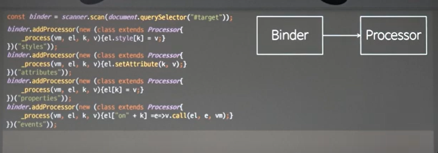
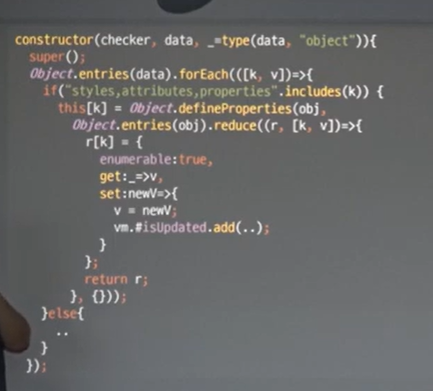

이젠 binder가 model이 변하면 알아서 움직이게 하고싶다 => 옵저버 패턴
binder가 움직이는 방식이 코드로 확장되어있는 부분이 많아서 그부분을 전략적으로 빼내는 방법에 대한 이야길 할 거임

## Strategy

여기서 말하는 Strategy는 어떤 말로 대체할 수 있을까? => 알고리즘도 맞지만 더 범용적으로 보면 도메인.

프로그램을 짯을때 어떤 문제를 해결하기위한 핵심적인 지식을 말함.

추상적인 개념에서 범용적으로 정의할 수 있다면 얼마든지 처리할 수 있다.

객체에는 두가지 측면이있음 상태와 행동

행동은 메서드 상태는 프로퍼티로 .

필드값들은 외부에 노출안함


이부분이 전략을 위한 알고리즘 지식 혹은 도메인 이게 전략.

이 전체코드는 구조와 전략으로 이루어져있는것임.

Strategy는 Structure랑 별개로 움직이지는 못함.

이 구조는 이 자료구조를 가지고있을때만 성립할 수 있다.

특정한 자료구조가 특정한 알고리즘과 맵핑된다.

= 이전략은 처음부터 특정한 데이터를 지칭할 수 있는 포인터를 가지고있어야만 거기에 맵핑할수있는 알고리즘을 만들수있음.

지금하고있는건 흔히 짜고있는 코드로 부터 어떻게 전략을 빼내는 지에 대한 발상법을 연구하고있는것.

객체지향에선 이부분을 컴포지션으로 해결함

컴포지션 ? => 코드를 객체로 바꾸는것

코드를 바꾸게 되면 어떻게되는가 전부다 회귀 테스트를 해야된다.

전략을 먼저 도출하는데 성공했으면 코드가 구조랑 어떻게 연결되어있는지 잘봐야되고.

그 코드를 객체로 바꿔야된다.

그러나 임의의 객체로 바꾸게되면? 임의의 객체와 이코드가 일반화되어있는 관계를 맺을수없다.

그렇기 떄문에 반드시 ! 인터페이스나 클래스라는 형으로 도출해야지 . 이 형에대해서 이 코드가 반응할수있게만들수있다.

객체로 바꾸고 싶지만. 객체가 여러가지로 들어온다고 생각한다면.

이객체가어떤식의 객체인지 알려주는것을 => Type

그래서 우린 타입을 정의해야됨.

타입을 정의해서 객체를 받아들이면. 기존 코드에는 의존성이없었지만

이 객체를 알아야만 렌더가 작동할수있게됨.

객체지향에서 가장먼저 디펜던시가 발생하는이유는 위임했기떄문이 아님. 나의 전략을 외부에 있는 객체의 도움으로 해결하고싶고 그 이유는 그렇게 하지않으면

변화할때마다 코드를 바꿔야된다.

이문제를 해결하기위해 코드를 객체로 바꾸면 그 객체에 대한 의존성이 생김

이래서 객체지향은 자연스럽게 객체의존성이 생김.

의존성이 생겼을때 내부에서 의존성 있는 타입의 서브 타입을 만들어내는 게 있고 공급받는게있음

내부에서 만들면? 다시 하드코딩임 그러니까 외부에서 공급받아야.

그래야 내부에는 형에대한 의존성이 있고 특정 객체에대한 의존성이 없을것. 이게 DI

디펜던시가 만들어지는 순간 DI는 자동이다.

연역적 추리 => 다양한 현상으로부터 원리가되는 추상화가되는 일반성을 도출하는것.

```
const Processor = class{
process(vm,el,k,v,) 를 다 보내줌

```

프로세스한테 다 보내주는데 \_process에게 위임

부모와 자식 사이에 composition이 일어남.

전략을 상속받은 객체한테 위임함.

외부한테 주는게아니라.

디펜던시인젝션의 방향을 외부에서 수입하거나 (주입받거나), 자식과의 injection을 성립시키거나.

자식한테 인젝션 성립시키는게 Template method임.

외부에서는 process로 보이지만.
내부에서는 자식쪽으로 인젝션되어있는 method에 의존하고있음

자식쪽으로 의존하고있는 method를 template method에서는 훅이라고부름

템플릿 메소드는 자기가 해야할일을 하는동시에 훅을 이용해서 위임된 부분을 매꿔서 처리하게되어있음.

디자인패턴용어는 몰라도 이 클래스는 process를 외부로 노출되고있는데 내부 자식을 ㅅ용하고있음. 그냥쓰면 throw되니까

확장한 \_process를 가지고있는 애만 무사히 처리 가능

이미 \_process는 추상 클래스로 쓰고있는것.

composition을 di를 통해서 해곃는게 Binder 쪽이고

Process는 template method를 통해서 해결하려고하는것.

알고리즘은 구조와도 관련이있다.

구조와 관련이없는 알고리즘은 드물다.

자바스크립트에서 class는 문이 아니라 식이다. 즉시실행 함수 시그니쳐랑 비슷함.

class를 만들면 class는 값이기때문에 new로 해서 생성자로 넘겨줌.


익명 상속된 클래스의 장점.


자식이 구현한걸 부모가쓸거야 이정도만해도 어려움.

객체지향은 객체망을 구성해서쓴다고했는데.

알고리즘의 일반화 추상화라는건 뭐냐면 공통으로 묶었어 제네릭으로 했어 이런게아니라 객체로 뺴고난다음에

객체를 형으로 빼고 형과 계약하고 형으로 계약된 내용으로 알고리즘을 만드는것을

알고리즘의 일반화라고한다.

어려운건? => 전략객체와 객체 패턴을 사용하기힘든이유?=> 알고리즘일반화가어렵다.

형을 안정화시킬려면 되도록이면 기능이없는게 좋다.

그래야 의존하는애가 코드가 안바뀔것임.

안정화되어있는 일반화되어있는 코드라는건 약속하고있는 내용이 적다는것이기떄문

적은데도 불구하고 일반화하는 능력이 부족해서 전략패턴이 잘안된다.

전략패턴과 전략패턴이 적용되기위한 알고리즘의 일반화.

알고리즘의 일반화 는

코드를 객체로 뺄때 그 객체는 형으로 빠지게되는데

형과 계약한 내용만 가지고 알고리즘을 고쳐주는게 일반화

코드가 리팩토링이 안되는 이유 ? => 추가되는 건 알고있지만 형을 만들고 도출하는것을 하기가 힘듦.

구저적인 부분과 전략을 나누는게 1단계

2단계 공통적인 부분

3단계 그 전략이 어떻게 상태와 관계를 맺는지 찾는것

4단계 그걸로 도출된 형을 가지고 알고리즘을 고치는것

const binder = scaaner.scan(document.querySelector('#target'))
이젠 이걸로만 쓸 수 없음

전략을 넣어줘야됨



Bider -> Processor
이걸 이제 바인더가 프로세서를 의존하기 시작했다.

객체지향에서 의존성이없다는이야기는 코드로 발랐다는이야기 = 코드를 맨날 고쳐야된다는 이야기

객체지향 하는이유? => 객체만 따로 공급하면 그 코드를 따로 건드릴 필요가없게만드는것.

의존성은 당연히 생긴다.

의존성이 있는게 나쁜게아니라 의존성이 단방향이아니라 여러방향인애들이 나쁘다.

의존성이 많은 게 나쁜게아님.

의존성에서 가장 중요한건 한방향을 바라봐야됨.

이러면 자연히 DI가 따라온다.

코드를 객체로바꾸면 의존성이 따라오고 의존성이 생겼는데 인젝션 메서드가없다 => 잘못한거

## Observer

Model View ViewModel

바인다가 뷰모델을 옵져빙하면 자동으로됨

그럼 바인더가 뷰모델의 변화를 감지하다가 본인이 렌더링을 해서 따로 call을 할 필요가없음.

실제로는 뷰모델이 binder 한테 noti를 주는 형태

옵저버 패턴에서 알아야될건

컴퓨터세계에서 감시하는애는 안 피곤함. 감시당하는애가 피곤함

실제로는 감시당하는애가 내가 뭘 변했어라고 알려줌.

감시하는 쪽은 편함.

심지어 분류해서 보내줘야됨.

큰 문제는 우리가 정말 알려줄수있는가

나의변화를 알려줘야되는데 나의 변화를 알려주기힘듦

뷰모델은 인메모리 객체.

자바스크립트에선 이부분에서 두가지를 지원함=>defineProperty / Proxy

Proxy => es6 (이건 바벨로 안되어서 proxy를쓸땐 es6이상인걸 무조건 확신해야됨 안드로이드 갤럭시 s3 s4까지 버린다는의미)

ie를 지원할거면 9부터 는 해야됨 그게 윈도우7이라서. 뭐아무튼

갤럭시 => kitcat=> es5

오브젝트 defineProperty 스태틱 메서드

옵저버에서 옵저버를 수행할애들은 역시나 형으로 만들어야됨.

문자열의 indexOf 는 오브젝트의 키 찾는거보다 빠름 자바스크립트에서 특별히 더 빠르다.

defineProperties 로 setter의 시점을 감시

세터의 시점이 isUpdated시점이라서

자바스크립트에대한 또다른 오해 클래스에 관한 내장 메서드가 적다고 생각하지만

Array 와 Object 메서드가 굉장히 많음

그래서 자바스크립트 언어 코어 객체를 정말 다 아냐 하면 아는 사람 없음

defineProperty 나 Proxy 물어보면 거의없음

자바스크립트는 코어 객체같은 경우 언어 스펙의 일부라서 노드든 브라우저든 다 보장이된다.

현시점에서 es5지원안하는 건없다고 보면됨.



리듀스는 초기값을 두고 인자로 계속 돌면서 추가 acc가 앞에 리던값이고 두번쨰는 내용물

세터 게터로 바꿔서 넣어서 열거가능하게 만드는데 기본값이 false라서 true로 해놓은 상태.

getter는 원래온거 그냥 토하게 만들고

setter는 v를 이용해서 새로운걸 넣어주고 캡쳐번수가되어서 계속사용됨

그리고 vm에 있는 updated에 뭔갈 더해줌

그래서 속성을 set으로 건드릴때마다 updated에 내용이 추가되게끔함.

그래서 모든 속성을 getter setter로 바꾼애로 대체시켜버림.

## Coposite

1:02:25
