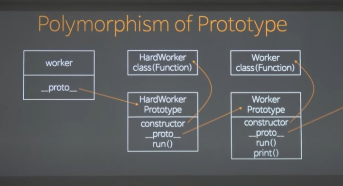
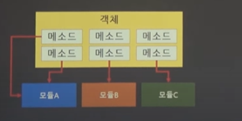
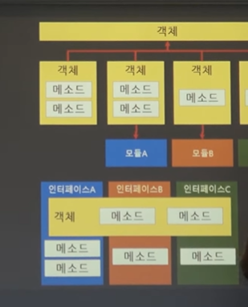
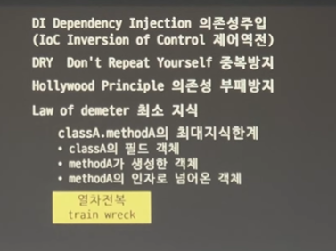

https://www.youtube.com/watch?v=E9NZ0YEZrYU&list=PLBNdLLaRx_rIRXCp9tKsg7qDQmAX19ocw

---

객체지향이냐 함수형이냐 프로시저냐 를 구분하는 잣대들은 사실은 그렇게 중요하지않다.

프로시저? => Procedural Programming => 절차적 프로그래밍 => 명령형 프로그래밍의 일종

객체지향도 명령형 프로그래밍

절차적 프로그래밍 <=> 선언형 프로그래밍

### 가장 중요한것 ? => Value Context vs Identifier Context를 쓸거냐

context를 관점이라고 해석해도 됨

자스의 경우 primitive

메모리 1 에 두던 3이두던 값이 3 이면 같다라고 보는데 Value context 임 => 어떤 변수에 저장되냐가 중요한 게 아니고 같은 값이 들어가면 같다고 보는거

Identifier Context 기준으로 같다 => 메모리 주소에 따라서 다르게 보는 것

객체지향은 철저하게 값 컨텍스트를 배제함

객체지향을 한다 => Value Context 를 하지 않는다.

개발할 때 어떤걸 지향할거냐에따라 달라짐

<strong> 권장사항 : 하나의 컨텍스트만 쓰는것 </strong>

ex)

```

const a = {a:5, b:3}

const b = {a:5 , b:3}


a===b  // Idenitfier
JSON.stringify(a)===JSON.stringify(b) //value

```

이게 객체지향의 가장 기본

메서드의 인자가 됬던 값이 됬던 생성하는 모든것이 되었건 객체만 사용한다.

그럼 숫자를 어떻게 받아요? => 숫자받는거 자체가 잘못된 거임

new Conut(3) 으로 받아야된다

그런 객체로 받아야됨

값을 쓸 수 있는 유일한 context는 객체지향에서 생성자 밖에 안남음

return 도 객체 하면

생성자에서 값을 감출때 밖에 못씀

---

### Value vs Identifier

- Value

1. 값은 메모리 주소가 중요치 않기 때문에 계속 복사본을 만든다는 이야기임 => 끝 없는 복사본 이게 값의 특징

객체가 상태가 변활때 마다 새 객체를 내 뱉으면 이것도값 같이 사용됨

2. 상태 변화에 안전 ? => 값의 경우 상태가 관리되서 안전한 것이 아님 계속 복사되어서 안전한 것 태어나는 불변성에 의해서

3. 연산을 기반으로 로직을 전개 => 상태를 관리하기 위해서 함수형 프로그래밍 의 경우 정해진 연산을 통해서. 연산을 기반으로 로직을 전개함

수학적 프로그래밍이 어려운 점 어려운 도메인의 복잡한것을 머리로 만들기 힘듦

- Identifier

1. 하나의 원본을 사용함 값이 mutable함 => 상태가 일관성이 없음

2. 상태변화를 내부에서 책임지게 만들어야됨 이게 어려운 점 내부상태에서 책임지게 만드는 객체를 만드는 것

3. 연산을 통해서 해결하는게 아니라 메세지를 기반으로 로직을 전개한다.

객체지향 세계에선 일단 모르겠고 이건 다른 애한테 줄게가 가능하다. (추상화)

객체지향에서 가장 중요한것이 무엇이냐? => 값을 사용하지 않는 것이다.

---

### Polymorphism (다형성)

다형성 => 잘못된 번역

폴리몰피즘 변신이라는건데 변신은 아님

```

const Worker = class{

run(){
console.log("working")

}

print(){
    this.run()


}
}


const HardWorker = class extends Worker{
    run(){
        console.log("hardWorking")
    }
}

// 이걸 객체 지향에선 오버라이딩 이라고 한다


```

워킹과 하드워킹이라는 상속구조

```
console.log(worker instanceof Worker) // true


```

이게 다형성

자식은 부모를 대체할수있다가 폴리 몰피즘

부모는 자식을 대체할 수 없지만 자식은 부모를 대체할 수있다.

자식 부모도 사실 좋은 워딩은아니다.

extends 확장.

하드워커는 워커를 확장했으니 당연히 true

확장된 클래스는 확장할 클래스를 대체할수있는 것을 폴리몰피즘이라고 한다.

이걸 폴리몰피즘 안에서 대체가능성이라고한다.

공부한다는 것 => 업계에서 사용되는 고유명사들을 인식해서 외우는 것

```
console.log(worker instanceof Worker) // true


```

요 현상을 폴리몰피즘의 대체가능성이라 하며

대체가능성은 확장된 클래스가 확장할 클래스를 대체할 수있다는것이다

하드워커에 print 가 없지만 실행하면 부모에 있는 print를 호출할려고할것이다. (상속 구조에 따라서)

근데 부모에서 this.run을 하는데 이러면 하드워커에 있는게 ? 아니면 기본 워커에있는게?

하드워커꺼가 나와야 되는게 아닌가 확장했는데

this.run 이라서 this는 하드일테니 this를 실행해야된다는 관점과 없는걸 갖다썻으니 없는데에서 해야된다. 의 관점 두개

this라는 본질은 나를 벗어나지 않음 그래서 상속으로 가도 하드워킹이 나옴

<b>이것을 내적일관성이라고 한다 =태어났을때의 원본클래스를 유지할려고 하는 것 </b>

폴리몰피즘은 대체가능성과 내적일관성을 합쳐서 폴리몰피즘이라고 한다.

대체가능성 => substitution
내적 일관성 => Internal identity

확장된 객체는 원본으로 대체 가능
생성 시점의 타입이 내부에 일관성 있게 참조 됨

---

### Polymorphism of Prototype

자바와 자스의 내적일관성을 만드는 것이 다르다.

자스는 프로토타입이 ㅇ

객체를 만들면 무조건 **proto** 가있으며 함수의 프로토타입을 가리키고있음

근데 하드워커도 **proto**를 가지고있고

함수의 프로토타입에는 무조건 constructor**proto**를 가지고있음 => 그리고 컨스트럭터는 자기자신을 가리킴

클래스안에서 메서드를만들면 컨스트럭터 프로토 안에들어감

=> constructor**proto**run()


결국엔 **proto** 가 null 이되는경우가 나옴

프로토 타입 체인은 자기가 찾는 메서드 이름이나 속성이름이 있으면 자기자신을 먼저 찾고 가까운 프로토를 찾아봄

또 없으면 타고가서 찾는 거

프로토 타입 체인은 상속받을때 근접한거 먼저 찾고 부모꺼 나중에 찾는다

이걸로 내적일관성을 가지게 된다.

A instanceof B는 어떻게 작동하는가?

a의 프로토랑 b의 프로토가 일치하는가? 로 확인가능

constructor가 고정값이 아니기 때문에 건드리면 망가뜨릴 수 있다.

안맞으면 proto 가 null 이될때까지 계속 타고간다.

c++은 참조 테이블

자바는 자바 나름대로의 스킬이 또 있음

각 언어마다 다르지만 객체지향이라함은 내적일관성과 대체가능성을 보장해줘야 됨

자바스크립트 가 객체지향언어냐고물어보면 "예"

폴리몰피즘이 성립하기 때문에

---

### Object essentials 객체의 본질이 무엇인가?

객체지향의 약속이 폴리몰피즘이라면

객체가 진짜로 가져야되는 본질적인 책임은 무엇인가

그게 바로

```


const EssentialObj = class{
#name ="";
#screen =null;

constructor(name){
    this.#name=name;
}
camouflage(){
    this.#screen = (Math.random()*10).toString(16).replace('.',"")

}

get name(){
    return this.#screen || this.#name
}


}

```

카모 플라주 : 스크린상의 이름을 위장시킴

밖에 노출 시킬때에는 스크린네임이있으면 스크린네임 아니면 이름

속성의 조건은 private이다.

속성이 private이 아니면 ? => 객체지향이 아니다.

객체의 속성이 private 인가 부터 점검해라
hide state 데이터의 은닉

private 이 아니면 뭐다? => 공개적으로 사용되는 값이다.

객체를 사용한다 ?=> 상태를 외부에 보여주지 않는다.

객체에있는것을 밖에 보여주면? => 객체가 값으로 사용된다.

그렇게 되면 메모리 가 아니라 값 컨텍스트로 움직인다.

get name (){} 부분을 encapsulation 캡슐화라고 부른다

캡슐화를 은닉과 혼동하는 경우가 많은데 다르다.

은닉 => field 데이터에 대한것이고 capule 은 기능(메서드)에 대한 것이다

즉 메서드가 은닉되어있다는것은 밖에서 뭘쓰는지 모른다는것

은행가서 돈 인출 => 카드 넣으면 돈 줘 밖에 안보여줌 => 실제는 보안인증 장부확인 데이터베이스 전부 다 함

이런 메서드를 노출 안함 일부러 돈 세는 소리도 들려줌 (헐 진짜인줄 알았는데)

그래서 돈세는 소리도 5가지나 다르다.

하나만 객체지향 아닌게 들어와도 모든게 다 무너짐

그래서 보다보면 어 이거 무너지겠는거 하는게 다 감이 옴

하나만 값 컨텍스트 전파해도 모든게 망함

객체지향 잘하기 어려운 이유 => 마음속의 타협 객체 80개 정도 썼으나 바쁘니까 하나 값 컨텍스트 (은닉과 캡슐화 안한거 갖다 썼다가 망함 )

객체지향을 하려면 도를 닦고 마음의 여유를 추구해야된다.

그래서 본질: 기능 메서드 의 캡슐화 // 상태의 관리 책임 (집안사정 보여주지말고 내가 잘 다스리고 내 상태는 내가 관리)

날로 제공하는것? => getter setter

setAge를 어떻게 하면 피할까요? => 왜 setAge를 하는지 알면 됨

객체지향에선 한 단계 더 생각해야지만 메서드 이름을 지을 수 있다.

setAge를 그냥 노출했다는 이야기 = 어디에쓰는지 고민하지 않았다는 이야기

setAdult setChild 가 될 수 도 있는것

그 안에 나이가있을뿐인데 나이에 따라 컨텐츠를 구분해야됨

그렇게 생각해야 기능의 캡슐화가 된다.

이 본질의 두개 중 하나라도 포기하면 객체지향이아니다.

객체지향이 어려운 점은 하나도 안 뺴놓고 캡슐화 하고 은닉해야되기때문

아까 말했던 수학적프로그래밍 어려운점은? => 모든 도메인 문제를 수학적으로 연산적으로 풀어야 됨

이공계를 나와서 연역, 귀납적인 생각을 잘 하고 객관화가 잘 되는 사고를 가지고있다. 빠르면 3,5년이 걸림

내 사고는 감성 공감 경험적인 합리적인 존재다 5~7년이 걸림

성향의 문제가아니라 어디에 훈련을 하냐

CS에서 빨리빨리 문제를 정복하고 위로 올라가고싶으면 연역적 사고와 귀납적 사고를 반복해서 추론을 키워야한다.

<U>이떄 추론의 근거가 되는건 자기의 근거를 빼고 합리적인 것을 찾아야된다.</U>

컴퓨터 사이언스는 패러다임 시프트가없음

0과1 이후에 확정이라서

기계가 움직이는데 감성이 전혀 안들어간다.

이걸 이해하면 금방 도달함

그런 사람이 되라는게 아니고 컴퓨터 사이언스를 할 때에는 내려놓으라는 말

아무튼 본질을 이 캡슐화와 은닉이라고 하는 이유는

<b>Isolation of change</b> 때문

변화에 대한 격리 구간을 만드는것

여기서 중요한것은 격리

변화에 대한 격리를 이룩하는 것

프레임은 계속 변한다.

pm이 찐따같아서 수정 변화를 가져온게 아니다 당연한거다. 탓ㄴ

여파가 다른데로 가면 안 됨

뭐 고쳤는데 왜 게시판 리스트가 망가지냐

해당 변화가일어났을 때 거기만 일어나고 다른데에 안일어나는것 => 격리

변화의 여파가 다른곳으로 안가는것 => 이게 모든 프로그래밍 언어의 공통적인 목표

그래서 본질로 은닉 캡슐화를 하는 이유는 변화에 대한 격리구간을 촘촘하게 세우는 것이다.

오염의 경우 여러 단계를 거치게 됨

중간에 격리벽 validation에 걸려서 잡아내는 경우도있고 home로 보내서 복원하는 경우도있음

우리가 감지하는것 격리벽이 아니라 실패되었을 때

격리벽 뒤에 수많은 예외처리를해서 막은거지 사실은 실패하고있던 것

항상 오염을 이뤄나게 안할려면 격리벽을 세워야된다

결국 오염을 안시키기보다 오염시키고 전역처리기로 막는 느낌

많은 회사에 가보면 js 전체에 감싼 try/catch 를 한두번 본게 아님

---

### 알려진 기본 설계요령

SOLID 원칙/ 마틴 파울러
SRP: 단일책임

책임? => 수정하는 원인이 하나밖에없음 이걸 SRP로 이해하면된다.

이 코드를 고쳐야되는 이유는 하나뿐인게 SRP

SRP를 제대로 지키지 못했을 때 일어나는 게 산탄총 수술 => shotgun surgery

격리가 정말 수준이 높다면 단위테스트가 필요없을 것이다. 격리가 잘 되어 있을 테니까

SRP를 잘못하면 산탄총 수술이 일어난다.

OCP Open Closed 개방폐쇠의 원칙

Open ? => 확장 => extends/ implements 할 수 있게 만들어라

Closed ? => 다른애가 수정해야되면 또 다른 extends나 implements로 만들어라

원래있던거 건드리지말고 ㅇ

LSP Liskov Substutusion 업캐스팅 안전 / 리스코프 박사

자식은 부모를 대체가 가능해. 그렇단 이야기는 언제나 업캐스팅하는게 안전하다는것

업캐스팅 ?=> 부모쪽으로 형변환
다운캐스팅?=> 자식쪽으로 형변환

객체지향으로 했으면 업캐스팅당연히 안전할텐데 왜있는가?

추상층의 정의가 너무 구체적이면 구상층의 구현에서 모순이 발생한다.

ex) 추상층 - 생물 클래스
숨을 쉰다, 다리로 이동한다

구상층
사람 ok
타조 ok
독수리 no
고래 no

독수리 고래는 생물 2 인가? 여러분들 클래스보면 생물2라고 부르는게 맞다 (ㅋㅋㅋㅋㅋㅋㅋㅋㅋㅋㅋㅋㅋㅋㅋㅋㅋㅋㅋㅋㅋㅋㅋㅋㅋㅋㅋ)

다리로 이동한다를 지워버리면 모두 좋아지지면 이동이라는것을 잊어버리기때문에

추상층을 두개로 분리한다

생물 (숨을쉰다) , 다리 이동은 인터페이스로 만든다.

리스코프 치하원칙이 제일 어렵다.

ISP interface Segregation 인터페이스 분리

리스코프 치하원칙을 해결하려고 ISP

객체안에 메서드 6개가있다면 모듈 a 는 2개 b는 또다른 2개 c는 또다른 2개를 쓸 수 있음

많은 경우 대상에 따라 객체가 메서드를 다 가질 수 밖에없음

상태의본질인 지갑이 객체에있고 a,b,c 각각 월급 용돈 대출 을 의미한다면 그런예시



ISP는 이문제를 해결하라는 것

첫번쨰 방법

객체안에 분신 을만드는것
사장 , 아빠 , 채권자

사장 객체가 지갑을 이요해 급여를 주고
아빠 객체가 용돈주고 이런 형태

인터페이스를 분리하지않고 처리하는것 이 소유 / 위임

각각 바라봐야 할 역할 만큼 객체를 만들어서 상대하게 해줌

각각 다른 모듈이 다른 애들을 상대함

객체를 처음 만들때 인터페이스 3개를갖고와서 오버라이드 해도 됨

외부에서 볼때에는 인터페이스 중 하나로 볼 것임


누군가는 new 아빠 new 사장 아니면 as 아빠 as 사장

그래서 떡지게 만들지마라.

why? => 떡져있는 객체를 수정하면 모듈 3개다 의존성에 의해서 영향을 받는다.

DIP depndaency Inversion 다운캐스팅 금지 = 의존성 역전의 법칙

의존성은 언제나 부모쪽으로 만 흘러야되는데

대부분 다운캐스팅을 함 그래서 무조건 다운 캐스팅을 금지함

코드안에 다운캐스팅이있다? => 망한거

고차원의 모듈은 저차원의 모듈에 의존하면 안 된다.

이 두 모듈 모두 추상화된 것에 의존해야 한다.

DI:의존성 주입 Dependency Injection
DI는 IOC 제어역전의 일부

DRY => Don't Repeat yourself
Hollywood Principle 의존성 부패 방지

할리우드 원칙의 핵심 :
물어보지 말고 요청해라

전화번호 달라고하지말고 시간날때 요청해달라고 해야 캡슐화가 되고 권한은 다 상대방이 가지고있음 하고싶으면 하고 아니면 안하고

그래서 질의를 하면 안된다

오디션 필요하면 내가 연락할테니까 너네가 남겨 같은 것

질의를 하게 되면 ? => 격리를 깨먹게 됨

전화번호를 받는다고 좋을까? => 전화 번호를 받았는데 다음날 번호를 바꿨음 => 개망

Law of demeter 디미터의 법칙 (최소 지식)

너무많은걸 알면 부패가 일어날 것이다.

최소한의 지식? => 인자로 넘어온 타입 내부에서 생성한 객체의 타입 , 원래 객체 필드 타입

이 3가지 이상을 알면 안됨 내장의 타입들을 다 알게 되기에.

디미터의법칙을 꺠먹으면 a.b.c.e.d. 이런식으로 접근하게되니 이 모습이기 기차 같아서

열차전복 사고가 일어남


1:12:54 Mesaage
