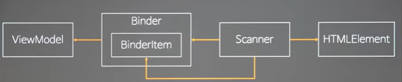

### MVVM

모델 뷰 뷰 모델 의 약자
마이클 소프트가 원조

사실 MS 빼고 MVVM 이라 부르기엔 애매하다.


MVC에는 모델 뷰 컨트롤러가있음

모델을 컨트롤러가 데려와서 view 가 소비할 수 있는 데이터 형태로 가공해서 View한테 준다.

화살표가 잘 못되어있음

화살표는 의존성관계를 나타냄

컨트롤러가 모델을 알고있는것 컨트롤러는 모델도 View도 알고있음

View 는 모델에 대한 의존성을 알고있음

View가 모델을 알고있는것의 문제? => 모델은 비즈니스 도메인과 관련된 것들 얘가 변경되는 이유와 화면에 표시되는 것이 변경되는 이유는 다르다.

변화에도 서로 다른데 서로 의존성이 있다는게 엄청나게 큰 문제.

MVC는 주로 백엔드에서 씀

스프링이 그렇게되어있음 왜냐 서버에서는 모델을 섭외해와서 컨트롤러 가공하고 View를 리스폰스 던져주면 끝나니까.

클라이언트에서는 MVC를 안씀

또 다른 MVC 모델


View랑 모델은 모르게했는데 View는 컨트롤러를 알게됨

이 구조에서의 문제? => 모델에변화가 생기면 항상 컨트롤러 코드가 바뀌니 컨트롤러의 유지보수가 엄청 힘들다.


MVP 라고 모델 뷰 프레센터 라는 것도있음

View가 게터 세터를 노출함

칼라에대한 세터도있고 게터도있고

View 는 프레센터 입장에서는 게터 세터를 갖고있는 인터페이스로 보임

mvp에서는 View 안에 뭐가없음 게터세터만 제공함

프레젠터는 게터 세터만 갖다씀

모델 내용을 잘 해석하고 난다음 view에있는 getter setter 로 사용할 뿐

여기서 가장 괴로운 것은 view 하나만 만들어도 모든 것을 다 맵핑해놔야됨

그 외에는 나쁘지 않은 모델


MVVM 이성립할려면 Binder 가 있어야됨

기본적으로 view 모델 뷰모델 이있는데

핵심은 뷰모델.

뷰모델은 순수한 뷰 라고 볼 수 있음 그림을 그리는 뷰가 아니라

인메모리객체로써의 순수한 데이터로써의 뷰다.

뷰를 조작할때는 돔이없는데에선 돔을 조작할수없다.

뷰모델은 뷰를 대신하기에 갱신가능

뷰모델을 가지고 변화를 감지에서 뷰가 변화하길 바라거나

뷰의 변화를 감지해서 뷰모델을 바꾸길 원하거나

그러니 바인더가없으면. MVVM은 성립하지않는다.

Binder 라는 애가 view 와 viewmodel 사이의 의존성을 없애버림

View model은 view를 모름

view를 대신한 순수한 모델이기때문에 view를 모름

바인더가 ViewModel을 관측하고있음

양방향으로 가면 input type의 text를 바꿔도 뷰모델이 바뀔것

옵저버가 좀 어려워서

직접 바인더한테 콜 하게 만들어서 옵저베이션의 부담을 줄일것이다.

primitive는 instance of 로 검사가 안됨. 그래서 검사해보고 아니면 instanceOf 로 나가라.


자바스크립트는 굉장히 독특한 언어임 그래서 한글처럼 쓰고 싶으면 많이 해야됨.
특징을 모르니. 자바스크립트는 이상하게 작동한ㄷ고 생각함.

type of에서 ==를 쓴 이유? => 강제 형변환을 시켜주는 ===짜리보다 ==가 빨리작동함.

=== 는 일단 형변환을 하고 검사를한다.

잘모르니까 무조건 3개 써라 라고 하는것임. 그러니 안전한것만 쓰라는 의미.

\_는 자바스크립트에서는 아무의미가없지만

다른곳에서는 사용하지않는 인자를 의밓함.

함수의 인자영역은 왼쪽에서 오른쪽으로 스코프가 하나씩 만들어져서 처리함.

첫번째 처리되면 두번째는 앞의 스코프를 인식함.

세번째도 마찬가지. 두번째까지 알게된다.


이렇게되면 이작동에 의해서 Array가아니면 즉시 throw가 일어남.

오 , 좋네 이런 타입스크립트를 쓰는거.


이렇게 큰 실수로 세어나아가는것을 막을 수 있다.

data- 로 안만들면 다 validation 에서 벗어났다고 다 깨짐 .

framework들도 예외는 아님.
w3c validate통과안하면 해외에서는 제품을 아예안받음.
그래서 표준을 맞춰서 만들려면 data-로 다 만들어야됨.


3개의 훅을 viewModel이 바인딩 해줄것임.


바인더가 해주는 일은 특정 view 세트를 안에서부터 쭉 세트를해서 뷰모델과 연결해서 반영해주는 꼴

Mvvm에서 가장 큰 핵심은 Binder임

Binder의 방식은 2가지가있는데

1. 앵귤러나 vue의 경우 태그를 만들고 스캔하게 되어있는데 이 스캔하는게 바인더

이방식은 모델과 뷰를 완전히 분리해서 관리하기가 쉽다.

2. 아예 처음부터 데이터랑 연결된것을 꼽게 만드는 것 (리액트 방식)

리액트의 단점 ? => state 관리하는데 이안에 view도있음

Binder는 ViewModel을 알고있음 ViewModel을 알고있어야 그림을 그릴수가있기때문.

Binder가 직접 HTMLElement를 스캔하게 하느냐? 하는 문제가있음.

만일 그렇게한다면

View를 스캔하는 여파가 Binder로 전부다 감.

그래서 자주 변할 HTML 을 인식하는 부분을 따로 두고 싶음. => Scanner를 따로.

Scanner를 따로주는게 객체지향에서의 역할 분리.

뺀 이유? 변화율

변화율? => 하루에 한번씩 바꾸는지 일주일에 한번씩 바꾸는지

하루에 한번씩 변하는애때문에 일주일에 한번씩 바뀌는애도 피곤해짐.

객체를 분리하는 첫번쨰 원리는 변화율이며 변화율은

코드를 바꾸는 이유가 똑같냐 안똑같냐.

바인더는 뷰모델이 바뀔떄만

스캐너가 따로 있는이유? html

그래서 시간에 따른 변화율이아니라 원인에 따른 변화율이며

객체마다 바뀌는 이유를 하나를 만들고 싶다 => srp


데이터 베이스가 됬든, 객체지향이 됬든 원리는 다 비슷함.
다대다로 연결되어있는애는일대일이나 다대일로 풀어야되는 중간테이블 껴가지고.

바인더와 html의 직접적인 포린키를 피할려고 스캐너를 두고 스캐너가 양쪽의 포린키를 잡는 꼴임.

스캐너를 두는 이유는 바인더와 html의 연결을 끊고싶기떄문

그러나 끊으면 작동이안되니까. scanner를 두는것.


이걸 완성하면

html로 부터 hook을 생성한 바인더 아이템들을 쭉만들고 이걸 소유한 바인더가있고

뷰모델을 만들어서 바인더한테 뷰모델 떤지면서 글줘 그러면 스캐너 통해서 잘 그려준다.

그럼 뷰모델만 갱신하고 바인더한테 그려달라고하면 view 가 갱신되는것을 볼 수 있을것이다.

### View Model


view model이 가장 쉬운이유 ?

view model이 순수한 인메모리 객체이기떄문

우리가 순수하게만든 데이터 객체이기때문에 만들기 굉장히 쉬움

자바스크립트 # private은

대괄호로도 얻을수없고 dot 노케이션으로 얻어야됨

for in에도 안걸리고 keys에도 아무대에도 안걸림. 무조건 클래스 내부에서만 쓸 수있다.

this["#"] 프로퍼티로써의 private속성이 아니라 그냥 프로퍼티로 잡힘. 다른애임ㅇ 

자바스크립트 언어가 보장해주는 private

스펙에 따르면 static으로 소환되어있는 private도 인스턴스를 사용가능

인스턴에서 사용되는 private 필드도 당연히 사용될수있음.

우리는 외부에서 생성하는것을 막고 오직 static get으로만 인스턴스를 만들기 원함.

```
const ViewModel=class{

static #private = Symbol()
static get(data){
return new ViewModel(this.#privae,data)
}

constructor(checker,data){

if(checker!== ViewModel.#private) throw"useViewModel.get()!"


}

}

얘는 어떤 경우에는 new가 아니라 ViewModel.get으로 만들어짐 

```

뷰모델은 하나의 돔객체를 대신하는 메모리 객체임 돔을 대신해서 돔의 여러가지들

돔에는 4가지가대표적으로있음  1. styles / 2. attribute(tag에 쓰는거) , 03. properties () 4. events 

Attribute
HTML Attribute는 HTML 문서 또는 파일에서 태그와 함께 사용되는 초기값입니다.
웹 페이지가 처음 로드될 때 HTML 마크업에 정의됩니다.
속성은 항상 문자열 형태로, HTML 코드에서 태그에 추가되어 해당 태그의 초기 상태를 정의합니다.
예를 들어, <input value="hello">에서 value는 attribute로서 입력 필드의 초기 값을 나타냅니다.


Property
DOM Property는 HTML 태그에 대한 JavaScript 객체의 속성입니다.
DOM이 로드된 후, JavaScript를 사용하여 언제든지 읽고 수정할 수 있습니다.
Property는 다양한 타입을 가질 수 있으며(문자열, 숫자, 불리언 등), 실시간으로 웹 페이지의 동적 변화를 반영합니다.
예를 들어, JavaScript에서 document.getElementById("myInput").value = "hello"를 사용하여 value property를 변경할 수 있습니다. 이는 사용자의 입력 또는 스크립트에 의해 실시간으로 변경될 수 있습니다.


돔에서는 attribute와 propertie 차이를 굉장히 중요시여김

Object.entries(data).forEach(([k,v])) // key/value 분류 
switch(k){

case:"styles":this.styles.v; break; 
// 동일 

default:this[k]=v; 위에 해당하는게 아니면 커스텀키로 잡아줘.  

이제 이 이후에 값을 변화할수있지만 키는 추가못하게하겠다 => seal 
Object.seal(this)


}

이게 버츄얼 돔이냐? 아님 이건 그냥 뷰모델임

돔을 직접가져와서 테스트할 필요가없으니 단위테스트하기가 편해짐.

뷰모델이 잘 되어있으면 이게 잘 반영이 안되면 binder의 잘못일것임.

nvvm에서 binder가 핵심인이유? 복잡한건 binder가 다 가져가서 ioc 제어역전에 성공함.

그럼 우리 코드에는 데이터조작만남고 view를 다루는 코드는 전부 다 사라진다. 

## Binder 

바인더는 native view를 알아야된다. 

바인더는 Items를 가지고있음


배열을 안쓰는이유? => 

set에는 중복기능이 있긴함 그러나 객체지향은 식별을 통한 구분을 지원함.

value 컨텍스트는 값에 따라서.  

객체컨테이너를 만들땐 무조건 set이어야됨.  값컨테이라면 배열이여도됨. 

배열에 a,a,a,a, 를 넣는이유는없음 그래서 객체 컨테이너는 set 

이걸 스캐너가 외부에서 주입해줘야되니 add라는 함수를 뺴줌.


render는 viewmodel을 받아야됨. 


가장먼저 viewmodel안에 있는지부터 확인할것이고 이게 ViewModel이길 바라니 이에 대한 검증부터 시작.


일반적으로 타입이 감수해야될것을 다른애들이 감수하는 경우가 굉장히 많음.

이안에서 전부다 처리를 해줘야됨.

프로그래밍이 어려워지는것 => 한군대만 약하게되어있어도 깨지면 다 망가짐. 


### BinderItem 

바인더안에있는 바인더아이템도 view 하나하나를 알고있을것임.

자바스크립트는 일반적으로 객체의 안정성을 확보하기위해 seal 이나 freeze를 많이건다. 


자바스크립트는 가장 어려운 언어임 이유?=> 계속 추가되어서.  다른언어에서 가장 좋아보이는거 계속 가져와서.

go / cotlin c# 다 가지고와서

context도 너무나도 다름.

자바스크립트를 꾸준히 공부안하면 금방 포기하게되어있음.

책이안나오는이유? => 더이상 최신 언어 커버하는 책이없음 너무 어려워서 

그럼어떻게 공부하는가 spec문서보고 chrome ㄱ 

BinderItem의 핵심은 

바인더가 어떤 뷰모델과 결합할지 모르기때문에 레이지 바인딩하려고 key만 가지고있음.

element를 이때 확정시켜버리면 그게안됨.


## Scanner

주요하는 일은 scan해서 BinderItem을 만들어서 끼워주는게 하는 일 

그렇기때문에 Scanner의 결과물은 Binder가됨 


재귀함수를 stack으로 바꾸는 연습을 많이해야됨 


재귀는 함수가 함수를 부르는건데 함수를 한번 부를때마다 함수한번에 해당하는 스택이 생김. 이걸 임시메모리에 쌓아서 해결하는건데 이게 쌓이면 스택오버플로우가생기는데.

이걸 해결하는게 배열로 스택을 따로 만들어서 처리하는것. 


첫번째 자식과 형재가있는지 보는것. 

있으면 다 stack에 넣는다. 

이걸통해 손쉽게 htmlElement를 순회한다 

checkItem 

"data-viewmodel" 이 있으면 바인더에 얘를 넣어줄것임


본인은 여기서 검사


똑같은 문제를 여러번 풀어봐야된다.

아무리 쉬운 문제도 매번 풀어보면 매번 성공하기 쉽지않음.

어려운 과제를 여러번 반복해서 아무때나 풀수있을때 실력이 올라감.

푸는데 성공하기만해서는 실력이 안올라감.


뷰모델만 만들고 어디에 맵핑될건지만 정하는 이게 ReactNative의 원리 

안드로이드 view만 갈아끼우고싶다. 그러면 제어역전을 통해서 

에라이 아직은 꽤나 난해하다 그래도 알아먹긴하겠는데.


브라우저는 원래부터 90퍼센트 이상을 그리는데 사용함.

