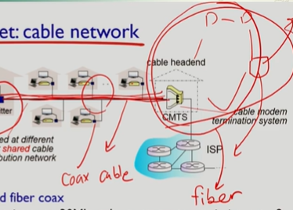
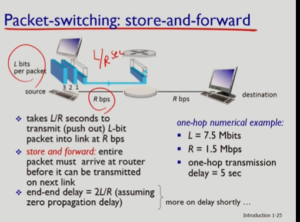
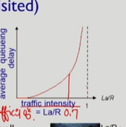
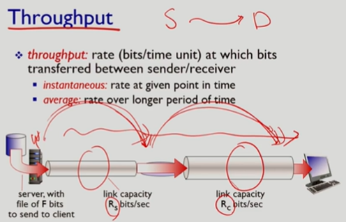

# What is internet?

- 목표

1.  컴퓨터 네트워크의 계층적인 프로토콜 구조 이해하는것
    프로토콜 이란 컴퓨터네트워크에서 절차를 따라서 정해진 규약에따라 통신을 해야됨.
    왜? => 사람간에 대화를 나눌때에는 자유로운 형식으로 대화를 나눠도 문제가없지만 컴퓨터간에는 규칙이없으면 이해를 할 수 가없다.
    근데 프로토콜이 매우 방대함.
    운영체제가 굉장히 많은 알고리즘으로 이루어져있듯이 프로토콜도 그럼. 그게 굉장히 방대해서 계층적으로 이루어져있음.

    네트워크가 다양한 네트워크가 있지만 그중에서 특별히 인터넷을 대상으로 공부할 것임

2.  인터넷에서 사용되고 있는 응용프로그램, 트랜스포트 프로토콜, 라우팅 알고리즘과 프로토콜에 대해서 집중적으로 학습

3.  네트워크의 자원 활용율을 높이고 사용자에 대한 서비스를 향상시킬 수 있는 네트워크 프로토콜 설계 및 분석 능력을 배양

기존의 책들은 바텀업인데 네트워크하향식접근은 탑다운.

아래계층으로 내려갈수록 물리적인 네트워크 컴포넌트에 더 직접적으로 연관된 계층이며 위로갈수록 사용자의 애플리케이션 프로그램에 더 가까운 프로토콜들을 정의함.

고로 이책이 사용자들이 사용하는 프로그램에 더 포커스를 맞춰서 설명되는것임.

프로토콜이 계층을 이루고있다고했는데 계층이 인터넷이라는 네트워크에서 사용하는 프로토콜은 5가지 계층이있음

물리 physical layer-> 링크 -> 네트워크 -> 트랜스포트 -> 애플리케이션

이번에는 앱 / 트랜스포트 / 네트워크를 중점적으로 다룸.

## 인터넷의 구성요소

인터넷의 가장 자리에는 사용자 컴퓨터나 서버들이 있다.

사용자 컴퓨터나 서버를 호스트라고 부름

네트워크 분야에서는 컴퓨터라고 거의 안부르고 호스트 / 엔드시스템이라고부른다.

호스트라고부르는이유? => 컴퓨터에서 애플리케이션을 실행하고있기때문

사용자 애플리케이션을 호스팅하고있다-> 호스트

또한 네트워크 가장 자리에 위치하고있다해서 엔드시스템이라고 부르기도함.

중앙에 라우터라는 특수한 컴퓨터가설치되어있는데
라우터는 사용자의 전달되어야하는 메세지가 목적지를 찾아가도록하게하는 컴퓨터

실제로 여러개의 라우터를 거쳐서 목적지에 가게됨

가장자리에는 호스트/엔드시스템 중앙에는 라우터/스위치 가 있게된다.

서로 연결해주는게 링크 communication links 이걸로 유저호스트와 라우터를 물리적으로 연결을 시켜주게된다.

인터넷은 네트워크의 네트워크다 => 네트워크들이 모인 네트워크다.

프로토콜은 이런 인터넷에서 메시지를 보내고 받는것을 제어하는 일련의 규칙

프로토콜은 표준화가 매우중요함  
왜냐? => 표준화가되어야 내용을 주고받을 수 있음

IETF => 인터넷 표준기관 RFC=> 표준안

프로토콜에선 과연 뭘 정의하는가? =>

포맷, 순서, 어떤 액션을 취해야되는지 같은것들을 정의한다.

인터넷은 네트워크의 네트워크이고

인터넷을 구성하는요소는 가장자리에는 호스트/ 엔드시스템 중앙에는 라우터 스위치 이들을 연결하는 링크가있으며

인터넷상에서 메시지를 주고받을때는 프로토콜을 따라서 주고받게된다.

네트워크엣지에 엔드시스템이라고불리는장비 혹은 유저호스트가있는데. 자세히들여다보면

이런 애들을 인터넷에 연결시켜주는게 access networks

직접연결되는것이 아니라 access networks가 있다.

### access netowrk 종류

access network를 특징하는 조건 중 하나가 bandwidth => transmision rate
단위시간당 실어날을수있는 비트수를 말함.

또하나는 shared 냐 dedicated냐

보안에서도 차이가있다.

wifi같은경우는 shared라 보안에 취약함.

bandwidth냐 shared냐 하는것들이 엔드시스템이 인터넷에 연결될때 중요한 요소.

- DSL (Access net: digital subscriber line)

케이블회사가 우리에게 Access network를 제공해주는 회사다.

전화회사에서 제공해주는 엑세스 네트워크를 dsl 이라고 부른다.

ADSL => asynchronus

전화회사에서 제공하는 네트워크는 dedicated되어있다.

일반적으로 DSL phone line에서 제공하는 bandwidth는 upstream rate 는 1Mbps보다 적고
다운로드 스트림은 10Mbps 정도가된다

왜냐 우리가 집에서 데이터 생산자라기보다. 다운로더 에 가깝기때문.

케이블 네트워크를 위해서 인터넷에 접속하기위해서는 케이블모뎀이있어야됨

전화회사를 통해서 연결할땐 dsl이고 케이블 네트워크를위해선 케이블 모뎀

물리적으로 봣을때에는 케이블 모뎀이랑 스플리터가 함께있기도하지만.

케이블 headend로 가면 CMTS라는 멀티플렉싱 장비가 있음.

CMTS => cable modem termination system

여기에서 케이블 모뎀에서 나온 데이터를 인터넷으로 넘겨주는 역할을함

케이블 네트워크를 액세스 네트워크로 사용할때와 전화를 사용할떄 차이점이있음

케이블 네트워크의 경우에는 한 회선을 공유하는 경우가많음

왜냐면 케이블 방송은 일반적으로 broad casting이라 동일시간에 같은 내용이 나옴.

그래서 케이블 회사는 bandwidth가 큰 회선을 하나 연결하고 그걸 여러집이 share하게 하면 굉장히 효율적.

그래서 케이블 회사를 통해서는 dedicated링크가아닌 shared 링크를 통함.

이 케이블 네트워크가 제공하는 네트워크를 HFC 라고함 HFC?=> hybrid filber coax

케이블 헤드에는 케이블헤드끼리 묶여있는 계층적인 구조가 또있음.

그래서 여러 케이블 헤드를 묶어주려면 더 많은 대역폭이 필요. 그래서 큰 bandwidth를 제공하는 **fiber**로 연결함

그앞은 coax cable

이런 배경으로 케이블 네트워크는 HFC라고도 많이 부른다.

케이블 네트워크도 전화랑 비슷하게 업스트림, 다운스트림이 다름.
다운스트림이 30 Mbps 업스트림이 2Mbps
단순하게 봐선 더 크네 할 수 있는데 shared network라서 내가 다 사용할때도있지만 아닐때도 있다.

그래서 최대가 30Mbps 다.

### Acess net: home network

홈 네트워크의 코어에는 router가 있음.

rotuer에는 데스크탑은 직접 물려있고 wifi access point가 연결되어있을수도있음.

router라는 장비는 여러 endsystem들을 묶어서 케이블 혹은 전화회사 네트워크에 연결하는 역할을 함.

그래서 이 라우터가 dsl 모뎀 혹은 cable 모뎀 에 연결 그리고 이모뎀이 headend나 central office에 연결

라우터와 와이파이 엑세스 포인트를 같은 박스에 있는걸 보는경우가많음.

한층을 연결하는 이더넷스위치가있을수도있고 한방을 연결하는 이더넷스위치 .... 어쨌거나 그 이더넷 스위치를 전체를 연결해주는 라우터로 연결

액세스 포인트 같은거는 이더넷스위치에 물림

이더넷스위치는 기관전체를 연결하는 라우터로 접속되고

라우터가 인터넷에 연결시켜주는 역할을 해주는 ISP라우터랑연결함

집의 경우에는 home network라우터를 전화 혹은 케이블 회사 에 연결했으나

기관인 회사나 학교는 내부 장비의 규모가 다름.

그래서 그때는 전화나 케이블회사가아니라 학교나 기관을 대표하는 라우터가 인터넷서비스를 제공하는 라우터에 직접연결함 (dedicated line) 이라인은 isp가.

집은 isp에 케이블회사랑 전화회사가 연결.

그래서 기관은 주로 이더넷으로 연결되어있고

### Wireless aceess networks

wifi는 주로 여지껏 본 연결스펙트럼중에 직접 와이파이 액세스포인트에 연결되괴
액세스 포인트는 일반적으로 이더넷 스위치

이더넷스위치는 라우터

라우터는 집이라면 모뎀
학교라면 isp

wifi가 없으면 셀룰러 네트워크를 씀

wifi는 주로 건물안에서만.

와이파이랑 셀룰러 둘다 shared network

단지 셀룰러는 넓은 지역이기때문에 wide area wireless access 라고부르기도함.

---

인터넷을 보면 core 와 edge로 나눌 수 있는데
edge에 인터넷의 구성요소로는 host / rotuer /switch / link 가있는데

link는 호스트와 라우터를 연결

edge쪽에 호스트가있는데 호스트가 라우터에 직접연결되는게 아니라 그사이에 access network가 있다.

홈
홈네트워크를 연결해주는 라우터 데스크탑에 직접연결 그리고 액세스 포인터가 있다.

라우터일수도있고 이더넷스위치일수도.

홈네트워크를 인터넷에 연결해주는게 전화회서 케이블 회사 각 dsl cable network(hfc)

이 라우터가 항상연결해주는게 dsl 모뎀 cable모뎀

### 호스트

네트워크 애플리케이션 프로그램을 호스팅하고있어서 호스트라고 부른다.

호스트에서는 사용자의 애플리케이션 메세지가 발생하게됨.

호스트에선 이걸 액세스네트워크로 내보내는 역할을하는데.

내보내기전에 이 애플리케이션 메시지를 패킷이라고 불리는 청크로 잘라줌.

패킷으로 잘라서 액세스 네트워크로 연결되는 링크로 밀어내게됨.

패킷의 크기가 L bit이고 액세스링크에연결되는 transmissoin rate 를 R이라고한다면

L/R second가 될것임

패킷의 크기의 단위 bit고
R의 단위는 bit/sec

호스트에서의 주된역할은 애플리케이션 메시지를 패킷으로 잘라서 액세스네트워크로 내보내는것이다.

### 링크

링크의 종류는 두개로 나뉘어짐

- guided media

copper , fiber , coax 가 있음
copper의 경우 이더넷 케이블로 많이 사용됨
fiber와 coax는 hfc 케이블로 많이 사용됨

hfc는 왜 둘 다 사용하는가 hybrid라서.

hfc는 단지내에있는 가구들을 공유해서 시그널을 내보내도록 함.
그래서 이게 헤드엔드로 모아짐

그리고 헤드엔드들끼리 또 모야짐 => 계층적인구조.

이 헤드엔드끼리 연결하는 링크는 fiber를 주로 사용하고 그 앞은 coax

coax보다 fiber가 훨씬 bandwidth가높아서 이런식으로 사용

- unguided media

물리적인 와이어를 사용하지않고 공기중에서 전달.

=> wifi / cellular (radio를 링크로 사용하는 네트워크들)

- Tp는 copper의 다른이름 으로 twisted Pair

category 5 와 6 가있는데 차이점은 지원하는 대역폭.

10gbps => 6
100mbps => 5
1기가 이하는 5

- coaxial cable

broadbandlink 라고하기도함 => bandwidth 가 넓은 링크

- fiber optic cable

coax나 copper이 elcetronic 시그널을 보냈다면
fiber optic은 light pulses를 보냄

fiber optic은 glass fiber라고하는걸로 만들어지는데.
두가지 특징이있음

1. transmission rate 가 매우크다.
2. light pulse를 tranmit하기때문에 주변의 노이즈에 강함 (별로 영향을 안받음) => 먼거리를 이동해도약해지지않고 이동가능
   => low error rate

그래서 굉장히 안정적이고

- radio

물리적인 선이 없이 전파되는.

물리적은애들에 비해 다음과 같은 단점이있음
-> 가다가 장애물을 만나면 사방으로 퍼져버리거나 막혀버릴수있음

radio를쓰는애는 => lan (wi-fi) 802.11b 의경우에는 11mb 802.11g는 54mbps / wide-area / satellite(위성) / terrestrial microwave(주변에 많이 접해볼만한건아님)

---

엔드시스템은 액세스 네트워크를통해 인터넷에 연결.

# network core

네트워크 코어에는 라우터와 스위치들이 복잡하게 연결되어 있음 라우터와 스위치들의 목적은
S에서 D로 유저의 메세지를 전달하는것

전달 방식은 두가지가있음

1. circuit switching
   주로 전화 네트워크에서 쓰던 방식
   특징 => 유저메시지를 전달하기전에 반드시 콜이 있어야됨.
   유저가 콜을 하면 콜 셋업 과정을 거침.

콜셋업과정에서하는 일은 두가지 => 경로결정 (어떤 라우터 스위치를 경유할것인지), 경로상의 자원 예약(resource reservation)

circuit switching에서 크리티컬한것은 리소스를 분할해놓는 방식이있어야됨.
분할하지않는다면 한사람이라도 링크를 사용하면 그사람에게 자원이 예약되는거라서 아무도 사용불가능.

그래서 그사람이 사용하는 양은 작아도 나머지사람들이 사용을 못하기에 분할해놓고 사용되지않은 한 덩이라만 콜한 사용자한테 할당하면됨.

그래서 circuit switching에는 자원을 분할하는 방법이있어야되는데 그것도 두가지

- FDM

빈도를 짜른거

- TDM

시간을 짜른거

전화네트워크 랑 인터넷중 뭐가먼저? 전화

글면 서킷 패킷중 서킷 이 먼저 그다음 패킷

패킷 스위칭의 주요개념을 세가지로

1. no call set up 예약할 필요가없음 즉no rsc reserve
   필요하면 그때그때 리소스를 줌

일단 한 데이터가 링크를 차지하면 그때는 링크대역폭 전체를 활용해서 데이터 transmission이 일어남

각 데이터 트랜스미션이 ful llink capacirt를 통해서 전달이됨

여러 데이터를 동시에 나눠서 내보내는게아님

한 데이터가 일단 링크를 차지하면 full link capacity를통해서 전달이됨

사용자가 만든 메시지 가 매우길다면 ?=> 시간이 길어짐

패킷스위칭은 기본적으로 애플리케이션에서 만들어진 메세지를 패킷이라는 청크로 잘라줌

각패킷에 이 패킷의 목적지가 어딘지 명시가되어야.

각 라우터는 패킷하나를 다 받아야지만 패킷을 파싱해서 목적지를 알수있음

각라우터는 패킷전체가 나에게 도달할때까지 일단 받는작업만하고있음

그다음에 패킷전체를 다받으면 주소전체를 파싱해서 목적지를 알아낸다음 어느링크로 뽑아내야되는지를 알아내고 보냄

3. store & forward
   

네트워크 코어를 지금까지는 라우터들이 매우 복잡하게 연결되어있다. 라고만 했으나 자세히 들여다보면

flat하게 연결되어있는게 아니고 network들의 network로 연결이 되어있음.

즉 구조를 가지고있다는것.

이 구조가 어떻게 형성이되었는가? => 국가간의 정책 등의 이유로인해서점진적으로 진화시켜옴

그래서 굉장히 복잡한 구조를 가지고있음

isp 라는 인터넷 사업자가 자기의 네트워크 (라우터들의연결)을 가지고있음

isp의 라우터들은 다 서로 연결되어있음 (connected) 왜냐면 한 라우터부터 다음라우터까지 반드시 경로가있음

어떤 사업자가 연결된 라우터들의 그룹을 갖고있다면 어떤 호스트로 부터 상대호스트로 가기위해서 무엇이되어야할까?

=>각각 임의의 isp 라우터연결되어있으면됨.

글로벌 isp에 모든 access network들이 다 연결되면된다.

그렇게되면 어떤 access network에 물려있는 호스트로도 다 갈수있음.

글로벌 ISP는 사업자임. 그러니 acess network로 부터 인터넷연결을 제공해주는 돈을 받게됨.

isp중하나에만 연결되면 다른 어떤 엑세스네트워크에 연결된 호스트라도 데이터를 보낼수있게됨

isp들끼리 연결 시켜주는것 자체가 또 비즈니스라서 제 3의 사업자가 생기는데 이게 IXP

이들의 역할은 isp들끼리 연결시켜주는 것.

일반적으로 건물하나를 사서 거기에 스위치만 층층이 다 설치해두고 isp들끼리 연결해줌.

regional isp에 있는건 전세계에 연결되어있을 필요가없음

1st hierachy isp가 전세계에연결

그 밑의 계층구조에있는 isp는 자기위의 인터넷 접속서비스를 삼으로써 나머지 와 연결할수있음.

서로 consumer isp / provider isp 인게 상대적으로 됨

윗 계층은 provider 아랫 계층은 consumer 이런식

consumer isp 들에게 인터넷에 접속하도록 해주기 위해선 Provider isp에서 라우터들에게 연결될수있는 접속점을 줘야됨.

reginonal 네트워크를 위한 isp 들은 서로 다 연결되어있지않음

바로 위에 있는 isp에만 연결이되면 되는데

경우에 따라선 다른 regional isp 랑 피어링 네트워크를 맺기도함

이유? => settlement-free를위해서

경우에따라선 Multi-home을 하기도함

isp는 자기위의 계층에있는 isp 하나로부터 최소한 연결은 되어있어야됨.

근데 이걸 여러개 둘수있는것이 multi home

여기에 또다른 측면이 추가된것이 content provider networks (google, ms)

데이터를 저장하는 데이터 센터가 전세계에 spread out 되어있는데

이 회사들은 데이터센터들을 연결을 해야될뿐아니라

데이터센터와 유저들을 연결을 해서 보급해야됨

그래서 이런회사들이 발생시키는 데이터량이 어마어마함

그래서 isp에 큰 돈을 줘야됨

그래서 이회사들이 자기만의 네트워크를 만들었음

그렇게 함으로써 isp에대한 연결비용을 줄일수있을 뿐 아니라서비스 컨트롤도 좀 더 자유자제로 할 수있음.

# delay , loss, throughput

네트워크 퍼포먼스중 가장 중요한 3가지 메트릭 => 딜레이 로스 throughput

어떤 패킷이 한 홉을 지나가는데있어서 겪게되는 딜레이에 4가지 종류가있음.

1. nodal processing

패킷이 로드에 도착하면 로드는 패킷에 프로세싱하게됨. 대표적인게 오류없이 항목을 잘 건너왔는지 에러체킹

도착하는 패킷에대해서 다음번 어느링크로 뽑아줄건지 아웃풋 링크를 뽑아내야됨

일반적으로 각패킷이 들어왔을떄 하는 일이 매일 유사하고 한 노드에 매우 고정적임

2. queuing delay

   아웃고잉링크가 자기차례가될떄까지 버퍼에서 기다리게되는데 이걸 큐잉딜레이

노드의 복잡한 정도에따라 가변적이게됨

3. transmission delay

링크에 실릴 차례가되면 패킷을 링크에 밀어넣는 시간이 필요한데 이걸 transmission delay라고함

패킷의 크기와 링크의 대역폭에 의해서 결정됨

패킷의 크기가 거의 일정하고 링크의 대역폭도 이 노드에선 결정된것이기떄문에 이 딜레이도 역시 일정함

패킷이길면길수록 오래걸리고 대역폭이 크면클수록 짧음

4. propagation delay

물리적인링크의 길이

이 네가지 종류의 딜레이가 한 홉을 지나가기위해 겪어야되는 딜레이가된다.

가변적인것은 큐잉딜레이밖에없음

## Queueing delay

큐잉딜레이가 발생하는이유? => out going링크로부터 뽑아낼수있는것보다 더 빠른속도로 트래픽이 쌓여서
버퍼에 패킷이쌓이고 큐잉딜레이가발생

노드에 유입되는 양은 단위시간당 도착하는 패킷수 x 패킷길이 트래픽의 양이 결정됨
link bandwidth (bps) a (average packet arrival)
l (packet length)

유입되는 속도보다 뽑아내는 속도가 더크게되면 큐의길이가 무한정으로 늘어나게되어있음
l\*a/r 가 0에가깝다는 이야기는? => 유입되는 속도보다 뽑아내는 속도가 빠르다 => 안복잡하다.=> 큐잉딜레이가작다.

la/r이 0.7 쯤됬을떄 이미 아주 가파르게 딜레이가 증가함

이유? => 1이면 유입되는 속도와 뽑아내는속도가 같은데 왜 가파르게 딜레이가 저럴까? => 경우에따라서는 la가 일시적으로 r보다 훨씬 클 수 있다.=> 이럴때 잠시동안 큐가 쌓이게됨 => 평균적으로는 뽑는속도랑 유사하지만 짧게는 유입속도가 훨씬커서 큐에 쌓여서 딜레이가 크게 나타날수있기에 일반적으로 0.7에 무한정으로 매우길어지는 상황이됨

## Packet loss

두번째 매트릭.

loss역시 queue로인해 생김

outgoing 링크마다 outgoing링크가 바로 available하지않을때 queue 가 있게되는데.
이 사이즈가 반드시 유한할수밖에없음.

la/r 이 1에 근접하면 queue가점점점 길어짐
그럴때 패킷이 도착하면 저장을 못하니 패킷을 버릴수밖에없는데 이게 바로 loss

잃어버린 패킷을받으려면 재전송을 해야되고 그러면 사용자입장에서는 딜레이가 길어지게됨

네트워크입장에서는 리소스가 낭비되게됨

## Throughput

단위시간당 처리량

단위시간당 S~D까지 배달한 트래픽의 양

Throughput은 R s에 의해 결정됨

패킷스위칭 네트워크에서는 패킷하나를 다 받을때까지는 다음 패킷을 전송을 안함

한패킷에 대해서는 파이프라이닝을 하지않지만 패킷단위를 생각해보면 첫번째패킷이 도착하고 가고있는동안 두번쨰패킷은 오고있을수있음

마치 병렬처리해서 한것처럼 패킷전송에 파이프라인이 이루어질수있음

단위시간당 전달되는 양은 어떤파이프에 의해 결정되는가? => 더 작은 파이프

## 22:00
