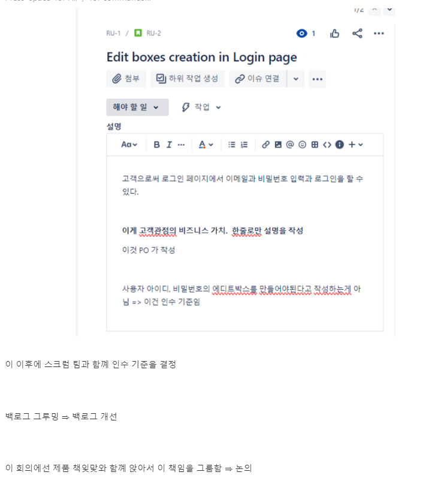

**각기능에 뭘 추가할것인지 정하고**

**개발 방법과 전략을 정함**

**기능 구현을 위해 어떻게 애자일 팀을 효율적으로 운영하고 프로젝트 관리방법을 정하고 배포를 정해야됨**

### 애자일의 에픽 & 유저스토리란

에픽이라고함은 달성해야 할 고급 요구사항임

우리 프로젝트에서 3개의 고급 요구사항이있다 ⇒ 위에말했던거

사용자 스토리 다음에 더 정확한 정의에 대해서 설명

일단

에픽 우리가 개발해야할 고급 기능

- 애자일 용어 설명

사용자 스토리 ?⇒ 애자일 프레임워크의 최소 작업 단위

애픽은 큰 작업

스토리는 에픽안에있는 작업조각

에픽을 완성하기 위한 5개의 조각

이렇게 조각난 작업이 고객에게 제공할 특정 가치를 명확히 한다.

유저스토리를 만들때는 항상 이 자잘한 작업이고객에게 제공하는 가치를 확실히 해야된다.

하나의 스토리로 푸터링크를 삽입할때도 이 사용자스토리 하나에 넣었을때 제공하는 가치가있는지 생각

없다면 추가해서 전달

누가 무엇을 하고자하며 뭘 얻는가 ⇒ 고객관점에서

우리페이지에서 하고싶은게 뭐고 결과로 필요한게 무엇인가

에픽과 유저스토리를 작성하고 연결

비즈니스의 가치를 설정하는 유저스토리 설명

