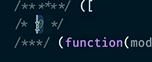

### 모듈 번들링이란

파일을 하나로 압축해주는 동작을 모듈 번들링 이라고함

빌드 번딜링 변환 모두 같은 의미

mode ? => 기본적으로 development / production / none 세가지가 존재

    "build": "webpack --mode=none --entry=src/index.js --output=public/output.js"

이런식으로하는거보다 웹팩설정파일을쓰는게좋음

module.export = {
mode: 'none',
entry: './src/index.js',
output: './public/output.js',
};

node / path / resolve => 경로 잡아주는
console.log(path.resolve('user', 'data', 'file.txt')); // /현재경로/user/data/file.txt
\_\_dirname은 Node.js에서 사용되는 전역 변수 //파일 시스템에서의 절대 경로

### 웹팩 전후

웹팩전과 후 리퀘스트 횟수가 다름

라이브러리가 20개다 그러면 서버에 왔다갔다 20번 해야되는데.

웹팩은 하나로 합쳐서 날리기때문에 요청자체는 한번이된다.


다음과같이 번호로관리


즉시실행함수의 형태로 들어있음

## 웹팩 소개 파트

js로딩이 너무느리다는것을 웹팩으로 해결
브라우저를 위한 사전 컴파일러 도구
웹팩은 자바스크립트만을 위한것이아니라 웹페이지를 구성하는 모든 자원에 관계됨.

grunt와 gulp는 웹 자동화 도구

gulp => 워크플로우 자동화 웹 테스크 매니저

음 예전엔 일일이 적어줬구나 이걸

웹팩과 그런트의 차이는 웹팩은 진입점이 하나인데 그런트는 js / css / html
여기서 핵심개념은 es6의 Import export
여러개의 파일을 하나로 합쳐주는게 모듈 번들러고. 이렇게 됬을때 네트워크 횟수가 줄어들어서 굉장히 단축된다.

### 웹팩과 모듈 소개

웹팩에서의 모듈은 자바스크립트에만 국하는게아님. ㅇ html css js font images 등 모든 자원을 말함.

### 웹팩 등장 배경

1. 파일 단위의 자바스크립트 모듈 관리의 필요성
2. 웹테스크 매니저
3. 빠른 속도와 성능

원래 var 로 만들어진애들은 최종적으로 들어온 이름으로 덮어씌워짐

결론적으로 다른 프로그래밍 언어에 비해 모듈자체가 원래 안됬었다.

현대 웹은 5초 안에 표시가안되면 대부분 집중력을 잃음.

예전에는 웹테스크매니저를 이용해서 압축하고 병합하는 작업을 진행했었음.
그러나 웹테스크 매니저로는 한계가있어서 웹팩 등장.

웹팩은 기본적으로 필요자원을 미리 로딩하는게아니라 그때 그때 요청하는 철학을 갖고있다.

### 웹팩으로 해결하려는 문제 4가지

1. 자바스크립트 변수 유효 범위
2. 브라우저별 http 요청 숫자의 제약
3. 사용하지 않는 코드의 관리
4. Dynamic Loading & Lazy loading 미지원
   => 동적으로 원하는 순간에 모듈을 불러오는것이 라이브러리가 아니면 불가능했었는데. 그게 바뀜

브라우저별 http 요청 숫자의 제약이있음.

빌드 결과분석 => source map

왜 개발자도구에서 누르면 빌드 전 꺼가 나오는가? => 개발자모드로 webpack해서 그럼 / 원본 파일에 연결해준거.

source mapped from main.bundle.js 라고 나옴

devtool:'source-map' 이 바로 이 기능

mode에 production 으로 하면 난독화가 되어있음 => 어디에서 뭐가 났고 이런거 못봄

## 웹팩 주요 속성

엔트리 아웃풋 모듈중

모듈이 개입하는거

- entry  
  웹팩에서 빌드와 변환 컴파일 번들링 (다같은소리) 진입점

- output
  빌드하고난 결과 파일 경로 및 정보
  output:{
  filename:'bundle.js'

  }
  filename에 넣을수있는옵션
  [id].bundle.js
  [name].
  이런식으로 넣을수있음.파일이 변화가됬다는것을 인식시키면서 사용자가 새로고침안해도 볼수있게하는전략

- loader
  웹팩이 웹 앱의 파일간의 관계를 이해할때 자스파일이 아닌 파일들을 변환하도록 돕는 속성 / 변환도구

---

빌드마다 고유 해시값이들어감

```
  module: {
    rules: [
      {
        test: /\.css$/,
        use: ['style-loader', 'css-loader'],
      },
    ],
  },

```

로더없이 빌드 하게되면 loader configure하라고 에러

css loader만 두면 build는 됨 근데 색깔이 적용이 안됨

'style-loader' 를 뒤로두면 또 에러

로더는 오른쪽에서 왼쪽 순서로 적용이됨 아... 012아니고 210

scss 적용하면 sass-loader가 가장 끝.

- plugin
  플러그인은 결과물에 대한 정보를 바꿔서 줌
  웹팩의 기본적인 동작에 추가적인것을 제공할때.
  로더는 파일해석 하는데에 관여하고 얘는 결과물의 형태 변경
  plugins:[]
  형태로만들어서 주입하는형태

엔트리 -> 로더 -> 빌드 -> 아웃풋(+플러그인)
