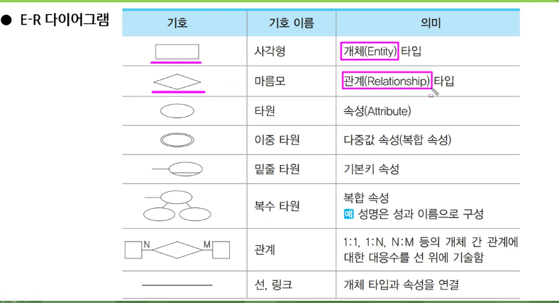
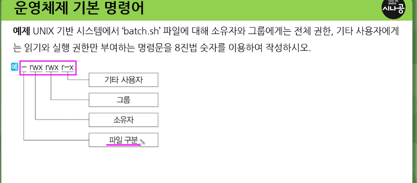

### 프로토콜

구문(Syntax): 전송하고자 하는 데이터의 형식, 부호화, 신호레벨 등을 규정함
의미(Semantic): 협조사항 과 오류관리를 위한 제어 정보를 규정함
시간(Timing): 두 기기 간의 통신 속도, 메시지의 순서 제어 등을 규정함

프로토콜의 기능: 단편화와 재결합, 캡슐화, 흐름제어 오류제어 동기화 순서제어 주소지정 경로제어 전송서비스 등

TCP IP는 인터넷에 연결된 서로 다른 기종의 컴퓨터들이 데이터를 주고받을 수 있도록 하는 표준 프로토콜
TCP: 전송계층 / 연결형 서비스 / 패킷의 다중화 순서제어 오류제어 흐름제어 기능
IP : 네트워크 계층 / 데이터그램을 기반으로 하는 비연결형 서비스 제공/ 패킷의 분해 , 조립 , 주소지정, 경로선택 기능을 제공

모르는사람한테 문자 못보냄 / 아는 사람끼리 =>TCP

TCP IP는 응용 전송 인터넷 네트워크

헷갈릴만한건 네트워크 가 인터넷이고
데이터 물리가 네트워크 액세스 계층임
전송은 동일하면

응용 => 데이터 송 수신 제공 TELNET (원격접속)/ FTP(파일) / SMTP(이메일) /DNS /HTTP
전송 => 신뢰성 있는 통신 제공 (TCP, UDP , RTCP)
인터넷 => 데이터 전송을 위한 주소지정, 경로설정을 제공함
네트워크 엑세스 계층 => 실제 데이터 를 송 수신하는 역할 / 이더넷 / IEEE802 / HDLC / X25 /ARQ등

- 응용 계층의 주요 프로토콜
  FTP : 컴퓨터와 컴퓨터 또는 컴퓨터와 인터넷 사이에서 파일을 주고받을 수 있도록 하는 원격 파일 전송 프로토콜
  기본 포트 번호는 21번이지만 다른 번호로 변경할 수 있음
  SMTP : 전자 우편을 교환하는 서비스
  TELNET: 멀리 떨어져 있는 컴퓨터에 접속하여 자신의 컴퓨터처럼 사용할 수 있도록 해주는 서비스
  SNMP: tcp/ip의 네트워크 관리 프로토콜로, 라우터나 허브 등 네트워크 기기의 네트워크 정보를 네트워크 관리 시스템에 보내는데 사용되는 표준 통신 규약
  DNS: 도메인 네임을 IP 주소로 매핑하는 시스템
  HTTP: 월드와이드 웹에서 HTML 문서를 송수신하기 위한 표준 프로토콜

포트번호 => ftp 21 telent 23 smtp 25 dns 53 http 80 https 443

- 전송게층 주요 프로토콜

- tcp
  양방향 연결형 서비스를 제공함
  가상 회선 연결 형태의 서비스를 제공함
  스트림 위주의 전달을 함
  순서 제어, 오류 제어, 흐름 제어 기능을 함

- udp

  흐름 제어나 순서 제어가 없어 전송속도가 빠름
  고속의 안정성 있는 전송 매체를 사용하여 빠른 속도를 필요로 하는 경우,
  정기적으로 반복해서 전송할 경우에 사용함
  신뢰성 보다 속도가 중요시 되는 네트워크에서 사용됨

- rtcp
  rtp(real time transport protocl)패킷의 전송 품질을 제어하기 위한 제어 프로토콜
  세션에 참여한 각 참여자들에게 주기적으로 제어 정보를 전송함
  하위 프로토콜은 데이터 패킷과 제어 패키의 다중화를 제공함
  데이터 전송을 모니터링하고 최소한의 제어와 인증 기능만을 제공함
  항상 32비트의 경계로 끝남

  - 인터넷 계층 주요 프로토콜
    ip => 주소설정 / 경로
    icmp => ip와 조합하여 오류 처리와 전송경로 변경 / 제어메시지를 관리/ 헤더는 8qkdlxm
    igmp => 멀티캐스트를 지원하는 호스트나 라우터 사이에서 멀티캐스트 그룹 유지를 위해 사용
    arp => 호스트의 ip 주소를 호스트와 연결된 네트워크 접속 장치의 물리적 주소 mac address로 바꿈
    rarp => arp와 반대로 물리적 주소를 ip주소로 변환하는 기능을 함

  - 네트워크 액세스 계층의 주요 프로토콜
    ethernet => IEEE802.3 / csma/cd 방식의 lan (여러명이 동시에 이야기하는것을 방지하기위해 먼저 들고있는 사람중 선생이 선택한 사람만 대답 충돌방지)
    ieee802 => lan을 위한 표준 프로토콜
    hdlc => 비트 위주의 데이터 링크 제어 프로토콜
    x.25 => 패킷 교화남ㅇ을 통한 dte 와 dce 간의 인터페이스를 제공하는 프로토콜
    rs-232c => 공중 전화 교환망을 통환 dte와 dce 간의 인터페이스를 제공하는 프로토콜

### 네트워크 관련 장비

- NIC (네트워크 인터페이스 카드)
  이더넷카드 혹은 네트워크 어댑터라고도 함
  정보 전송 시 정보가 케이블을 통해 전송될 수 있도록 정보 형태를 변경함
  인터넷 선 꽃을수있는카드

- 허브
  7계층 중에서 물리에서 사용
  한 사무실이나 가까운 거리의 컴퓨터들을 연결하는 장치 / 각각의 회선을 통합하여 관리
  허브는 신호증폭 기능을 하는 리피터의 역할을 포함함

- 허브종류
  더미허브 : 네트워크에 흐르는 모든 데이터를 단순히 연결하는 기능만 제공하는 허브종류
  스위칭 허브: 네트워크상에 흐르는 데이터의 유무 및 흐름을 제어하여 각각의 노드가 허브의 최대 대역폭을 사용할 수 있는 지능형 허브
  더미와 스위칭 속도차이 스위칭>더미
  더미허브는 단순히 컴퓨터연결=> 사용자 누군지 모름
  스위칭허브 => 누군지앎 누가 어디있는지 안다.

- 리피터
  거리가 증가할수록 감쇠하는 디지털 신호의 장거리 전송을 위해 수신한 신호를 재생시키거나 출력전압을 높여 전송하는 장치 = 마이크 같은거
  물리계층에서 동작

- 브리지
  브리지는 LAN과 LAN을 연결하거나 LAN 안에서의 컴퓨터 그룹을 연결하는 장치.
  네트워크를 분산적으로 구성할 수 있어 보안성을 높일 수 있음
  네트워크의 수많은 단말기들에 의해 발생되는 트래픽 병목 현상을 줄일 수 있음
  브리지가 n개일떄 n(n-1)/2 가 구성 가능한 회선수

- 스위치
  브리지와 같이 LAN과 LAN을 연결하여 훨씬 더 큰 LAN을 만드는 장치
  하드웨어를 기반으로 처리하므로 전송 속도가 빠름
  포트마다 서로 다른 전송 속도를 지원하게 제어할 수 있음
  수십에서 수백 개의 포트를 제공함
  OSI 참조 모델의 데이터 링크 계층에서 사용됨

- 라우터 (네비게이션)
  LAN과 LAN의 연결 기능에 데이터 전송의 최적 경로를 선택하는 기능이 추가된 장치
  서로 다른 LAN과 WAN을 연결하는 기능도 함
  네트워크 게층에서 동작하는 장비
  3계층 , 즉 네트워크 계층까지의 프로토콜 구조가 다른 네트워크 간의 연결을 위해 프로토콜 반환 기능을 수행함

- 게이트웨이
  게이트웨이는 OSI 전 계층의 프로토콜 구조가 다른 네트워크를 연결하는 장치
  화장실과 안방이라는 서로다른 공간을 연결시켜주는 장치가 게이트웨이
  세션 표현 응용 계층 간의 연결을 하여 데이터 형식 변환, 주소 변환, 프로토콜 변환 등을 수행함

### ER모델

개체와 개체 간의 관계를 기본 요소로 이용하여 현실 세계의 무질서한 데이터를 개념적인 논리 데이터로 표현하기 위한 방법
개체 타입(Entity Type)과 이들간의 관계타입(Relationship Type)을 이용해 현실 세계를 개념적으로 표현함

이중타원 => 다중값 속성(복합 속성)
밑줄 타원 => 기본키 속성
복수 타원 => 복합속성
마름모 위에 네모 => 개체간 관계 NM 1:1 1:N등
사각형 : 개체타입
선 링크 : 개체 타입과 속성을 연결

### 운영체제 기본 명령어

- window
  DIR 파일목록표시 옵션 => /p 는 화면단위로 짤라서 보여라 /w wide해서 보여라 /o 정렬해라 /s 서브디렉토리 하위 디렉토리 다 표시해라 /a 지정한속성이 설정된 파일을 표시해라
  COPY 카피 DEL
  TYPE 파일의 내용을 표시
  REN 파일의 이름을 변경
  MD 디렉터리를 생성함
  CD 디렉터리의 위치를 변경함
  CLS 화면의 내용을 지움
  ATTRIB 파일의 속성을 변경함 /r 읽기전용 + 설정 - 해제
  FIND 파일에서 문자열을 찾음
  CHKDSK 디스크 상태를 점검함
  FORMAT 디스크 표면을 트랙과 섹터로 나누어 초기화함
  MOVE 파일을 이동함

  - UNIX /LINUX
    cat : 파일의 내용을 화면에 표시함
    cd : 디렉터리의 위치를 변경
    chomod: 파일의 보호 모드를 설정하여 파일의 사용 허가를 지정
    chown : 파일 소유자와 그룹을 변경함

    u:user g:group o: ohter a: all
    +:권한추가 =: 부여
    rwx:읽기 쓰기 실행
    chomod u=rwx abc.txt // u라는 사용자는 abc라는 txt파일을 읽고쓰고 실행 다함
    chown member 1 abc.txt = > abc.txt의 소유자를 member1으로 변경

    cp:파일을 복사함
    rm:파일 삭제
    fsck:검사/보수
    kill: pid를 이용하여 프로세스 종료
    fork : 새로운 프로세스를 생성함
    killall : 프로세스의 이름을 이용하여 프로세스를 종료함
    ls : 현재 디렉터리의 파일 목록을 표현함 (=dir)
    mkdir : 디렉터리 생성 (=md)
    rmdir: 디렉터리 삭제
    mv
    ps:현재 실행중인 프로세스를 표시
    pwd: 현재 작업중인 디렉터리 경로를 화면에 표시
    top : 시스템의 프로세스와 메모리 사용 현황 표시
    who : 접속해 있는 사용자

    

    첫번쨰는 소유자 두번쨰는 그룹 세번쨰는 기타
    실행권한 만 주고싶다? => --x 같은 형태

    권한있다 없다 1 /0

    8진수로 변환 111=>7 110=>6

    => chomod 775 batch.sh

### 스케쥴링

내가 해야되는 일이 3가지가 있다고 하면 3가지를 어떤 순서대로 처리할 것인지 우선순위를 부여하는 작업을 보고 스케쥴링 이라고 함

비선점 스케쥴링 : 이미 할당된 CPU를 다른 프로세스가 못뺐음 / FCFS SJF HRN 기한부, 우선순위 등
선점 스케쥴링: 빼앗는거 가능 / 우선순위 , SRT , RB , 다단계 큐 , 다단계 피드백 큐

프로세스가 생성되어 완료될 때까지 프로세스는 여러 종류의 스케줄링 과정을 거치게 됨.

FCFS : 준비상태 큐에 도착한 순서에 따라 차례로 CPU를 할당하는 기법.
SJF : 준비상태 큐에서 기다리고 있는 프로세스들 중에서 실행 시간이 가장 짧은 프로세스에게 먼저 CPU를 할당
HRN : 실행 시간이 긴 프로세스에 불리한 SJF 기법을 보완하기 위한 것으로, 대기 시간과 서비스(실행) 시간을 이용하는 기법
우선순위를 계산하여 그 숫자가 가장 노픈 것부터 낮은 순으로 우선순위가 부여됨
기한부 : 프로세스한테 일정한 시간을 주어 그 시간안에 프로세스를 완료하도록 하는 기법 // 제한된 시간 안에 완료되지 않을 경우 제거되거나 처음부터 다시 실행해야 함
우선순위 : 기다리는 프로세스 마다 우선순위를 부여해서 가장 높은 애한테 cpu를 할당함 . 우선순위가 동일하면 fcfs대로 할당

\*우선순위는 시스템에 의해 자동으로 결정되기도 하고 외부 사항에 의해 결정되기도 함. date
내부적 우선순위 - 시간 제한, 기억장치 요구 , 개방된 파일 수, 평균 입 출력 실행 시간 등
외부적 우선순위 - 작업을 지원하는 정책 , 부서 등

- 선점 스케줄링

- 선점 우선순위 : 준비상태 큐의 프로세스들 중에서 우선순위가 가장 높은 프로세스에게 먼저 CPU를 할당하는 기법

SRT : 비선점 스케줄링인 SJF 기법을 선점 형태로 변경한 기법으로, 선점 SJF 기법이라고도 함 현재 실행중인 프로셋의 남은시간과 준비상태 큐에 새로 도착한 프로세스의 실행 시간을 비교하여 가장 짧은 실행 시간을 요구하는 프로세스에게 CPU를 할당함.

RR: 시분할 시스템을 위해 고안된 방식 / FCFS 알고리즘을 선점 형태로 변형한 기법 먼저온 애가 먼저 CPU를 받지만 각 프로세스느 ㄴ할당량 시간 동안만 실행한 후 완료되지않으면 가장 뒤로 다시 재배치

다단계 큐 (MQ): 프로세스를 특정 그룹으로 분류할 수 있을 경우, 그룹에 따라 각기 다른 준비상태 큐를 사용하는 기법

다단계 피드백 큐(MFQ): 특정 그룹의 준비상태 큐에 들어간 프로세스가 다른 준비상태 큐로 이동할 수 없는 다단계 큐 기법을 준비상태 큐 사이를 이동할 수 있도록 개선한 기법

### 데이터베이스 개요

- 데이터 저장소
  데이터들을 논리적인 구조로 조지고하하거나 , 물리적인 공간에 구축한 것을 의미함.
  논리 데이터 저장소 / 물리 데이터 저장소 크게 두가지로 나눠 볼 수 있음.
  데이터 및 데이터간의 연관성 제약조건을 식별하여 논리적인 구조로 조직화한것
  물리 데이터저장소는 논리 데이터저장소를 소프트웨어가 운용될 환경의 물리적 특성을 고려하여 실제 저장장치에 저장한 것을 의미함

- 데이터베이스
  공동으로 사용될 데이터를 중복을 배제하여 통합하고, 쉽게 접근하여 처리할 수 있도록 저장장치에 저장하여 항상 사용할 수 있도록 운영하는 운영데이터

  통합된 데이터 => 중복 배제
  저장된 데이터 => 접근할 수있는 저장 매체에 저장된 자료
  운영 데이터 => 조직의 고유한 업무를 수행하는 데 반드시 필요한 자료
  공용 데이터 => 여러 응용 시스템들이 공동으로 소유하고 유지 하는 자료

  - DBMS 데이터베이스 관리 시스템
    데이터의 종속과 중복성의 문제를 해결하기 위해 제안된 시스템
    정의 기능 조작기능 제어기능
    사용자의 요구에 따라 정보를 생성해주고, 데이터베이스를 관리해주는 소프트웨어
    정의 기능 : 데이터의 형과 구조에 대한 정의, 이용 방식, 제약 조건 등을 명시하는 기능
    조작 기능 : 데이터 검색, 갱신, 삽입, 삭제 등을 위해 인터페이스 수단을 제공하는 기능
    제어 기능 : 데이터의 무결성, 보안 , 권한검사, 병행 제어를 제공하는 기능(누구는 보고 누구는 못보게)

- 데이터의 독립성
  종속성에 대비되는 말로 논리적 독립성과 물리적 독립성이 있다.
  논리적 독립성이란? => 응용 프로그램과 데이터에비으를 독립시킴으로써, 데이터의 논리적 구조를 변경시키더라도 응용 프로그램은 영향을 받지 않음

  물리적 독립성 => 응용프로그램과 보조기억장치 같은 물리적 장치를 독립시킴으로써, 디스크를 추가/변경 하더라도 응용프로그램은 영향을 받지 않음

- 스키마
  데이터베이스의 구조와 제약조건에 관한 전반적인 명세를 기술한 것

  외부 개념 내부

  외부? => db입장에서의 외부 => 사람들 =>사용자나 응용프로그래머가 각 개인의 입장에서 필요로 하는 데이터 베이스의 논리적 구조를 정의한 것
  개념 ? = > 데이터 베이스의 전체적인 논리적 구조 / 하나만 존재
  내부 스키마? => 물리적 저장장치 입장에서 본 데이터베이스 구조 / 실제로 저장될 레코드의 형식, 저장 데이터 항목의 표현 방법, 내부 레코드의 물리적 순서 등을 나타냄

  - 설계순서
    요구 조건 분석 => 개념적 설계 => 논리적 설계 => 물리적 설계 => 구현
    요괴놈물궄ㅋㅋ
    개념적 설계 => 개념 스키마, 트랜잭션 모델링, ER
    논리 => DBMS에 맞는 논리 스키마 설계 , 트랜잭션 인터페이스 설계
    물리 => 물리적 구조의 데이터로 변환
    구현 DDL로 생성 / 트랜잭션 작성

### 데이터베이스 설계

데이터베이스 설계는 사용자의 요구를 분석하여 그것들을 컴퓨터에 저장할 수 있는 데이터베이스의 구조에 맞게 변형한 후 DBMS로 데이터베이스를 구현하여 일반 사용자들이 사용하게 하는 것.

- 고려사항
  무결성 : 삽입 삭제 갱신 등의 연산 후에도 데이터베이스에 저장된 데이터가 정해진 제약 조건을 항상 만족해야 함
  일관성 : 데이터베이스에 저장된 데이터들 사이나, 특정 질의에 대한 응답이 처음부터 변함이 없어야 함
  회복: 장애 발생 시 리커버리
  보안 : 불법적인 데이터의 노출 또는 변경이나 손실로부터 보호 가능
  효율성: 응답시간의 단축, 시스템의 생산성, 저장 공간의 최적화 등이 가능해야 함
  데이터베이스 확장: 데이터베이스 운영에 영향을 주지 않으면서 지속적으로 데이터를 추가할 수 있어야 함

### 운영체제의 개념

OS:operating system 의 약자

컴퓨터 시스템의 자원들을 효율적으로 관리하며, 사용자가 컴퓨터를 편리하고 효과적으로 사용할 수 있도록 환경을 제공하는 여러 프로그램의 모임

컴퓨터 사용자와 하드웨어 간의 인터페이스로 동작하는 시스템 소프트웨어의 일종임

운체제는 프로세스 기억장치 주변장치 파일 등을 관리하는 기능을 수행함.

- 목적
  처리능력(많은 양) / 반환시간(걸린 시간) / 사용가능도(즉시 사용 가능한 정도) / 신뢰도(정확하게 해결하는 정도)

- 기능
  프로세서 (처리기) 기억장치 (주기억장치, 보조기억장치), 입출력장치, 파일 및 정보 등의 자원을 관리함
  자원을 효율적으로 관리하기 위해 자원의 스케줄링 기능을 제공함
  시스템의 각종 하드웨어와 네트워크를 관리-제어함
  데이터를 관리하고 , 데이터 및 자원의 공유 기능을 제공함

- 운용 기법
  일괄처리 시스템 (batch processing) => 한꺼번에 량 또는 기간동안 모아서 한 번에 처리=>빨래 느낌
  실시간 처리 (Real Time Processing) => 발생 즉시 처리 => 음식먹는거 생각
  다중 프로그래밍 (Multi Programming) => 하나의 cpu와 주기억장치를 이용해 여러개 동시 처리방식 하나의 주기억장치에 2개 이상의 프로그램을 기억시켜 놓고, 하나의 CPU와 대화하면서 동시에 처리함
  시분할 시스템 (Time sharing) => 여러 명의 사용자가 사용하는 시스템에서 컴퓨터가 사용자들의 프로그램을 번갈아 가며 처리 / 각 사용자에게 독립된 컴퓨터를 사용하는 느낌을 주는 방식, 라운드 로빈 방식이라고도 함.
  다중 프로그래밍 방식과 결합하여 모든 작업이 동시에 진행되는 것처럼 대화식 처리가 가능함.
  시간을 나눠서 어떤 프로그램에 몇 초 주는 형태 시간을 나눠주는 방식 => 시분할

  다중 처리 => 여러개의 cpu와 하나의 주기억장치 여러개의 프로그램을 동시에 처리 하나 고장나도 다른 하나ㄲ
  다중 모드 처리 => 일괄 시분할 다중 처리 실시간 처리를 한 시스템에서 모두 제공 (여러 모드)
  분산 처리 => 여러 개의 컴퓨터(프로세서)를 통신 회선으로 연결하여 하나의 작업을 처리하는 방식, 각 단말장치나 컴퓨터 시스템은 고유의 운영체제와 CPU, 메모리를 가지고 있음

### 운영체제의 종류

- 윈도우
  gui
  선점형 멀티태스킹 : 동시에 여러 개의 프로그램을 실행하는 멀티태스킹을 하면서 운영체제가 각 작업의 CPU 이용 시간을 제어 하여 응용 프로그램 실행중 문제가 발새하면 해당 프로그램을 종료시키고 모든 자원을 반환하는 방식 => 강제종료를 시킬 수 있냐 없냐

pnp (plug and play => 꽃으면 실행된다)
모든 장치 usb형태 이걸 꽃으면 지가 알아서 해당 장치를 사용할 수 있게 하는것이 pnp때문
해당 하드웨어에 필요한 시스템 환경을 운영체제가 자동으로 구성해 주는 기능

ole(object linking and embedding)
다른 응용 프로그램에서 작성된 문자나 그림 등의 개체를 현재 작성 중인 문서에 자유롭게 연결하거나 삽입 하는 기능 (근데 이게 운영체제?)

255자의 긴 파일명
몇 가지 특수 문자를 제외한 문자 및 공백을 사용하여 최대 255까지 파일 이름을 지정할 수 있음

Single-User 시스템
컴퓨터 한 대를 한 사람만이 독점

- UNIX
  시분할 시스템을 위해 설계된 대화식 운영체제
  대부분 C언어로 작성되어 있어 이식성이 높으며, 프로세스 간의 호환성이 높음
  다중 사용자, 다중 작업을 지원함
  소스가 공개된 개방형 시스템임
  트리 구조의 파일 시스템을 갖음

  커널 : 하드웨어를 보호하고 프로그램과 하드웨어간의 인터페이스 역할을 담당 UNIX의 가장 핵심적인 부분
  CPU스케쥴링 관리 / 파일관리/ 입출력관리 등 여러가지를 함
  쉘: 명령어를 인식하여 프로그램 호출하고 수행하는 명령어 해석기

  유틸리티 프로그램:사용자가 작성한 응용프로그램을 처리하는 데 사용함
  DOS에서의 외부 명령어에 해당됨 / 에디터/ 컴파일러 /인터프리터 / 디버거 등

- LINUX
  UNIX기반으로 개발된 운영체제
  소스코드가 무료로 공개되어있기 떄문에 , 원하는 기능을 추가할 수 있음

- Mac OS
  애플사가 유닉스를 기반으로 개발한 운영체제
  애플 사에서 생산하는 제품에서만 사용이 가능함 드라이버 설치와 해제 과정이 단순함

- 안드로이드

### OSI 참조모델

시스템간의 원활한 통신을 위한 통신규약 => 7계층

하위 물리 데이터링크 네트워크
상위 전송 세션 표현 응용
물데네전세표응

### OSI참조 모델에서 데이터 단위

프로토콜 데이터 단위 (PDU)
프토로콜 데이터 단위는 동일 계층 간에 교환되는 정보의 단위
물리계층 : 비트
데이터링크계층 : 프레임
네트워크 : 패킷
전송: 세그먼트
세션 표현 응용 : 메시지

서비스 데이터 단위(SDU : Service Data Unit)
서비스 데이터 단위는 서비스 접근점(SAP)을 통해 상 하위 계층 끼리 주고받는 정보의 단위를 말함.

- 물리계층
  실제 접속과 절단
  물리 전송 매체와 전송 신호 방식을 정의
  리피터 허브

- 데이터링크
  인접한 개방형 시스템 간에 신뢰성 있고 효율적인 정보 전송을 할 수 있도록 시스템간 연결 유지 종료
  속도 차이 해결을 위한 흐름제어
  프레임 시작 끝 동기화 기능
  오류검출과 회복
  순서적 전송을 위한 순서 제어 기능도 있음
  HDLC LAPB LLC MAC LAPD PPP
  랜카드 브리지 스위치

- 네트워크
  시스템들간의 네트워크 연결을 관리하는 기능과 데이터의 교환 및 중계 기능 수행
  경로 설정 및 네트워크 연결 설정 유지 해재
  라우터

- 전송

  OSI 계층 중 하위 3과 상위 3계층의 인터페이스역할
  종단 시스템 간의 전송 연결 설정, 데이터 전송, 연결 해제 기능
  주소 설정 , 다중화 ,오류제어 ,흐름제어
  TCP(등기) UDP(일반)
  게이트웨이

- 세션
  관련성 유지 / 대화제어 담당
  동기점이라는게 있어서 오류가있는 데이터 회복을 위해 사용
  소동기점 / 대동기점

- 표현
  서로 다른 데이터 표현 형태를 갖는 시스템 간의 상호 접속을 위해 필요한 계층
  코드 변환, 데이터 암호화, 데이터 압축, 구문 검색, 정보 형태변경, 문맥관리

- 응용
  사용자가 OSI환경에 접근할수있도

### 인터넷

TCP/IP 프로토콜을 기반으로 하여 전 세계 수 많은 컴퓨터와 네트워크들이 연결된 광범위한 컴퓨터 통신망

인터넷에 연결된 모든 컴퓨터는 고유한 IP주소를 갖음

- ip 주소
  인터넷에 연결된 모든 컴퓨터 자원을 구분하기 위한 고유한 주소
  8비트씩 4부분 32비트 => IPv4
  인터넷 주소중 가장 작은주소는 0을 32개쓰면 ipv4중 가장 작은주소
  가장 큰건 다 1

  a클래스 국가나 대형 통신망에 사용 (0~127로 시작)

  e는 실험적 주소
  d는 멀티클래스
  c는 소규모 통신망
  b는 중대형
  a는 국가나 대형 통신망

  읽고쓰기 편하게 10진수로 표현 함

  192.168.10.0 이렇게 하나만 나옴 이거 쓰레기 주소
  반드시 서브넷 마스크가 나와야 됨 (sm=> 쓸수있는거없는거 구분 1로표현된건 쓰지마 0은 써라)
  ip주소 가 오고 서브넷이 다 1이면 아무것도 쓰지마

  한 자리 별로 0~255
  192.128.0.0/24 이런식으로 표현 24는 무엇이냐? => 1의 갯수 8마다 255

  24=> 255.255.255.0

  막아놓은 주소를 네트워크 주소라고하고 내가 쓸 수 있는것을 호스트주소라고함

  서브네팅 => 핟당된 네트워크 주소를 다시 여러개의 네트워크로 나누어 사용하는 것을 말함.
  => ip 주소를 계산해라
  서브넷 마스크는 각 클래스마다 다르게 사용됨

  - FLSM 방식 ? => 똑같이 나눠라
  - Subnet-Zero ? => 0번주소도 ip주소로 쓸 수 있다.

  몇개로 나누느냐? => 2의몇승이냐 생각
  192.168.1.0/24 => FLSM방식으로 3개로나눠라 ? => 192.168.1.0/26

  0의 갯수도 2의 몇승
  0000 0000
  1100 0000 => 2 6
  64 64 64 64 에서 한개 막기 끝

  192.168.1.0~63 / 64~127 / 128~191

  남은거 => 192.168.1.192~255

  이런과정이 서브네팅
  아아 남은 서브넷 가지고 계산이 갈라치는거구나

  2개라고하면 2의7승이고
  0~127 / 128~255 구나

  - ipv6
    128비트의 긴 주소 / 주소부족 문제 해결
    전송속도 빠름
    인증 기밀 무결 지원 => 보안
    주소의 확장성, 융통성, 연동서이 뛰어남
    실시간 흐름 제어로 향상된 멀티미디어 기능을 지원함
    패킷 크기를 확장할 수 있으므로 패킷크기에 제한이 없음
    기본 헤더 뒤에 확장 헤더를 더함을 ㅗ

### 포인터의 개념

- 포인터? => 주소를 저장하는 변수 = 포인터 변수
  주소 자체가 포인터

point :~를 가리키다 pointer : 가리키는 무엇 / 사람
포인터? => 주소를 가리키는

int a ;=>정수형 자료 저장하는 a 변수
int \* a; => 정수형 자료형을 저장할 곳을 가리킬 a변수를 선언해라

포인터변수의 경우 \*을씀 => 선언할떄

그외 => 메모리를 직접 가리킴

포인터변수는 주소를 가지고있음 FE4A

\*a =4
a의 주소위치에 4가 저장되어있음
a=4 하면 메모리주소가 어딘지 모르는 그냥 4가됨 기존의 메모리주소가아니라.

int b=3;
int \*c;

c에 b의 주소를 저장하고싶다면?

c=&b;

&는 일반변수의 주소를 뽑아내는 역할을 함.

### 교착상태

상호배제에 의해 나타나는 문제점으로 둘 이상의 프로세스들이 자원을 점유한 상태에서 서로 다른 프로세스가 점유하고 있는 자원을 요구하며 무한정 기다리는 현상을 의미함.

상호배재: 한번에 한개의프로세스만이 공유자원을 사용
점유와 대기: 하나의 자원을 점유하면서 추가로 점유하기위해 대기가필요
비선점 : 강제로 못뻇음
환형대기: 공유자원을 사용하기 위해 대기하는 프로세스들 이 원형으로 구성되어 있어 자신에게 할당된 자원을 점유하면서 앞이나 뒤에 있는 프로세스의 자원을 요구해야 함

### 교착상태의 해결방법

예방 기법 : 사전에 제어하는 방법 / 자원의 낭비가 가장 심함
회피 기법 : 가능성 배제하지 않고 발생하면 피해나가는 법 / 은행원 알고리즘
발견 기법 : 교착상태가 발생했는지 점검하여 교착상태에 있는 프로세스와 자원을 발견
회복 기법 : 교착상태를 일으킨 프로세스 종료하거나 자원을 선점하여 프로세스나 자원을 회복

### DB관련신기술 DB관련용어

빅데이터 / 브로드 데이터(다양한 채널에서 소비자와 상호 작용을 통해 생성된 것 마케팅에 있어 효율적이고 다양한 데이터) / 메타 데이터(일련의 데이터를 정의하고 설명해 주는 데이터)
디지털 아카이빙 : 디지털 정보 자원을 장기적으로 보존하기 위한 작업
하둡 : 오픈 소스를 기반으로 한 분산 컴퓨팅 플랫폼 / 자바 소프트웨어 프레임워크 // 일반 pc급 컴퓨터들로 가상화된 대형 스토리지를 형성하고 그안에 보관된 거대한 데이터 세트를 병렬로 처리할 수 있도록 함  
맵리듀스 : 대용량 데이터를 분산 처리하기 위한 목적으로 개발된 프로그래밍 모델 / 연관성있는 데이터들을 묶는걸 map 작업이라고 하고 / 중복 데이터 제거 및 추출이 reduce작업이라고함

타조: 아파치 하둡 기반의 분산 데이터 웨어 하우스 프로젝트
데이터 다이어트 : 삭제하는게 아니라 압축 및 중복 데이터 배제 , 새로운 기준에 따라 나누어 저장하는 작업
데이터 마이닝 : 대량의 데이터를 분석하여 데이터에 내재된 변수 사이의 상호 관계를 규명하여 일정한 패턴을 찾아내는 기법
OLAP: 다차원으로 이루어진 데이터로부터 통계적인 요약 정보를 분석하여 의사결정에 활용하는 방식

데이터 웨어하우스 : 정보 와 창고의 합성어 기업의 의사결정에 사용될 수 있도록 여러 시스템에 분산되어있는 데이터를 주제별로 통합 축적해 놓은 데이터베이스

가상 데이터웨어하우스 : 물리적으로 구축하지않아도 실제 구축한 것 처럼 효과를 내는 가상 시스템

스택: 리스트의 한쪽 끝으로만 자료의 삽입, 삭제 작업이 이루어지는 자료 구조
큐 : 한쪽에서는 삽입이 이루어지고 한쪽에서는 삭제가 이루어지도록 구성한 자료 구조

정규화 : 뭐 부분적 이행 함수 종속 제거 등등

반정규화 : 의도적으로 정규화 원칙을 무시하는 행위

이상: 정규화를 거치지 않으면 데이터베이스 내에 데이터들이 불필요하게 중복되어 릴레이션 조작 시 예기치 못한 곤란한 현상이 발생하는데, 이를 이상이라며 삽입 이상 삭제 이상 갱신 이상이 있음

인덱스 : 데이터 레코드를 빠르게 접근하기 위해 키 값 포인터 쌍으로 구성되는 데이터 구조

뷰 : 접근이 허용된 자료만을 제한적으로 보여주기 위해 하나 이상으 ㅣ기본 테이블로부터 유도된, 이름을 가지는 가상 테이블

파티션 : 테이블이나 인덱스를 작은 논리적 단위인 파티션으로 나누는것을 말함

관계대수: 관계형 db에서 원하는 정보와 그 정보를 검색하기 위해서 어떻게 유도하는가를 기술하는 절차적인 언어

관계해석 : 관계 데이터의 연산을 표현하는 방법

후보키 : 튜플을 식별하기 위해 사용하는 속성들의 부분집함. 유일성과 최소성을 만족시켜야 함

기본키 :후보키 중 선정된 주키 노 중복

대체키 : 둘 이상일 때 기본키를 제외한 나머지 후보키

슈퍼키 : 한 릴레이션 내에 있는 속성들의 집합으로 구성된 키 / 최소성은 만족 못 시킴

외래키 : 참조

개체 무결성: 기본 테이블의 기본키를 구성하는 어떤 속성도 null이나 중복값을 가질 수 없다.

참조 무결성: 외래키 값은 null이거나 참조 릴레이션의 기본키값 과 동일해야함 => 참조할 수 없는 외래키 값을 가질 수 없다
