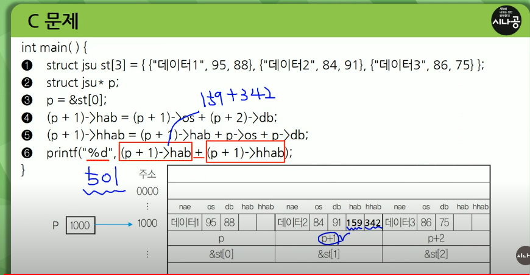
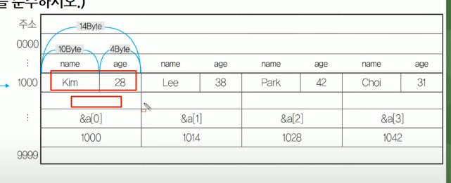

### JAVA

클래스 안에 반드시 메인메서드가 있어야 메인부터 실행이 됨
자바 같은 객체지향언어에서는 함수를 보고 메서드라고 부름 (그거나 그거나)
입력받을때 java에서 제공하는 util Scanner가 있음 (당연히 import해야됨)

자바는 아무리 작은 프로그램이라고 하더라도 클래스 안에 속성이나 메서드를 만들어서 실행을 해주어야 함

메인 함수가 시작전에 클래스를 만들어 줘야 함

```java


class Test {

    public static void main(String args[]){
        int a =26;
        int b =91;
        int q= 0;
        int c =a<b ?a:b;
        for (int i=1;i<c;i++){
            if(a%i==0&&b%i==0)
                g=i;
        }
        System.out.print(g);//13

    }


}


public class Test {

    public static void main (String[] args){
        int[]a = new int[8]; //0으로 초기값 할당
        int i = 0;
        int n = 11;
        while(n>0){
            a[i++]=n%2;//후치
            n/=2;
        }
        for(i=7;i>=0;i--){
            System.out.printf("%d",a[i]);
        }

    }


}


import java.util.Scanner;

public class Test
{
    public static void main(String[]args)
    {
        Scanner scan = new Scanner(System.in); // 객체변수 생성코드 System.in ?=> 표준입력장치 키보드 사용자로부터 입력받은 걸 scan이라는 객체변수로 받겠다
        int a = scan.nextInt();//입력받은 값을 정수형으로 변환해라
        System.out.printf("a*3=%d\n", a*3);//java에서는 printf println print 3가지가있다. printf?=>c언어랑 같은 %d는 정수값으로 출력하라는 이야기 \n 은 개행 a*3 = 12 가 나옴 printf의 경우 제어문자 \n을 써야 다음으로
        System.out.println("a/2="+(a/2)) // println은 값이나 변수가 가지고있는 내용을 형식없이 출력하고 다음줄 처음으로 커서를 이동시켜라 라는 뜻을 가지고있음 a/2 = 2 가 나옴
        System.out.print("a-1="+(a-1))//형식없이 그대로 출력 a-1=3
        scan.close();//scan이라는 객체변수 메모리영역을 해제
    }
}
```

```java
쉬운데

class Test{

    public static void main (String args[]){

        int i =17;
        i +=1;
        i -=2;
        i *-=3
        i %=5;
        System.out.print(i);
    }

}


public class Test{

    public static void main(String[]){
            String str="agile";
            int x[] = {1,2,3,4,5};
            char y[] = new char[5]; // 똑같은 배열이지만 개수를 쓰냐 초기값을 주냐에 따라 이렇게 변경 생성자 인가 다 빈값이네
            int i =0;
            while (i< str.length()){
                y[i]=str.charAt(i);
                i++;
            }
            // y= agile

            for(int p:x){ // 향상된 반복문 int p ? => p라는 변수에 x라는 배열이 가지고있는 값들을 하나씩 가지고와서 p에 집어넣아ㅓ라 라는 이야기 오 ㅋㅋ 자바에신기한거있네
                i--;
                System.out.print(y[i]);
                System.out.print(p+"");//p의값을 출력하고 + 은 이어서 공백을 출력하라는 의미
                // e1 l2 i3 g4 a5 // 마지막공백까지
            }

    }

}


```

### Python

객체지향 기능을 지원하는 스크립트 언어로 다른 언어 비해 문법이 간단함
문자와 문자열을 작은 따옴표 큰 따옴표 구분 없이 사용 가능하며 세개의 따옴표로 묶어 표현가능
문장의 끝을 의미하는 ; 가 필요없음
if나 for 와 같이 코드 블록을 포함하는 명령문을 작성할때 중괄호({})대신 콜론과 여백으로 구분함.

input() 함수는 python 의 표준 입력 함수로, 키보드로 입력받아 변수에 저장하는 함수
입력되는 값은 문자열로 취급되어 저장됨

변수 1, 변수 2 = input(출력문자).split(분리문자)
리스트랑 비슷한게 배열 리스트는 갯수를 따로 적지않음 가장 큰 차이점은 정수값들만 넣는거랑 아닌거

a.remove() => 하면 위치 떙겨지네 난 지워질 줄

extend 확장 / pop 값출력하고 걔는 삭제 와 pop이마지막꺼가아니네 python 개편하네ㅋㅋ;;
sort => 기본 오름차순
sort(reverse=true) => 내림차순 reverse는 true면 내림차순
copy => 복사

print(출력값,sep=분리문자,end=종료문자)

a[1][-3:], a[2][:-3]

슬라이스는 문자열이나 리스트와 같은 순차형 객체에서 일부를 잘라 반환하는 기능
객체명[초기위치:최종위치] 최종위치(=> -1까지)
객체명[초기위치:최종위치:증가값] 증가값 양수면 최종위치 -1 음수면 +1
객체명[:] / 객체명[::] 들어있는 모든요소 다
객체명[초기위치:]=>초기위치에서 마지막위치까지 다 반환
객체명[:최종위치] 0에서 -1까지
객체명[::증가값] 0번째위치에서 마지막위치까지 증가값 만큼 증가하면 해당 위치 요소들을 반환

randge(3,6) => 6-1 까지 3,4,5
print(i,end=" ") // 끝나고 공백하나

세트자료형 => 정렬이없고, 중복값을 저장하지 않음

false true 쓸떄 맨앞 대문자로 해야된다 아 ㅋㅋㅋㅋ c언어든 자바든 파이썬이든 대소문자 구분해서 출력결과도구분해야된다고 자스는...

map(함수,리스트) 리스트에있는거 가지고 함수 계산해라 이게 map

lambda 변수명 : 수학식

람다식 => 어떤 문제를 해결하기 위한 과정을 수학식으로 표현한 것을 람다 식이라고 함.
프로그래밍 언어에서 람다 식은 수학적 연산을 수행하는 함수나 메소드를 간소화할때 사용함.

수학식 간소화 함수 좋네 일일이 만드는거보다

```python

a ={'apple','lemon','banana'}
a.update({'kiwi','banana'}) #병합
a.remove('lemon')
a.add('apple')
for i in a:
    print(i)


a = 100
result =0
for i in range (1,3):
    result = a>>i # i만큼 오른쪽 시프트해라 파이썬에서 정수는 4바이트라 32비트 패딩비트에 들어가는 값은 a가 양수냐 음수냐에 따라 달라짐 맨앞의 부비트는 그대로 내려오 양수면 패딩은 왼쪽 오른쪽 다 0 음수일때 오른쪽이면 1
    result = result+1

print(result) //26


```

### C

구조체
여러가지 자료를 넣을수있는거
struct jsu st[3]{ // jsu라는 구조체를 st[3]라는이름으로 3개짜리 배열을 만들어 쓰겠다.
char nae[12]; => 11까지
int os, db ,hab, hhab

}


이야 복잡한듯한데 다알면 별건 아니네
쭈욱 정리될것임

```c


#include <stdio.h>
int factorial(int n); // 실행하고 반환할 값의 형 int
main(){
    int(*pf)(int); // *pf => 함수 포인터 이름 함수의 주소도 함수 포인터에 저장 가능 함수 int?=> 함수가 전달받을 인수의 자료형 아 뭐야 이것만아니까 걍 팩토리얼이네 뭐 별 기대도안하긴했는데
    pf =factorial; // pf는 팩토리얼
    printf("%d",pf(3));
}

int factorial(int n){
    if(n<=1)
        return 1;
    else
        return n*factorial(n-1);
}


#include <stdio.h>
main(){
    int arr[6];
    int max =0, min=99;
    int sum =0;
    for(int i=0;i<6;i++){
        arr[i]=i*i;
        sum+=arr[i];
    }
    for(int i=0; i<6;++){
        if(max<arr[i])
            max=arr[i];
        if(min>arr[i])
            min=arr[i]
    }
    printf("%.2f",(sum-max-min)/4.0); //%.2f=> 소수점 2점번째까지 표시해라 7.50 아 .도그냥있는게아니네;
}


#include <stdio.h>
main(){

    int i=1,n=0;
    while(i<=50){
        if(i%7==0)
            n+=i;
        i++
    }
    printf("%d",n);
}


#include <stdio.h>

main(){
    int a =50;
    int *b = &a;
    *b = *b +20;
    printf("%d ,%d\n", a,*b)
    char *s;
    s = "gilbut"; // 마지막 널문자 / 1바이트씩 차지
    for(int i=0; i<6;i+2=2){
        printf("%c",s[i])
        printf("%c",*(s+i))
        printf("%s\n",s+i) // 70, 70 \n g, g, gilbut  \n l, l, gilbut \n u, u, gilbut \n
// 포인터 변수의 여러 표현 s s+1 / &s[0] , 1000, 1001
    }
}


#include <stdio.h>
main(){
    int j = 024, k=24 , L=0x24, hap; // 숫자앞에 0이붙으면 8진수 24(8) , 24 (10),0x => 16진수 24(16) 2*8+4*8  / 16*2+4*16의 0승 각자리수별 이런 식으로 계산 20 , 36
    hap = j+k+L//80
    printf("%d,%d,%d,%d\n",j,k,L,hap)//20,24,36,80

}


#include <stdio.h>
main(){


int a =10;
char b = 'a'; // A = 65 a = 97

printf("%d\n",a); // 10
printf("%d\n",b); // 97
printf("%c",b); // a


}


#include <stdio.h>

main (){

int n1 = 15, n2 =22;
n1^=n2; // bit 연산  n1이라는 변수의값고 n2라는 변수의 값을가지고 n1에 넣어라 n1 = n1^n2 0000 1111 0001 0110 같으면 0 다르면 1 => 00011001
n2^=n1; //
n1 ^=n2;

printf("%d %d",n1,n2); //22 15 쉼표 없는 거 주의 22,15아님 출력서식주의

}


#include <stdio.h> // 헤더파일 표준 입출력 관련 함수 정의해둔 헤더파일
main() // 메인함수가 있어야 프로그램 실행
{
    int i,j,k; // 변수 선언
    scanf("%d %d, &i,&j"); // %d 입력받는 문자를 10진수로 받아들이겠다. 앞의 두개에 전달되는게 뒤의 두 i ,j 엔퍼센트 기호는 주소연산자 // 얘는 입력문
    k=i+j;// c언어에서는 처리문
    printf("%d\n",k); // 10 // 얘는 출력문 //fprintf는 파일로 출력해라 여기서의 %d 는 scanf와 동일함
}


#include <stdio.h>

main(){

    int score[] = {86,53,95,76,61}; // score [86,53,95,76,61]
    char grade; // 문자형 변수
    char str[] = "Rank" // [R,a,n,k,/0] 마지막은 null문자
    for(int i=0; i<5 ; i++){
        switch (score[i]/10){ // 정수형 나눗셈 c에서는 무조건 정수  8 /B
            case 10:
            case 9:
                grade = "A";
                break;
            case 8:
                grade ="B";
                break;
            case 7:
                grade ="C";
                break;
            default: grade ="F";
        }
        if(grade !="F"){
            printf("%d is %c %s\n",i+1,grade,str) // %d 정수 %c 문자 %s 문자열 is는 그냥 뭐 가리키는게 아니고 진짜 is
        }

    }
}


```
