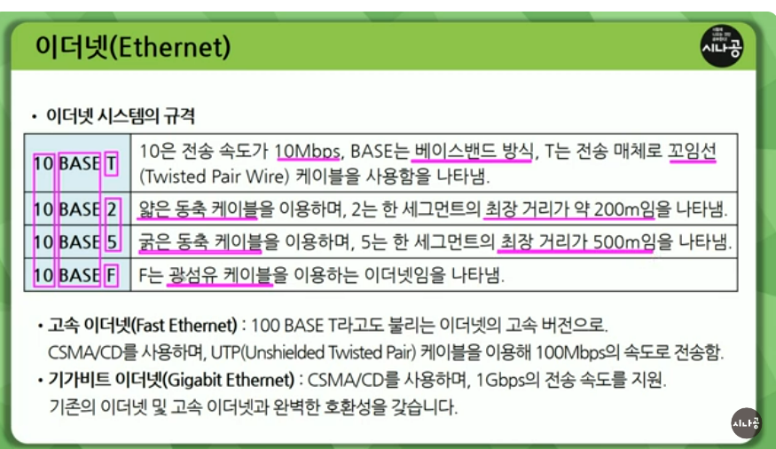

### CSMACD

CSMA/CD 방식

CSMA 방식에서와 같은 충돌이 발생하는 문제점을 해소하기위해 CSMA 방식에 충돌 검출 기능과 충돌 발생 시 재송신하는 기능을 부가

통신하기전에 누가 이 통신회선 쓰고있는지 확인

Carrier Sense => 통신회선이 다른애들이쓰고있는지 아닌지점검하는것

Multiple Access => 여러개가 액세스하면 충돌이 발생하면 데이터가 정상적으로 전달이 안됨

Collision Detection => 충돌여부 확인

이런문제점을 해결하기위해 CSMA에 충돌검출과 충돌시 재송신하는 기능부가한것 => CMSACD.

CSMA CD방식은 통신회선이 사용중이면 대기하고, 데이터가 없을떄에만 데이터를 송신.

송신중에도 전송로의 상태를 계속 감시.

충돌이 발생하면 송신을 중지 후 모든 노드에 충돌을 알린 후 일정 시간이 지난 다음 데이터를 재송신함.

성형 또는 버스형 LAN에서 가장 일반적으로 사용됨.

전송량이 적을떄 매우 효율적이며 신뢰성이 높다

### 이더넷

CSMACD방식을 사용하는 LAN.
네트워크안의 기기들이 서로 주고받을수있도록.
가장 많이 보급된 네트워크 / 제록스 DEC 인텔등에 의해 개발됨 / IEEE 802.3에 정의됨

802.3 CSMA/CD방식

이더넷 시스템의 규격

T꼬임선
F 광섬유
2 => 얇은 동축 케이블 한 세그먼트 최장거리 200
5 => 굵은 동축 케이블 한 세그먼트 최장거리 500

기가비트 이더넷 : CSMA/CD를 사용 1Gbps전송 속도 지원 => 기존의 이더넷과 고속 이더넷과 완벽한 호환성

### 네트워크 관련 장비
