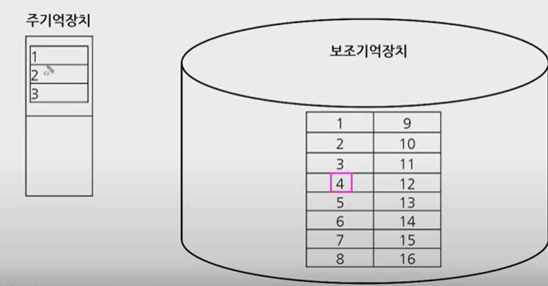
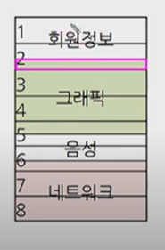
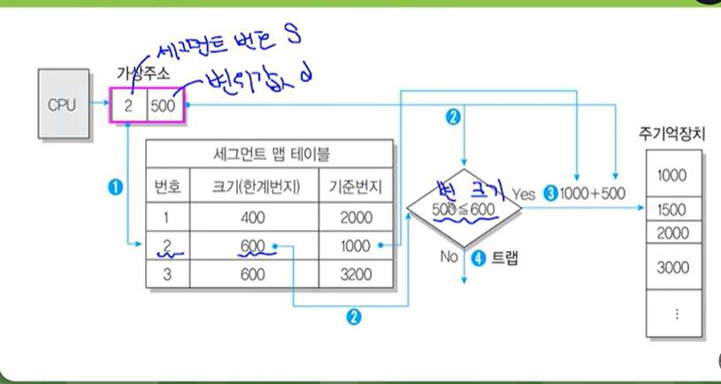
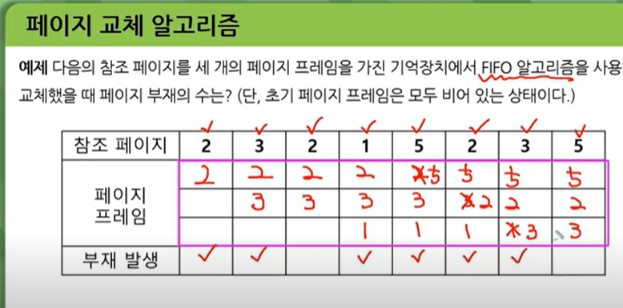
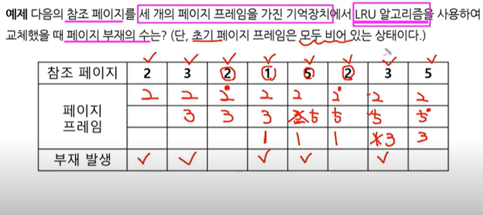
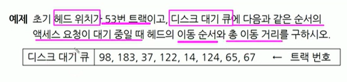
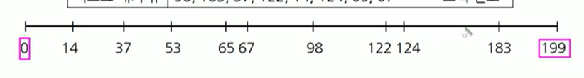
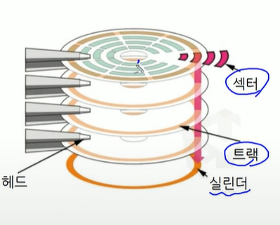
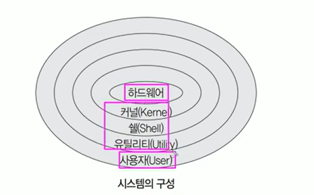
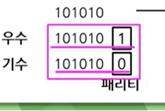

# 프로그래밍 언어 활용

자바랑 파이선은 C언어에서 출발

### 프로그래밍 언어 개념

소프웨어프로그램을 개발하는 절차

1. 요구사항 분석

2. 결과를 가지고 설계

3. 구현

4. 테스트

5. 유지보수

프로그래밍 언어 파트는 3.의 구현 과 연관이있음

명령어의 집합이 프로그램이고

작성하는 과정이 프로그래밍이다.

로우레벨 언어 기계어
사용자 중심 고급언어 => C JAVA Phyton 로구분.

bit / binary digit 이라고하는 0과 1의 값으로 변환되어 컴퓨터가 이해할 수 있도록 함.

\*자료의 단위

bit byte kb mb gb tb
바이트 부터는 각각 1024 (2의10승)

비트는 정보의 최소 단위 => 1비트는 2개

1비트는 => 0,1 이니까 2개 2의1승이라 2

바이트는 8개의 바이트

'A'가 입력되면 컴퓨터는 ? => 2진수단위로 처리 하기 때문에 변환처리를 먼저함

변화하는기준 ? => 아스키 코드
전원버튼 모양새 => 1, 0합친거 오; 높은전압일떄는 1 낮은 전압일떄는 0 으로 인식
0은 1.5볼트 1은 5볼트의 전기적 신호에 매칭시켜 이해할수있도록 내부적으로 변환이됨

1+2가 처리되는과정

1. 입력장치로 데이터를 입력
2. 메모리에 저장
3. CPU에서 호출 (메모리에 저장된 데이터를 가지고옴)
4. CPU 해독 (+ 는 더하라는 연산이구나 )
5. CPU에서 연산 (처리)
6. 출력장치로 정보 보여짐

아스키코드는 각나라의 언어를 다 표현할순없어서 나온게 유니코드

### C언어

코딩하기전 단계가 순서도를 먼저 만드는 단계가있음

알고리즘(논리적인 절차)

그리고 그 절차를 가지고 코딩을함

일반적으로 큰 프로젝트는 논리적인 절차를 찾아내고 나서 시작해야됨

1~10까지 덧셈의 경우

각항의 값은 number +1
합계는 sum = sum + number

변수는 변하는 값

## 운영체제의 정의 및 목적

운영체제는 컴퓨터 시스템의 자원들을 효율적으로 관리하고 편리하게 사용할수있는환경을 제공하는 소프트웨어

운영체제에는 윈도우 UNIX LINUX MAC 등이있음

사용자와 하드웨어간의 인터페이스로서 동작하는 시스템 소프트웨어를 운영체제라 부름

다른 응용프로그램이 유용한 작업을 할 수 있도록 환경을 제공함

처리능력 향상, 사용 가능도 향상, 신뢰도 향상, 반환시간 단축등이있음

처리능력/반환시간/사용가능도/신뢰도는 운영체제의 성능을 평가하는 기준임

처리능력? => 처리하는 일의 양
throughput

반환시간? => 걸린시간
turn around time

사용가능도 => 사용할 필요가 있을때 즉시 사용 가능한 정도 => 100대 컴퓨터중에 실제 가동중인건 10대밖에없다고 하면 사용가능도 가 낮은거

availability

신뢰도 => 정확하게 해결하는 정도
relibaility

## 운영체제의 기능

프로세서(처리기) 기억장치 (주/보) , 입출력장치
파일 및 정보 등의 자원을 관리함

자원을 효율적으로 관리하기위해 자원의 스케쥴링 기능을 제공함

사용자와 시스템간의 편리한 인터페이스를 제공함

데이터를 관리하고 데이터 및 자원의 공유 기능을 제공함

핟웨어와 네트워크를 관리 제어함

시스템의 오류를 검사하고 복구함

자원 보호 기능을 제공함

입 출력에 대한 보조 기능을 제공함

가상 계산기 기능을 제공함

윈도우가 새로나오면 호환이 어떨지 모름 => 가상의 컴퓨터를 만들어서 설치해서 기존 버젼도사용하고 신버젼도 사용

근데 물리적인 컴퓨터는 한대

한대 컴퓨터를 이용해서 마치 여러대의 컴퓨터가있는것처럼 쓸 수 있게 해주는 기능이 가상 계산기.

## 운영체제 운용 기법

일괄처리 (batch 시스템)
일정량/ 일정기간동안 데이터를 모아서 한꺼번에 처리하는 방식

급여계산/ 연말 계산 등의 업무

실시간 처리 (real time processing)
데이터 발생 즉시/ 또는 데이터 처리 요구가 있는 즉시 처리해서 결과 산출

시간 제한을 두고 수행되어야 하는 작업에 사용됨

은행 /좌석예약업무 같이 실시간 처리되어야하는것들에 사용됨

다중 프로그래밍 (multi programming)
**하나의 cpu** 와 주기억장치를 이용하여 여러개의 프로그램을 동시에 처리하는 방식
하나의 주기억장치에 2개이상의프로그램을 기억시켜놓고 하나의 cpu와 대화하면서 처리
=> 메세지도하고 음악도듣고

시분할 시스템(Time sharing )
라운드 로빈 방식이라고도함

시간을 나눠주는 방식을 시분할 시스템이라고함

사람이 그렇듯 cpu도 동시에처리 불가능 번갈아 대화하면서 동시에처리
컴퓨터는 처리속도가 워낙빠르다보니 사람이 보기에는 동시에 처리되는것처럼 느낌
**다중프로그래밍 방식과 결합** 해서 대화식처리가 가능함

다중 처리 시스템 (multi processing)
여러개의 cpu와 하나의 주기억장치를 이용해서 여러개 프로그램동시에 처리방식
cpu가 여러개 달려있다보니 하나가 고장나도 다른것을 이용해서 처리가능

애는 cpu가여러개 주기억 장치하나

다중 프로그래밍은 cpu하나

다중 모드 처리(multi mode processing)

일괄처리 시스템이든 시분할 시스템이되었던 다중처리든 실시간을 한시스템에서 모두 제공하는 방식

분산처리(distributed processing)
뭔갈 처리하긴하는데 분산시켜서 처리하는 방식

각 단말 장치나 컴퓨터 시스템은 고유의 운영체제와 cpu, 메모리를 가지고있음

## 운영체제의 운용 기법의 발달 과정

1세대 일괄처리시스템(배치)
2세대 다중프로그래밍 / 다중 처리 / 시분할/ 실시간
3세대 다중모드 // 한시스템에서 2세대 모두 제공
4세대 분산처리

### 프로세스의 정의

프로세스는 일반적으로 프로세서(처리기,CPUI)에 의해 처리되는 사용자 프로그램
주기억 장치랑 보조기억장치가있을때

보조기억장치에 한글 엑셀 들이있으면 클릭하면 주기억장치로 한글이 올라가는 형태

주기억장치에 존재하는 프로그램들을 프로세스 라고 부름.

일반적으로 프로세서에 의해 처리는 사용자프로그램, 시스템 프로그램을 프로세스라고 부른다. => 실행중인 프로그램을 의미

다른 말로 job , task라고도 함.

프로세스는 다음과같이 여러형태로도 정의할수있음

PCB / P가프로세스 C가 컨트롤 B가 블럭 우리말로하면 프로세스 제어 블럭
CPU는 사람으로 치면 뇌

실 기억 장치에 저장된 프로그램

프로세서가 할당되는 실체로써 , 디스패치가 가능한 단위

준비 상태에서 cpu할당받아서 실행상태로 바뀌는것을 디스패치라고 부름
디스패치가 가능하다는것은 보조기억장치에있는게아니라 주기억장치로 올라왔다는 이야기.

프로시저가 활동중인 것
윈도우라는 프로그램은 하나의 프로그램으로 구성된것이아님.
윈도우라는 하나의 큰 프로그램을 여러개로 분할할수있는데. 그런것들을 프로시저라고 부름

프로그램이 두개가있을때 규칙적으로 연속적으로 처리가 되는것이 아님.  
한글 프로그램을 실행시키는 이유? => 문서를 얻기위함 => 지정된 결과를 얻기위한 일련계통적 동작이라고볼수있음

그리고 그 사건들을 위한 과정역시 하나의 프로세스라고 말할수있다.

운영체제가 관리하는 실행단위도 프로세스로 정의가 가능하다.

### 프로세스 상태 전이

프로세스 상태 전이는 프로세스가 시스템 내에 존재하는 동안 프로세스의 상태가 변하는것을 의미하며, 프로세스의 상태를 다음과 같이 상태 전이도로 표시할 수 있음.

프로세스의 상태는 제출 접수 준비 실행 대기상태로 크게 5가지로 나눌 수있음

주요 는 준비 실행 대기임

병원이있다고 가정하면 로비가 하드 외과가 메모리라고하면

메모리에 사람이 올라가있으면 그게 준비. 간호사가 OS에 해당해서 스케쥴러 역할을 한다고 비유

의사가 CPU 의사를 환자가만나면 실행상태가됨.

검사가필요해서 잠깐 다른거 검사해라 하고 나가있으면 그게 대기의 개념.

더블클릭 (제출) => 접수(HOLD) => <= 디스크

하드 디스크에 스풀이라는 공간이 존재하는데.

입출력이일어난다면 하드디스크에있는 프로그램들이 더 빨리나가기위해서 스풀이라는 공간을 활용함.

디스크영역에서 접수가 일어나면 메모리영역으로 찾아가서 job스케쥴러를 통해 read상태가되고 dispatch를 거쳐서 실행이되고.

입출력이 발생하면 대기 (wait, block ) 입출력이 종료되면 다시 깨워서 ready상태가된다.

종료는 terminated

대기에서 다시 실행상태로 갈수는없다 대기에서 준비만. 입출력이일어나면 대기고 입출력이끝나면 준비상태로변경

특정 프로세스가 준비상태에있다가 실행되고 준비갔다가 이런식의 변경

실행에서 준비로도 바뀔수가있다.

제출 : 작업을 처리하기위해서 사용자가 작업을 시스템에 제출한 상태
접수 : 제출된 작업이 스풀 공간인 디스크의 할당위치에 저장된 상태
준비 (ready) : 프로세스가 프로세스를 할당받기 위해 기다리고있는상태.
프로세스는 준비상태 큐에서 실행을 준비하고 있음. => 준비상태
접수 상태에서 => 준비 상태로의 전이는 job스케줄러에 의해 수행됨.

- 실행
  준비상태 큐에 있는 프로세스가 프로세서를 할당받아 실행되는 상태.

프로세스 수행이 완료되기 전에 프로세스에게 주어진 프로세서 할당 ㅣ간이 종료 되면 프로세스는 준비상태로 전이됨.

### 스레드

스레드는 프로세스 내에서 작업단위로써 시스템의 여러 자원을 할당받아 실행하는 프로그램 단위.

프로세스는 전부 보조기억장치에 저장되어있는데 인터넷을 하곘다고 하면 프로그램이 하드디스크에 들어있다가 주기억장치로 올라감.

특정 프로그램을 하나 실행시키게 되면 컴퓨터는 프로세스마다 자원을 분할해서 할당함.

라면끓이겠다고 하면 라면끓이는 프로세스가 실행된다고 할떄 => 물을 받고 가스레인지 올려놓고 불을 키고 끝까지 기다려야됨.

작업하나하나를 스레드라고 비유

햄버거를 만들겠다고하면 햄버거안에 들어갈 패티를 구워야되는데 햄버거 패티를 굽는 작업하나 / 재료준비하나 /

하나의 프로세스에 하나이상의 스레드가있으면 다중 스레드라고함. 하나면 단일스레드

프로세스의 일부 특성을 갖고 있기 때문에 경량 프로세스라고도 부름.

스레드는 독립적인 스케쥴링의 최소단위로서 프로세스의 역할을 담당함.

동일 프로세스 환경에서 서로 독립적인 다중 수행이 가능함.

작업관리자에서 보는 프로세스 가 그 프로세스. 컴퓨터에서 어떤 프로세스가 실행되고있는지 이런것들을 한눈에 볼수있다.

성능에 메모리영역에 가면 CPU 가 처리를 해줄 것임.

cpu에 프로세스랑 스레드.

프로세스보다 스레드가 많은이유? => 한개의 프로세스안에 여러개 스레드를 가지고있는 경우가 있어서. 그렇다.

스레드는 크게 두가지로 분리할수있음

- 사용자 수준의 스레드
  사용자가 만든 라이브러리를 사용하여 스레드를 운용함.
  속도는 빠르지만 구현이어려움
  커널 모드로 전환이 없어서 오버헤드가 줄어듦

- 커널 수준의 스레드
  운영체제의 커널에 의해 스레드를 운용함
  구현이 쉽지만 속도가느림
  한 프로세스가 운영체제를 호출할 때 전체 프로세스가 대기하지 않아서 시스템의 성능을 높일 수 있음
  여러 스레드가 커널에 동시접속 가능 / 스레드의 독립적인 스케줄링이 가능함.

- 스레드 사용의 장점
  실행환경을 공유시켜 기억장소의 낭비가 줄어듦
  공통적으로 접근 가능한 기억장치를 통해 효율적으로 통신함
  하나의 프로세스를 여러개 스레드 => 병행성 증진
  하드웨어 / 운영체제의 성능과 응용프로그램의 처리율을 향상 시킬 수 있음

### 스케줄링의 개요

스케줄링은 프로세스가 필요한 시스템의 자원을 프로세스에게 작업할당하는거

하나의 프로세스가 생성되어서 완료될때까지 여러 종류의스케줄링 과정을 거치는데

그 종류에는 장기/ 중기/ 단기 스케줄링이 있음

장기 스케줄링 : 어떤 프로세스가 시스템의 자원을 차지할 수있도록 할것인가를 결정하여 준비상태 큐로 보내는 작업/ 작업스케줄러에 의해 실행됨 cpu를 할당받으려는 프로세스가 많을 경우 프로세스를 일시 보류시킨 후 활성화 해서 일시적으로 부하를 조절함.  
 중기: 어떤 프로세스들이 CPU받을 것인지 결정 하는 작업
단기 : cpu를 할당받는 시기와 특정 프로세스를 지정하는 작업

### 프로세스 스케줄링의 기법

크게 비선점과 선점 스케줄링 두개가있음

화장실에 칸이 한칸밖에없는데 사람이 있으면 나올때까지 무작정 기다려야됨 => 비선점

선점 => 강제로 화장실에 있는 사람빼고 들어가는것 (ㄷㄷ)

강제로 뺏어올수있냐 없냐의 차이가 선점 비선점

비선점형 강제로 뺏어올수없는거

이미 할당된 CPU를 다른 프로세스가 강제로 뺴앗아 사용할 수 없는 스케줄링 기법

프로세스가 CPU를 할당받으면 해당 프로세스가 완료될때까지 CPU를 사용함

프로세스 응답 시간의 예측이 용이 하며, 일괄 처리 방식에 적합함

비선점의 문제 => 중요한 작업이 안중요한 애를 기다릴수있음 FCFS / SJF HRN 등의 알고리즘이있다.

선점은 많은 오버헤드를 초래함.

빠른 응답 시간을 요구하는 대화식 시분할 시스템에 사용됨.

선점이 가능하도록 시간 배당에 대한 인터럽트용 타이머 클록이 필요함.

라운드 로빈 ,SRT , 선점 우선순위, 다단게 큐, 다단계 피드백 큐 등의 알고리즘이 있음.

### 주요 스케줄링 기법

비선점
FCFS 선입선출 = FIFO
먼저 들어온게 먼저 서비스되는것 준비상태 큐라는것에 도착한 순서에 따라 차례로 CPU를 할당하는 기법으로 가장 간단한 알고리즘.
먼저 도착한것이 먼저 처리되어 공평성은 유지되는데
짧은 작업이 긴 작업을 기다리고 중요하지않은게 중요한작업을 기다리게 할수도있음.

평균실행/대기/반환 시간 계산

그래프 그리면서 풀기

SJF
우선순위
HRN
기한부

선점
Round Robin
SRT
선점 우선순위
다단계 큐
다단계 피드백 큐

### 병행 프로세스

두 개 이상의 프로세스들이 동시에 존재하며 실행상태에 있는것

한정된 컴퓨터 하드웨어나 자원을 공유하고 동시에 작업을 수행하기 위해 사용하는 개념

### 임계 구역

Critical Section

위태로운 부분 .

비유하자면 공중화장실 칸 에 한칸 한칸을 임계구역이라고 하는것
나만쓰는게 아닌.

여러개의 프로세스가 공유하는 데이터및 제원에 대한 어느 한 시점의 사용하도록 지정된공유 영역

임계구역 문제를 해결하기위해서는 상호배재, 진행, 한계대기 라는 3가지 조건을 충족해야한다.

상호배제 - 한번에 한개의 프로세스만 공유자원을 사용할 수 있어야되는것
진행 - 아무것도 임계구역에 접근하지않았을때 접근 가능
한계 대기 - 하나의 프로세스가 임계 구역을 진입하기 위해 무한정 대기하지 않아야함.
한번 탔던 애는 다음에 탈떄 처음부터 다시기다리게 끔 해줘야. 뒤에있는애들이 무한정 대기를 하지 않음

### 동기화 기법

두 개 이상의 프로세스를 한 시점에서는 동시에 처리 불가능 => 프로세스에 대한 처리순서를 결정하는것

상호배제의 한 형태

세마포어 : 각프로세스 제어 신호를 전달하여 순서대로 작업을 수행하도록 하는 기법 / 신호기, 깃발이라는뜻

다익스트라 (여기서도나오네) 가 제안해서 P와 V 라는 두개의 연산에 의해 동기화를 유지하고 상호배제 원리 보장

모니터 : 세마포어가 프로세스에 제어신호전달해서 순서대로 하는거였으면 실제로 구현해놓은 프로그램을 모니터라고 함

동기화를 구현하기위한 특수 프로그램 기법

임계영역을 프로셋에 할당하는데 필요한 데이터와 처리하는 프로시로 구성

자료 추상화와 정보 은폐 개념을 기초로 하며 공유 자원을 할당하기 위한 병행성 구조로 이루어져있다.

모니터의 경계에서 상호배제가 시행됨

모니터에는 한순간에 하나의 프로세스만 진입하여 자원 사용가능

### 교착상태 / 데드락

상호배제에 의해 나타나는 문제점

서로다른 프로세스가 점유하고있는 자원을 요구하며 무한정 기다리는거

길 에 차가 막혀가지고 아무도 못벗어나는 느낌

- 교착상태 발생의 필요 충분 조건

교착상태가 발생하기 위해서는 4가지 조건이 충족되어야됨 4중 한개라도 충족안되면 교착 상태 ㄴ

1. 상호배제
   한번에 한개의 프로세스가 공유자원쓰는거

2. 점유와 대기
   최소한 하나의 자원을 점유하고있으면서 다른 프로세스에 할당되어있는 자원을 추가로 점유하기 위해 대기하는 프로세스가있어야됨

=> 프린터 사용중인데 A파일이 필요한데 다른애가 쓰고있음 그러면 대기해야됨

3. 비선점

강제로 못뺏어야됨

4. 환형대기
   서로서로 공유자원을 안주니까 사용하기위해서 대기하는 프로세스들이 원형으로 구성되어서

할당된 자원 점유하면서 앞뒤에있는애한테 프로세스 자원을 요구하는거

지꺼깢고있으면서다른애들한테 자원 요구하고 원형으로 구성

### 기억장치의 관리 전략

주기억장치와 보조기억장치가 있는데

모든 프로그램은 보조기억장치에들어있음

실행하는 순간 주기억장치로 들어감

주기억장치에 적재시키는시기, 적재위치등을 지정해서 한정된 주기억장치 공간을 효율적으로 사용하기위한것

- 종류

반입전략
프로그램이나 데이터를 언제 주기억장치로 적재할것인지 결정하는 전략
요구반입
실행중인 프로그램이 특정 프로그램이나 데이터등의 참조를 요구할때 적재하는거
예상반입
미리예상해서 참조될 애를 적재하는거

배치전략
프로그램이 됬든 데이터가 됬든 주기억장치 어디에 위치할건지

반입은 언제 얘는 어디에

최초 first fit
데이터가 들어갈수있는 크기의 빈 영역중에서 첫번쨰 분할영역 에 배치시키는거

최적 best fit
'' 단편화를 가장 작게 남기는 분할영역에 배치

최악 worst fit
단편화를 가장 많이 남기는 분할영역에 배치

단편화? => 기억장소에 못쓰는 부분

못쓰는부분은 작으면 작을수록 좋음 그래서 이게 작으면 베스트고 크면 최악

교체전략
모든영역이 이미 사용중일때 새로운 프로그램이나데이터를 주기억 장치에 배치할려고할떄

누굴 교체할것인지 결정하는 전략 => FIFO OPT LRU LFU

### 가상 기억 장치

주기억장치의 할당기법에는 연속할당 과 분산할당기법이있음

프로그램이 주기억장치보다 큼 그럼 실행시킬수가없음

그럼 보조기억장치가 주기억장치한테 일부를 빌려줌

가상기억장치는 보조기억장치의 일부를 주기억장치처럼 사용하는것
잘라가지고 필요한것만 주기억장치로 넣는것

그러면 실행시키고자하는 프로그램이 아무리 커도 실행이가능

프로그램들을 여러개 작은 블록으로 나누어 가상 기억장치에 보관해놓고 프로그램 실행시 요구되는 애만 주기억장치에 불연속적으로 할당해서 처리.

주기억장치 용량보다 큰 프로그램을 위해사용하는게 가상기억장치다.

가상기억장치를 사용하면 주기억장치의 이용률과 다중 프로그램의 효율을 높인다.

여기서 가상기억장치에 저장된 프로그램을 실행하려면 가상기억장치의 주소를 주기억장치의 주소로 바꾸는 변환작업이 필요함 이를 주소사상 또는 주소매핑이라고함

가상기억장치의 일반적인 구현방법이 페이징과 세그멘테이션 기법이있음

페이징이 전부 똑같이나누는거 일정하지않은게 세그멘테이션

꽉찼을때 페이지 바꾸는것중 가장쉬운게 FIFO

17k 를 4k 씩 짜르면 마지막에 1k 가 들어감 나머지 3k 이남은걸 보고 내부 단편화라고함

페이징기법에선 프로그램의 크기와 페이지 크기에따라 내부 단편화가 발생할 수있음

페이징기법은 가상장치에있는 프로그램과 주기억장치의 영역을 동일한 크기로 나눔. (두개를 다)

프로그램을 쪼갠걸 페이지라고 하고 주기억장치의 단위를 페이지 프레임이라고함

외부단편화는 발생하지않지만 내부 단펴노하는 발생함.

중간에 주소변환이 필요. => 이를 위해 필요한 페이지의 위치정보 -> 페이지 맵 테이블이 필요

페이지 맵 테이블 사용으로 비용증가하고 처리속도 감소.

세그멘테이션은 기능이다 배열이다 뭐 이런 논리적인 단위로 짜르는게 세그멘테이션

주기억장치는 쪼개지않음.

페이징기법으로 쪼개면 이런식으로 짭치게들어감 이걸 보완하기위한게 세그먼트

나는 회원정보만 필요한데... => 그래픽이랑짭쳐있음

크기가 전부 다를 수 밖에없음

세그먼트 단위로 쪼갰으면 크기가 전부 달라서 큰게 들어가면다른게못들어가기도 => 주기억장치를 효율적으로 활용하지못함

주기억장치가 다찼을떄 이제 페이지 교체 알고리즘을 활용해서 빼버림

교체할때마다 크기의 차이가 나면 빈공간이 생김 그래서 주기적으로 압축을 해줘야됨 => 가비지컬렉터 가 모아서 큰 공간을 만듦

내부단편화는 발생하지않지만 외부단편화가발생

각세그멘테이션은 고유한 이름과 크기를 가짐

기억장치의 사용자 관점을 보존하는 기억장치 관리기법을 세그멘테이션 기법이라고도함.

세그멘테이션은 기억공간을 절약

세그멘테이션 역시 주소변환을 위해서 세그맨트 맵 테이블이 필요하다.

세그먼트가 주기억장치에 적재될때 다른 세그먼트에게 할당된 영역을 침범할 수 없으며 이를 위해 기억장치 보호키가 필요하다.

가상주소는 세그먼트 번호를 나타내는 s와 세그먼트 내에 실제 내용이 위치하고있는곳까지 거리나타내는 변위값d로 구성됨

s 번호/ d 거리

실기억주소는 완전한 주소형태
세그먼트 기준번지 + 변위값 = 실기억주소 형식

세그먼트 맵테이블은 s와 크기 l 시작주소(기준번지) b 로 구성됨

slb

변위값이 크다는것은 실행범위를 침해했다는 의미로 트랩발생=> 실행중단

한계번지인 크기보다 변위값이 작으면 기준번지랑 변위값 더해서 주소만들어 주기억장치로

몰라도 상관은없는데 실기억주소를 만들땐 변위값이랑 기준번지를 더해서 만든다는것

### 페이지 교체 알고리즘의 개요

주기억장치에 뭘뺴고 가상기억장치에서 가져올것이냐=> 페이지 알고리즘

페이지부재(페이지폴트) 가 발생하면 보조-> 주기억장치

OPT FIFO LRU LFU NUR SCR등이있다.

### 주요 페이지 교체 알고리즘

OPT 최적교체

OPT는 앞으로 가장 오랫동안 사용하지 않을 페이지를 교체하는 기법
벨레이디라는 사람이 제안함.

이방법을 쓰면 페이지 부재횟수가 가장 적게발생하는 가장 효율적인 알고리즘임.

FIFO예제

- LRU

가장 최근에 가장 오랫동안 사용하지않은 페이지를 교체.

오재밌는데 하긴 근데 페이지프레임이 3개니까 쉽고 재밌지

### LFU 알고리즘

사용빈도가 가장 적은 페이지를 교체함.

활발하게 사용되는애는 교체안함.

### NUR = LRU랑 비슷함

최근에 사용되지않은 페이지를교체

최근에 사용되지않은 페이지는 향후에도 사용되지않을 가능성이 높다는것을 전제로해서 시간적인 오버헤드를 줄인다.

최근의 사용여부를 확인하기위해서 참조비트와 변형비트가 사용된다.

변형비트 - 사용
참조비트- 호출

### SCR => second change replacement 2차 기회 교체

SCR은 가장 오랫동안 주기억장치에 있던 페이지중 자주 사용되는 페이지의 교체를 방지하기위한 기법

FIFO기법의 단점을 보완하는데 사용

### 디스크 스케쥴링의 개요

디스크 스케쥴링은 사용할 데이터가 디스크 상의 여러곳에 저장되어있을때

데이트 액세스하기위해 디스크 헤드가 움직이는 경로 결정 기법
FCFS , SSTF, SCAN C-SCAN N step SCAN 에센바흐 SLTF 스케줄링 기법등이있다.

### 주요 디스크 스케쥴링

FCFS = FIFO

가장 먼저 디스크에있는 대기 큐에 들어온 트랙에 대한 요청을 먼저 서비스

가장 간다한 스케쥴링 .

디스크 대기 큐에 있는 트랙 순서대로 디스크 헤드를 이동시킴

디스크 대기큐에 들어온 순서대로 서비스를 하기떄문에 더 높은 우선순위 요청이 입력되어도 순서가바뀌지않음. => 공평성이 보장

디스크의 오버헤드가 적을때 효율적임.

헤도이동거리가 상당히 길어질수도.

디스크 오버헤드가 커지면 응답시간이 길어짐

탐색시간을 최적화하려는 시도가없는 기법 (ㅋ)

시자귀치 찦고 계산

SSTF shortest seek time first

가장짧은 트랙에 대한 요청을 먼저 서비스함

현재 헤드위치에서 가장 가까운 거리에있는 트랙으로 헤드를 이동시킴

FCFS보다 처리량이 많고, 평균 탐색시간이 짧음

처리량이 많은 일괄처리 시스템에 유용

### 파일 시스템의 개요

파일의 저장, 액세스 공유 보호 등 보조기억장치에서 파일을 총괄하는거

사용자와 보조기억장치사이에서 인터페이스 제공

사용자가 파일을 생성, 수정, 제거 할 수있도록 함

적절한 제어 방식을 통해 타인의 파일을 공동으로 사용할 수 있도록 함.

파일 공유를 위해서 판독만 허용, 기록만 허용, 수행만 허용 또는 여러형태로 조합한것등 여러 종류의 액세스 제어 방법을 제공

사용자가 적합한 구조로 파일을 구성할 수있도록 함

불의의 사태를 대비해서 예비와 복구 기능을 제공

편리하게 사용할수있게 논리적인 디렉터리를 보여줘야됨

안전하게 사용하고 보호되어야함

파일의 정보가 손실되지않도록 => 데이터 무결성

### 파일 디스크럽터

파일 서술자 / 파일에 대한 정보를 가진 제어블록을 파일 디스크립터라고부름

파일 제어블록 이라고도 함

보통 파일 디스크립터는 보조기억장치에있다가 오픈되면 주기억장치로

파일 디스크립터는 파일시스템이 관리하므로 사용자가 직접 참조불가

파일에 대한 정보를 가진 제어블록이 파일 디스크립터더라.

파일디스크립터에는 파일의 이름 / 크기 / 보조기억장치에서 파이르이 위치가 어딘지도가지고있음

파일구조 : 순차파일/ 색인순차파일/ 색인파일등

보조기억장치유형 : 자기테이프/ 자기디스크
액세스 제어정보
파일유형: 텍스트파일, 목적프로그램 파일 (2진 파일, 기계어 파일, 실행파일)등

엑세스한횟수등등

### 파일의구조

파일을 구성하는 레코드들이 보조기억 장치에 편성되는 방식을 의미, 편성방법에따라 순차파일, 색인 순차파일, 랜덤파일, 분할파일 등이있음

- 순차파일
  순차파일이라는것은 순서파일이라고도 부름
  레코드를 논리적인 처리 순서에 따라 연속된 물리적 저장공간에 기록하는것을 의미함.
  사이에다가 데이터를 넣고싶으면 전부 한칸씩옮기는. 마치 배열같은 느낌이네.

삭제하고싶을때도 앞으로 하나씩 땡기는

검색할때도 순차적으로 하기때문에 효율이 굉장히 떨어짐

- 직접파일

파일을 구성하는 레코드를 임의의 물리적공간에 기록

레코드에 특정 기준으로 키가할당되며 해싱 함수를 이용해서 상대주소를 계산한 후 해당하는 주소에 레코드를 저장

해싱함수에 의해 계산된 물리적 주소를 통해 접근이 가능함

임의 접근이 가능한 자기 디스크나 자기드럼을 사용함

- 색인 순차 파일

순차파일과 직접파이렝서 지원하는 편성방법이 결합된 형태

레코드를 참조하려면 색인을 탐색하고 색인이 가리키는 포인터 주소를 사용하여 참조

일반적으로 자기디스크에서 많이 사용되고 자기테이프에서는 사용 할 수 없음

하나의 디스크는 트렉과 섹터로구성되어있음

제일바깥에있는게 0 12345트랙이런식으로 번호가매겨짐

0으로 갈수록 가장 바깥

0번쨰 트랙을 싹다모아둔걸 실린더

색인 영역/ 기본영역/ 오버플로우 영역

기본영역=> 실제로 저장되는 저장공간

색인영역=> 특정 레코드의 위치를 찾아갈때

더이상 새로운 레코드 삽입불가능할때 대비해서 확보해둔 기억공간이 오버플로영역

트랙 색인 영역: 각 실린더마다 하나씩 만들어지며, 각 트랙에 기록된 데이터의 레코드

실린더 색인영역: 각파일당 하나씩 만들어지고 트랙색인의 최대키 값들로구성된영역

마스터 색인 영역: 실린더 색인이 많을 경우 그것을 일정한 크기의 블록으로 구성하고, 해당 레코드가 어느 실린더 색인영역에있는지 나타내는 영역

### 디렉터리의 구조

디렉터리 = 파일시스템 내부에 있는것, 효율적인 파일 사용을 위해
디스크에 존재하는 파일에대한 여러 정보를 가지고있는 특수한 형태의 파일

- 디렉트리 구조의 종류

1단계 디렉터리 ==> 예전에는 하드디스크가없었음. 자기테이프가있음 거기서 사용하던거 / 모든 파일이 하나의 디렉터리 내에 위치해서 관리되는 구조
모든 파일들이 유일한 이름을가지고있어야.

2단계 디렉터리 : 중앙에 마스터파일 디렉터리가 있고, 그 아래에 사용자별로 서로다른파일 2계층구조
마스터 파일디렉터리와 사용자 파일 디렉터리가있음
마스터는 사용자파일디렉터리를관리하고
사용자파일은 사용자별 파일을 관리
C드라이브 밑에 사용자별 이름 쭉 있는 형태

트리 디렉터리 : 하나의 루트 디렉터리랑 여러개의 서브 디렉터리 (지금형태)
여러개의 폴더로 구성
디렉터리 탐색은 포인터에 의해 계층적으로 이루어짐
DOS/UNIX/Windows 등의 운영체제에서 사용되는 디렉터리 구조

비순환 그래프 디렉터리 : 하위파일이나 하위 디렉터리를 공동으로 사용할수있는것 / 사이클이 허용되지않음

공유된 파일을 삭제할 경우 고아 포인터가 발생할 수 있음. => 삭제된애를 공동으로 가리키고 사용할려고하는것

일반적인 그래프 디렉터리: 트리 구조에 링크(link)를 첨가시켜 순환을 허용하는 그래프 구조
불필요한 파일을 제거하여 사용공간을 늘리기 위한 참조 계수기가 필요함.
참조순환을 허용하냐 안하냐

### 자원보호

자원보호는 컴퓨터 시스템에서 사용자, 프로세스 등을 주체라고함

이런 주체가 cpu나 기억장치 등과 같은 자원에 불법적으로 접근하는것을 제어하고

객체의 물리적인 손상을 예방하는 기법을 의미함.

자원을 보호하기위한 기법으로 접근제어 행렬, 전역 테이블, 접근 제어 리스트, 권한 자격 리스트가있음

\*주체/객체/접근권한
주체: 객체에 접근하는것으로 사용자, 프로세스 등을 의미함.

객체: 정보를 갖고있는것을 객체라고 부르는데. 디스크 , CPU, 기억장치, 자료구조, 프로세스 등을 의미함.

접근 권한: 주체가 객체 어떤 형태로 접근할 수있는가를 정의한것 r w x 등이 있음

접근 제어 행렬 (Access Control Matrix) => 객체에 대한 접근 권한을 행렬로 표시
행은 사용자 프로세스 열은 객체

전역 테이블 : 가장 단순한 구현 방법으로 세개의 순서쌍인 영역 객체 접근권한을 목록형태로 구현한 것

테이블이 매우커서 주기억장치에 저장할 수 없으므로 가상기억장치 기법을 사용해야하며, 주기억장치에 저장될 경우 공간을 낭비하게된다.

접근 제어리스트

접근제어 행렬에있는 각 열 즉 객체를 중심으로 접근리스트를 구성한것.

그냥 반대로 해놓은듯? 접근제어행렬을

권한 자격 리스트

접근제어 행렬에 있는 각행, 즉 영역을 중심으로 권한 리스트를 구성한 것

### 다중처리의 개념

multi processor는 하나의 시스템에 여러개의 처리기를 두는것

다중컴퓨터 라는 개념도있음

이건 cpu 마다 메모리os있는느낌이고
다중처리기는 하나의 메모리 os에 여러개 cpu

다중처리기는 CPU간의 결합이 강해서 강결합 다중 컴퓨터는 약결합

그리고 다중컴퓨터를 분산처리시스템이라고도함

필요한경우에는 통신성르 사용해서 서로 다중컴퓨터간 연결할수있음

다중 처리기 운영체제는 master/slave 처리기 분리 실행 처리기 대칭적 처리기로 분류할 수 있음.

### master /slaver 주종 처리기

하나의 프로세스를 주 프로세스로 정하고 나머지는 종으로 지정하는구조

주프로세서가 고장나면 전체 시스템이 다운됨
주 프로세서만 입출력을 수행=> 비대칭 구조

주프로세서는 운영체제를 수행함

종 프로세서는 연산만 담당

입출력 발생하면 주 프로세서에게 서비스를 요청

### 약결합/ 강결합 시스템

약결합시스템

각 프로세서마다 독립된 메모리를 가졌고 분산처리시스템이라고도함

둘이상의 독립된 컴퓨터시스템을 통신망을 통해 연결한 시스템

각시스템마다 독자적인 운영체제를 가지고있음

강결합 시스템

동일 운영체제하에서 여러 개의 프로세서가 하나의 메모리를 공유해서 사용하는걸로

다중(병렬) 처리 시스템이라고도함.

하나의 운영체제가 모든 프로세서와 시스템 하드웨어를 제어함.

프로세서 간의 통신은 공유 메모리를 통해서 이루어짐

하나의 메모리를 사용하므로 CPU간의 결합력이 강함

### 분산처리 시스템의 개요

분산 처리 시스템은 약결합 시스템으로 독립적인 처리 능력을 가진 컴퓨터 시스템을 통신망으로 연결한 시스템.

서로 다른 장소에 위치한 컴퓨터 시스템에 기능과 자원을 분산시켜 상호 협력할 수 있는 시스템.

분산 처리 시스템이랑 대조가 되는게 중앙 집중형 시스템임.

중앙 처리 집중형 => 중앙 컴퓨터 하나 사고 단말기 만 사는거 (단말기 => 입출력만)
사용자들은 단말기를 이용해서 중앙컴퓨터랑 통신 해서 중앙컴퓨터가 모든걸 처리 => 단말기에는 cpu가없어서 처리불가

- 분산 처리 시스템의 설계 목적

1. 자원공유 : 각 시스템이 통신망을 통해 연결되어있으므로 유용한 자원을 공유해서 사용가능
2. 연산 속도 향상: 하나의 일을 여러시스템에 분산시켜 처리해서 연산속도향상
3. 신뢰도 향상 : 하나의 시스템에 오류있어도 다른 시스템은 계속 일을 처리가능
4. 컴퓨터 통신 : 지리적으로 멀리 떨어져있더라도 통신망을 통해 정보 교환 가능

분산 처리 시스템의 장점

1. 중앙 컴퓨터의 과부하를 줄일 수 있음
2. 사용자는 각 컴퓨터의 위치를 몰라도 자원을 사용할 수 있음
3. 업무량의 증가에 따른 시스템의 점진적인 확장이 용이함
4. 하나의 일을 여러 시스템이 처리함으로써 연산 속도, 신뢰도, 사용가능도가 향상되고, 결함 허용이 가능함

분산 처리 시스템의 단점

1. 중앙 집중형 시스템에 비해 소프트웨어 개발이 어려움
2. 중앙 집중형 시스템에 비해 보안 정책이 복잡해짐
3. 시스템 유지상 통일성을 잃기 쉽다.
4. 시스템의 설계가 복잡하고 데이터 처리 서비스의 질이 떨어짐

### 위상에 따른 분산 처리 시스템의 분류

여기서 위상이라는건 모형을 보고 이야기하는것 => 어떤 모양으로 연결했냐에따라 나눠짐

Star형 /성형 : 별모양 중앙에 하나가있고 거기에 하나씩 별모양으로 연결되어있음 이때 중앙에있는거랑 다른애들은 1:1로 연결되어있음. 모든 사이트가 하나의 중앙 사이트에 point to point 형태로 연결되어 있고, 그 외에 다른 사이트와는 연결되어 있지 않은 구조.

기본 비용은 사이트의 수에 비례하며, 통신 비용은 적게 소요됨.

구조가 간단하고 보수 및 관리가 용이함.

중앙 사이트 제외 다른 애들이 고장 나면 영향안미치지만 중앙 망가지면 다망가짐

사이트 증가시 통신회선도 증가

---

망형 - 완전 연결 형 : 각 사이트들이 시스템 내의 다른 모든 사이트들과 **직접** 연결된 구조 / 기본 비용은 많이들지만 통신비용은 적고 신뢰성이 높다.

망형 - 부분 연결 형 : 일부사이트들 간에만 직접 연결된 형태. 연결된 다른애들을 통해 통신하는구조. / 기본 비용 연결형 보다 적고 통신비용은 많음 , 신뢰성이 낮다.

트리 계층 형 : 기본 비용은 부분 연결형보다 적게 소요되고, 통신 비용은 트리의 깊이에 비례한다. 부모 사이트가 망하면 아래도 같이 다운

링 형 : 동그랗게 생겨서 서로서로 연결되어있는 모양 / 각 사이트가 인접하는 다른 두 사이트와면 직접 연결된 구조 / 정보는 단방향 또는 양방향으로 전달 될 수 있음.
기본 비용은 사이트 수에 비례하고 목적 사이트에 데이터를 전달하기 위해 링을 순환할 경우 통신 비용이증가함

다중 접근 버스 연결: 시스템 내의 모든 사이트들이 공유 버스에 연결된 구조. / 기본 비용은 사이트 수에 비례하고 통신비용은 저렴함

### UNIX의 개요 및 특징

unix는 하나의 운영체제.
윈도우는 개인용 운영체제고 유닉스는 서버용으로 개발된 부분 mit
시분할 시스템을 위해서 설계된 대화식 운영체제, 소스가 공개된 개방형 시스템임.

대부분 c언어로 작성되어있고 이식성이높음, 프로세스간의 호환성이 높다.
크기가 작고 이해하기 쉬우며
다중 사용자 , 다중 작업을 지원 => 서버용이라

많은 네트워킹 기능을 제공하므로 통신망 관리용 운영체제로 적합함
트리구조의 파일 시스템을 갖는다.
전문가적인 프로그램 개발에 용이/ 다양한 유틸리티 프로그램들이 존재

### 다중 사용자 , 다중 작업

다중 사용자는 여러 사용자가 동시에 시스템 사용하는거

다중 작업은 여러개의 작업이나 프로그램을 동시에 수행하는거 (하나 이상의 작업을 백그라운드에서 수행해서 여러 작업 동시 처리 가능)

UNIX나 LINUX같은 서버용 운영체제는 multi user multi tasking임

\*포그라운드 작업과 백그라운드 작업
전면에서 실행되는 우선순위 높은작업 포그라운드
우선순위가 낮아 화면에 보이지않고 실행되는 프로그램 백그라운드 작업

### UNIX 시스템의 구성

하드웨어 / 커널/ 쉘 /유틸리티 / 사용자

유닉스에서 핵심적인 부분이 커널 => 하드웨어와 인터페이스상의 관리 기능

쉘 : 명령어 입력할때 인식해서 프로그램이 호출하고 실행해주는 명령어 해석기를 쉘이라고 부름 시스템과 사용자간의 인터페이스
윈도우가 개발되기이전에 DOS의 COMMAND.COM(내부에서 사용하는 내부 명령어가 다들어있음)과 같은 기능을 수행함.
쉘이라는것도 하나의 파일임 보조기억장치에서 교체처리가능

공용 Shell => bourne shell c shell korn shell 등 / 이나 사용자가 만든 shell 사용가능

파이프라인 기능도 지원함. 입출력 재지정을 통해 출력과 입력의 방향을 변경 가능
파이프라인? => 둘 이상의 명령을 함께 묶어 처리한 결과를 다른 명령의 입력으로 전환하는 기능

유틸리티: 일반 사용자가 작성한 응용프로그램 처리할때 사용하는게 유틸리티
DOS 라는 운영체제 에서의 외부 명령어에 해당
에디터/ 컴파일러/ 인터프리터/ 디버거 등이 있음

커널: 컴퓨터가 부팅될때 주기억장치에 적재된 후 상주하면서 실행됨 , 하드웨어 보호하고 프로그램과 하드웨어간의 인터페이스 역햘을 담당.

프로세스(CPU 스케줄링) 관리, 기억장치 관리, 파일관리, 입출력관리, 프로세스간 통신, 데이터 전송 및 변환등 여러가지 기능을 수행한다.

### UNIX 파일시스템의 구조

UNIX 파일 시스템의 구조는 디스크를 블록으로 분류하여 배치한 구조를 의미
부트블록 슈퍼블록 I node블록 데이터 4개로 구분

부트블록 : 부팅에 필요한 코드를 저장하고있는 블록

슈퍼 블록: 전체 파일 시스템에 대한 정보를 저장하고있는 블럭

아이노드 블럭: i => index 각 파일이나 디렉터리에 대한 모든 정보를 저장하고있는 블럭
모든정보? => 파일소유자의 사용자 번호 UID 그룹 번호 GID / 파일크기 파일타입 , 생성시기 , 최종 변경 시기 , 최근 사용 시기, 파일의 보호권한, 파일 링크 수 , 데이터가 저장된 블록의 시작 주소

데이터 블럭: 디렉터리별로 디렉터리 엔트리와 실제 파일에 대한 데이터가 저장된 블럭

디렉터리 엔트리? => 파일이름과 I-node번호로 구성되어 서로연결해주는 기능 수행

### UNIX LINUX기본 명령어

CLI 기본 명령어

fork 새로운 프로세스 생성
exec 새로운 프로세스 수행
kill
& 백그라운드 처리를 위해 명령의 끝에 입력
ps
cp
mv
rm
cat 파일 내용을 화면에 표시함
chmod 파일의 보호 모드를 설정해서 파일의 사용허가를 지정함 이거 권한설정할때했던듯
mkfs 파일 시스템을 생성한다.
ls
finger 사용자 정보 표시
chown 소유자 변경 / 이것도 언제했었는데 서버관리할때 한거같기도하고

### Windows 의 개요

winodws는 1990년대 마이크로소프트 사가 개발한 운영체제
windows의 버전에는 95 98 me xp vista , 7, 8 , 10 등등

윈도우의 주요특징은 gui 선점형 멀티테스킹 등이 있음

그래픽 사용자 인터페이스는 마우스를 이용해서 아이콘이나 메뉴를 선택해서 모든 작업을 수행하는 방식을 말함.

CUI => 캐릭터 유저 인터페이스 => 명령어를 가지고 하는거 이게DOS
CLI 가아니였어?

- 선점형 멀티태스킹
  선점형의 반대가 비 선점형

화장실이 한칸밖에없을때 한칸에 사람이 들어가있으면 나는 그사람이 나올때까지 기다려야됨. 근데 그사람이 언제나올지 모름 무한정대기 이게 비선점형
선점형 => 안에있는 사람 빼버리고 들어가는거 (ㄷㄷ)
선점형은 어떤 문제가 생기면 강제종료 시킬수있음
비 선점형은 오류가 생기면 오류가 처리될때까지 무한정 기다리는 것

강제종료를 시킬수있냐없냐에 따라 선점형이냐 비선점형이냐가 갈림.

응답이없으면 컴퓨터를 껏다키는게 아니라 그 프로그램만 꺼버림.

멀티태스킹을 다른말로 다중 작업이라고함.

선점형 멀티태스킹이라고 하면 동시에 여러 프로그램을 실행시키면서 운영체제가 각 작업의 CPU이용 시간을 제어하면서 강제종료 시키고 모든 자원을 반환하는 방식.
이러면 하나의 응용 프로그램이 CPU를 독점하는것을 방지할 수 있음 => 시스템의 다운 현상없이 안정적인 작업 가능

예전에는 노래를 들으면서 작업을 하겠다 꿈도 못꿈

PnP plug and play (자동 감지 기능)
컴퓨터 시스템에 프린터나 사운드 카드 같은 하드웨어를 설치했을때, 해당 하드웨어를 사용하는 데 필요한 시스템 환경을 운영체제가 자동으로 구성해 주는 기능.
하드웨어를 사용하는데 필요한 환경을 운영체제가 자동으로 구성해주는 기능
pnp기능을 활용하기 위해서는 하드웨어와 소프트웨어 모두 pnp 를 지원해야함

OLE
다른 프로그램에서 작성된 문자나 그림 등의 개체를 현재 작성중인 문서에 연결 밑 삽입해서 편집할수있게해주는 기능
OLE로 연결된 이미지를 원본 프로그램에서 수정하거나 편집하면 그내용이 그대로 해당 문서에 반영됨.

### windows 기본 명령어

DIR => 파일 목록을 표시함
COPY
TYPE 파일내용표시
REN 이름변경
DEL
MD 디렉터리 생성
CD

CLS 클린스크린의 약자 => 화면상의 내용을 지움
ATTRIB => 파일의 속성을 변경함
FIND => 파일을 찾음
CHKDSK => 디스크 상태를 점검함.
FORMAT => 디스크 표면을 트랙과 섹터로 나우어 초기화
MOVE => 파일 이동

윈도우는 원래 CLI가 아님 GUI.

### 정보통신시스템의 기본구성

전화통화를 하겠다고하면 전화기가 있어야됨

단말기 랑 컴퓨터가있으면 통신회선 전화선이있는데
원래 전화하려고쓴거다보니 신호변환기가 필요.

신호변환기가 하는일? => 통신회선에 적합한 신호로 중간에 변환해주는 역할을함.

분명히 보냈다고 하는데 못받았을수도 => 그때를 위해통신회선을 감시하는애가있음 => 통신제어 장치

통신제어장치다 = 통신할때일어나는 모든일들을 관장 / 감독 제어 관리

단말기를 영어로 DTE 신호변환기를 DCE 통신제어창치를 CCU 컴퓨터는 그냥 컴퓨터

단말기는 여기서 입출력만함. 여기서 데이터를 처리하는건 컴퓨터가 유일함.

여기까지가 정보통신 시스템의 데이터 전송계에 해당하는 내용

### 단말장치

DTE => 단말장치
통신 시스템과 사용자의 접점에 위치해서 컴퓨터에 의해 처리될 데이터를 입력하거나 처리된 결과를 출력하는 기능을 함.

예전엔 회사에서 컴퓨터를 한대만 구입하고 단말기를 컴퓨터랑 연결시키고 여러명이사용하게끔 했었다고함.
요새는 단말기자체를 보기도 힘듦

### 신호변환장치

신호를 변화해주는 장치.
단말장치와 컴퓨터가 통신하기위해 중간 전화선을 쓴다고 가정할때.
단말기와 컴퓨터는 디지털 신호를 쓴다고하면 전화선은 아날로그 신호

중간에서누군가는 이 신호를변환해줘야되는데 이게 신호변환장치

이 신호변환기 이름이 모뎀
모뎀이라는 애가 아날로그로바꿨다가 디지털로 바꾸는 역할을 수행

단말장치가 디지털이고 컴퓨터도 디지털 전용선도 디지털을 쓰지만 환경이서로 다르기때문에 한방에 날라갈수있을것같지만 못날라감.

그래서 전용선 맞춰주는 장치가 필요함 이게 DSU

둘다 아날로그고 전용선이 디지털인 경우도있음. 이경우의 전용선을 탈때도 신호가안맞아서 신호변환기가 필요. => 이게 코덱

변조: 원래신호를 다른걸로 변환
복조: 다른신호를 원래신호로변환

전송회선의 양쪽 끝에 위치하므로 데이터 회선 종단장치 (DCE)라고도 함

모뎀 요약: 디지털 아날로그 디지털 / 공중 전화 교환망 PSTN
DSU :디지털 디지털 디지털 / 속도가 빠르고 오류율이 낮다. / 송수신 기능과 타이밍 회복 기능을 DSU자체에서 수행 / 유니폴라 (단극성)신호를 바이폴라(양극성)신호로 변환 모뎀이 비하여 구조 단순 공중 데이터 교환망 PSDN
코덱: 아날로그 디지털 아날로그 / 펄스 코드 변조(PCM) 방식을 이용하여 데이터를 변환함.

### DTE DCE 접속규격

DTE가 단말장치
DCE 는 회선 종단장치
DTC와 DCE접속을 정확하게 수행하기 위해 기계적, 전기적, 물리적, 논리적 조건을 사전에 정의해 놓은 규격.
OSI참조 모델의 물리 계층에 관계됨.

접속규격이 종류

ITU-T 라는것은 국제 전기 통신 연합을 보고 그렇게 말함.
V시리즈는 공중 전화 교환망 PSTN을 통한 DTE DCE 접속 규격.
v.24가 기능적, 절차적 조건에 대한 규정
v.28이 전기적 조건에 대한 규정

X시리즈는 공중 대이터 교환망 PSDN 을 통함.
x20 비동기
x21 동기식
x24 상호접속 회로
x25 패킷 전송을 위한.

근데 이런걸 알아야되나 하긴 시험이니까 알아야되겠지

EIA

RS-232C : 전화 교환망 V시리즈랑 호환이가능함. 현재가장많이 사용된다.
RS-449 : 고속데이터 통신을 위한 접속 규격 232C의 단점 보완을 위한 새로운 표준
거리에 제한이없고 232C에 비해 속도가 빠르다.

### RS 232C 커넥터

DTE와 DCE사이의 접속규격으로 RS-232C가 가장 많이 이용됨.
25핀으로 구성 전송거리는 15m 이하
데이터 신호 속도는 최고 20Kbps 이다.
전이중/반이중 , 동기/ 비동기 모두에 대응한다.

### 다중화기

다중화기는 영어로 Multiplexer
하나의 통신 회선에 여러개의 단말장치가 동시에 접속해서 사용할수있도록 하는장치

중간에서 돈을 걷어서 한명이 갔다오는게 한명한명들어가는것 보다 효율적

고속회선 하나를 여러명이 같이 사용하기때문에 전송효율이 좋아짐.

시분할 다중화기 / 주파수 다중화기 두가지가있음.

주파수 분할 다중화기 FDM
통신회선의 주파수를 여러 개로 분할하여 여러대의 단말기가 동시에 사용할 수 있도록 한 것.

=> 하나의 통신회선을 여러개 주파수로 분할 시키고 사용할수있도록
=> sbs에서 프로그램을 만들고 500에 쏘면 집에서 500 주파수를 통해서 프로그램이 보내짐
kbs도 700번대 주파수 이용해서 집까지 전달.

보호대역 => guard band

전송신호에필요한 대역폭보다 전송매체의 유효대역폭이 큰 경우 사용

다중화기 자체에 변 복조 기능이 내장되어 있어 모뎀을 설치할 필요가없다.
시분할 다중화기에 비해 구조가 간단하고 가격이 저렴.
대역폭을 나누어 사용하는 각 채널의 상호관섭을 방지하기위한 보호 대역이 필요

보호대역 사용으로 인해 대역폭의 낭비가 초래됨.
저속이며, 비동기식으로만 이용
아날로그 신호전송에 적합하고 멀티 포인트방식.

시분할 다중화기 TDM Time division multiplexer

통신회선의 대역폭을 시간 폭으로 나누어 여러 대의 단말장치가 동시에 사용할 수 있도록 한 것.

디지털 회선에 주로이용, 대부분의 데이터 통신에 사용
대역폭의 이용도가 높고 고속전송에용이
시분할 다중화기에는 동기식 시분할 다중화기와 비동기식 시분할 다중화기 둘 다있음

너네 똑같이 1분씩 써 =>동기식 / 균등
가기싫어도 시간을 할당받는 문제?가있음.

그래서 그거랑 다른게 비동기식
비동기식이 조금더 똑똑해서 지능 다중화기/ 확률적 다중화기/ 통계적 다중화기 등으로 불림
데이터 전송이 많아질 경우 전송 지연이 생길 수 있음.

동기식을 STDM 비동기식을 ATDM 이라고 함.

동기식이든 비동기식이든 버퍼가 꼭 필요함.

### 광섬유 케이블

광섬유 케이블은 유리를 원료로 해서 제작된 가느다란 광섬유를 여러 가닥 묶어서 케이블 형태로 만든거

가운데 부분을 코어라고 하고 코어를 감싼 중간을 클래드라고함. 바깥은 재킷

재킷은 클래드와 코어를 지켜주는. 피부같은거
클래드도 코어지켜주는거 실제로 빛을 반사시켜주는게 클래드 코어보다 약간 낮은 굴절률을 가졋고 코어의 빛이 외부로 못빠져나가게 함

광케이블을 통해서는 빛이 왔다갔다.
컴퓨터는 전기에너지 사용 광케이블은 빛에너지.

전기에너지를 빛으로 바꾸고 하는 작업이 또 필요한데

전기에너지를 빛 에너지로 바꾸는게 발광기 LD 라고 부름
광케이블은 빛에너지를 전기로 바꿔야됨. 수광기 PD 각각 d 는 diode

광케이블/ 발광기/수광기 가 있어야 통신이 가능

광케이블은 데이터를 빛으로 바꾸는 전반사 원리를 이용해서 전송.
유선매체중 가장빠른 속도와 높은 주파수 대역폭을 제공함.
대용량 / 장거리 전송이 가능
도청이 어려워 보안성이 좋다.
저손실성, 무누화의 성질을 가지며 무유도 성질이므로 전자기적 잡음에 강하기도함.
감쇠율적고 리피터의 설치간격이 넓어서 리피터의 소요가 적음 (리피터 = 증폭기)
온도 변화에 안정적이고 신뢰성 굿
설치 비용은 비싸지만 단위당 비용을 따지면 저렴함
광섬유 간의 연결이 어려워 설치 시 고도의 기술을 요한다.

### 통신속도

변조속도 : 1초동안 몇개의 신호변화가있는지 나타냄 / baud 라는 단위 사용

신호속도 = 변조속도(baud) \* 변조시 상태변화수
변조속도 = 데이터 신호속도(bps) / 상태변화수
마치 거속시 보는듯

- 변조시 상태변화수  
  모노비트 = 원비트 2위상 /1bit
  디비트4위상 /2bit
  트리비트 8위상/3 ''
  쿼드비트 16위상/4 ''

변조속도가 1600baud고 dibit를 사용하면 전송속도는?

1600\*2 => 3200bps

### 통신용량

단위시간 동안 전송회선이 최대로 전송할 수 있는 정보 통신 정보량을 말함.

샤논의 정의
샤논은 잡음 여부에 따라 두 가지로 통신 용량을 정의함.

1. 잡음이 있을때 /2. 없을때

대역폭이넓으면 많은데이터가 지나감.

공식 자체를 물어보는 문제가 시험에 나오기도한다.

전송로의 통신 용량을 늘리기위한방법? => 대역폭늘리기/ 잡음 줄이기/ 신호세력 높이기

### 디지털 변조

디지털 변조란 디지털 데이터를 아날로그 신호로 변환하는것을 의미,
모뎀(MODEM)을 이용함.
변조 방식에는 진폭 편이 변조 ASK , 주파수 변이 변조 FSK, 위상 변이변조 PSK, 직교 진폭 변조 QAM
직교는 합쳐놓은거.

진폭 편이 변조 => 2진수를 서로 다른 진폭의 신호로 변조 / 잡음에 약해서 전송용으로 사용 ㄴ

주파수 편이 변조 : 서로 다른 주파수 변호 / 저속도 비동기식 모뎀

위상편이 변조 => 서로다른 위상을 갖는 신호 변호/ 한 위상에 1비트쓰냐 2비트 3비트냐쓰냐를 대응시켜 전송해서 속도를 높일수 있음. / 중고속 , 동기식 모뎀

직교 진폭 변조 = 진폭+위상 / 고속전송가능 9600 bps 모뎀의 표준 방식으로 권고됨.

### 펄스코드 변조 PCM

화상, 음성, 동영상 비디오 , 가상현실과같은 연속적인 시간과 진폭을 가진 아날로그 데이터를 디지털로 변경시키는것.

코덱을 활용한다.

전용선은 디지털 신호를 이용

그래서 이 신호를 맞춰주기 위해서 신호변환기를 사용. 그래서 사용하는것이 코덱

아날로그데이터를 디지털 신호로 변조하고

디지털 신호를 다시 아날로그로 복조

송신측에서는 표본화 해서 PAM으로 만든다음 => 양자화 -> 부호화 단계를 거쳐 디지털 형태가 만들어짐/ 변조

수신측에서는 복호화 여파화 를 통해 원래대로 복조

부호화 와 복호화 사이가 전송 되는 부분.

표본화 Sampling : 음성 , 영상 등의 연속적인 신호 파형(아날로그 데이터)을 일정 시간 간격으로 검출하는 단계
샤논의 표본화 이론 => 어떤 신호 f 가 의미를 지니는 최고 주파수보다 2배 이상의 주파수로 균일하게 채집되면 이 데이터는 원래 신호가 가진 모든 정보를 포함함.

표본화에 의해 검충된 신호를 PAM신호라고 하며 이때까진 아날로그임.

표본화 횟수 => 2배 x 최고 주파수
표본화 간격 => 1/ 표본화 횟수

양자화 Quantizing: 표본화된 PAM 신호를 유한개의 부호에 대한 대표값으로 조정하는 과정.
실수형태의 PAM 을 반올림해서 정수형으로 만듦

양자화 잡음은 표본 측정값과 양자화 파형과의 오차를 말함.

양자화 레벨을 세밀하게 함으로써 줄일 수 있으나, 전송할 데이터 양이 많아지고 효율 낮아짐

PAM신호를 부호화할때 2진수로 표현할수있는 레벨을 양자화 레벨이라고함.

부호화 Encoding : 양자화된 PCM 펄스의 진폭크기를 2진수로 표시하는과정

복호화 Decoding : pcm을 pam으로 되돌리는과정 (복호기 = Decoder를 사용)

여과화 Filtering : pam을 원래 아날로그로 바꾸는 과정

### 통신 방식

단방향 양방향이있는데 이건 다시

단방향 /반이중 / 전이중 통신으로 나뉘어짐ㄴ

단방향 Simplex통신 => 한방향 통신 / 라디오 ,tv
반이중 Half-Duplex통신 => 양방향인데 동시에 양방향은 안됨 2선식 / 무전기 , 모뎀 (무전기갖고 떠들고있을떄 상대방은 듣기만 하는 형태) 송신과 수신을 번갈아가면서 들음
전이송 Full-Duplex통신 => 동시에 양방향 가능 4선식 / 전화 전용선

### 동기식 비동기식 전송

글자를 보낼때 묶어서 보낼거냐 한글자씩 보낼거냐
쉬는 시간이 필요하냐 없냐 로 구분할수도

- 동기식 전송
  동기식 전송은 미리 정해진 수만큼 문자열을 한 블록(프레임) 으로 만들어 일시에 전송
  쉬는 시간 필요없음
  전송 효율이 좋음 / 속도빠름 / 고속
  주로 장거리에 활용
  프레임 안에는 데이터 뿐만 아니라 행선지코드 , 제어문자, 오류검출을 위한 패리티 등의 추가 정보 구성

- 비동기식
  ㄱ ㅏ ㄴ ㅏ ㄷ ㅏ ㄹ ㅏ 이런식
  뭐...어제 다시 배운 스트림 버퍼 가 떠오르네
  쉬는 시간 필요함
  쉬는 시간을 휴지시간이라고 부름 idle time
  동기식 보다 속도느림 / 저속
  단거리 전송에 활용
  어디까지가 글자의 시작이고 끝인지 를 구분을 넣어서 전송
  ㄱ ㅏ ㄴ => 간? 이런식으로 착각할수있기때문
  시작 => start bit
  정지 = > stop bit

  프레이밍 에러? => 송신과 수신측의 샘플링 시점이 달라서 생기는 오류 / 시작 정지비트사이에 더많은 비트 전송하게되면 오버헤드 비율은 줄어들지만 프레이밍 에러 발생가능 확률이 올라감

### 전송제어 절차

Transmission Control
정확하고 원활한 데이터 흐름을위해 관리

상대방과 내가 주고받는 타이밍, 입출력 제어 , 오류제어 등등이 전부 전송제어에 들어감

데이터가 흘러가는 흐름도 제어해야됨

입출력 제어 회선 제어 동기제어 오류제어 흐름 제어
OSI7 참조 모델의 데이터링크 (2계층)에서 수행하는 기능

전송 제어 절차 5단계
데이터 통신 회선 접속 -> 어디로 갈지 데이터링크 설정(확립)-> 실제 정보 메시지 전송-> 전송끝나고 링크종결 -> 회선절단

### HDLC

High level Data Link Control

비트 위주의 프로토콜

포인트 투 포인트 1:1/ 멀티포인트 1:다/ 루프 (순환) 방식 모두 사용가능

단방향 반이중 전이중 모두 지원 / 동기식 전송방식 사용

에러제어를 위해 ARO/ARQ 사용// Go Back N / 선택적 재전송

흐름제어 => 슬라이딩 윈도우 방식 사용 (동적 흐름제어 알고리즘)

각프레임에 데이터 흐름 제어하고 오류보정할수있는 비트열 삽입해서 전송하는 방식

전송 제어상의 제한을 받지않고 자유로이 비트 정보를 전송하는것을 비트 투과성이라고함

전송 효율과 신뢰성이 높음

HDLC프레임 구조
플래그/주소부/제어부/정보부/FCS/플래그

정보부가 텍스트

플래그 주소부 제어부가 헤더

FCS와 플래그가 트레일러

FCS가 오류를 검출할수있게 해주는 비트

플래그라는것은 HDLC 구조에서 맨앞 뒤에 들어가는데 시작과 끝나는것을 표현하는 비트 /8bit
고유한 비트 패턴 01111110

플래그를 통해 동기유지도가능(시작플래그가 왔다면 종료 플래그가 올때까지 종료 x)

주소부: 여기도 8bit인데 확장 가능 / 송수신국을 식별하기 위해 사용 / 모든 수신국어 전송되는 방송용은 11111111 지정된 수신국 시험용 00000000

제어부: 역시 8비트 하나의 프레임을 상대방에게전송할떄 종류 식별/ 정보 프레임: 사용자 데이터 전달 / 감독프레임: 오류 , 흐름제어 / 비번호 프레임: 회선의 설정, 유지 및 종결담당
ISU(Information / Supervisory , Unnumbered)

정보부: 유일하게 bit가 안정해져있음 실제 상대에게 보내는 정보 메세지 들어가는부분

FCS: 오류검출 위해 사용하는부분 / 프레임 검사 순서 필드/ 일반적으로 CRC코드 사용

### 오류 발생의 원인

전송 과정에서 발생하는 주요 오류

감쇠 : 점점 거리에따라 약해지는거

지연 왜곡: 보냈을떄 누군 빨리들어오고 누군 늦게 들어오는거 / 하나를 통해 여러개를 보냈을떄 주파수에따라 속도에 차이가있어서 생기는 오류

백색 잡음: 가우스잡음, 열잡음 이라고도 부름 / 전송매체 내부 온도에 따라 전자의 운동량 변화로 인해 생기는잡음

상호 번조 잡음: 서로 다른 주파수들이 하나의 전송 매체를 공유할 때 주파수 간의 합이나 차로 인해서 새로운 주파수가 생성됨

누화 잡음 = 혼선: 인접한 전송 매체의 전자기적 상호 유도작용에 의해 생기는 잡음

충격성 잡음: 번개 등 외부 충격 또는 통신 시스템의 결함이나 파손등의 충격에 의해 순간적으로 생기는 잡음

### 자동반복요청

ARQ (automatic repeat request) 오류 발생시 송신측에 오류 보내주고 송신측이 재전송하는 모든 절차

정기-대기 ARQ : 송신측에서 한개 보내고 수신측으로부터 응답기다리는거 / 가장 구현 편하나 전송효율쓰레기

긍정적 응답 ACK / 부정응답 NAK

계속해서 응답 주고받는 형태

연속 ARQ :

연속적으로 데이터 블록을 보내줌 GO BACK N ARQ / 선택적 재전송 ARQ 가 있음.
싹다보내주고 잘받았는지 못받았는지 확인 후 전송
GO BACK N은 오류난 부분부터 그 이후 다 시 재전송
선택적 ARQ는 오류발생한것만 재전송

적응적 ARQ : 블록의 길이를 채널의 상태에따라 그때그때 동적으로 변경하는 방식, 전송 효율이 가장 좋음
제어회로가 복잡하고 비용이 많이 들어 현재 거의 사용안함.

### 오류검출방식

패리티 검사 (패리티 비트) : 데이터 블록에 1비트 검사 비트인 패리티 비트를 추가해서 오류를 검출
짝수 = 우수 / 홀수 = 기수

가장 간단한 방식이지만 2개의 비트에 오류가 동시발생하면 검출 불가
오류 검출만 가능하고 수정 불가

1의 개수를 우수개 / 기수개 (짝수개 홀수개)
걍 짝수 홀수라고하면안되나

ㅇ 우수기수 정하고 받는데에서 우수인지 기수인지 채크해서 오류가있다없다를 판단하는것.
우수 패리티 기수 패리티로 보낸다는것을 인지하고. 1의갯수세어봐서 ㅇ

그러네 2개이상 에러나면 어짜피 짝수홀수 짝이 맞아떨어지니까 오류난다고 판단불가

홀수 짝수 수직 패리티체크와 홀수 짝수 수평 패리티 체크 두개가있음

해밍코드 : 수신측에서 오류가 발생한 비트를 검출하고 직접 수정하는것 이걸 전진방식이라고도하고 자기정정부호라고도함

1비트의 오류만 소중 가능하고 정보비트외에 잉여비트가 많이 필요함.

2n번째를 오류 검출을 위한 패리티비트로 사용함.

순환 중복(잉여)검사 (CRC): CRC? => HDLC 프레임 구조에서 FCS라 하여 프레임검사 순서 필드를 만드는 방법으로 사용했었음.
집단 오류를검출할수있고/ 검출률이 높으므로 가장많이쓴다.

얘도 오류 검출만하고 수정은 못함 => 송신측에 재전송 요구. 후진(역방향) 오류수정방식

### 통신 프로토콜의 정의

통신규약 ㅇ 이제하도많이봐서 질린다

통신을 제어하기 위한 표준규칙과 절차의 집합으로 하드웨어와 소프트웨어 문서를 모두 규정한다.

### 통신 프로토콜의 기본 요소

구문 : 전송하고자 하는 데이터의 형식, 부호화, 신호레벨 등을 규정
의미 : 두기기간의 효율적이고 정확한 정보 전송을 위한 협조사항과 오류관리를 위한 제어정보규정
시간: 두 기기간의 통신속도, 메시지의 순서 제어등을 규정

### 프로토콜의 전송방식 완성

- 문자 전송 방식
  데이터 프레임의 구성에따라 문자/바이트/비트 방식으로 구분 가능

문자 전송방식의 경우 데이터 프레임의 시작과 끝을 나타내느 형식 / 대표적인 프로토콜로 BSC가있음

- 비트 방식
  데이트 프레임의 시작과 끄텡 플래그삽입 => HDLC
  DDCM => 전이중 반이중 동기 비동기 다 지원
  HDLC=> ISO에서 만든거
  SDLC => IBM사
  ADCCP => HDLC,SDLC와 연결제어 방식이 거의 같은 절차 /얘는 ANCI라는데에서 만듦 (미국 표준 협회)

- 바이트방식
  전송 데이터 프레임의 문자개수, 메시지 수신상태 증의 제어정보 삽입해서 전송하는 방식 => DDCM이 대표적

### X.25

DTE(단말기) DCE (데이터 회선 종단 장치) 간의 인터페이스 제공 프로토콜
두 단말 장치가 패킷교환망을 통해 패킷을 전달하기위한 통신 규정

다운로드 할때 작은 크기로 쪼개서 보내는거

ITU-T에서 재정 / 국제 표준 프로토콜이며 우수한 호환성을 가지고있음
강력한 오류 체크 기능이 있음 신뢰성이 높다.

가상 회선 방식을 이용해서 하나의 물리적 회선에 다수의 논리채널을 할당하므로 효율성이높다.

축적 교환방식을 사용하므로 전송을 위한 처리 지연이 발생 가능

- x.25의 계층 구조

물리: OSI 참조모델중 1층에 해당하는거 물리 접속에 관한 인터페이스 정의 x.21ㅅ용

프레임:OSI 7계층에 2층 데이터 링크 계층에 해당 / HDLC의 변형인 LAPB를 전송제어를 위해 사용 / 다중화 /오류제어/ 흐름제어 등을 수행함

패킷 : OSI 7계층중 3층 네트워크 계층에 해당 / 데이터 전송시 의 오류제어 순서 흐름 제어 데이터 전송제어기능
call(호)를 선택후 해제할때까지 가상회선 이용해서 통신경로 유지하고 패킷끝까지 안전하게전송

### TCP IP
