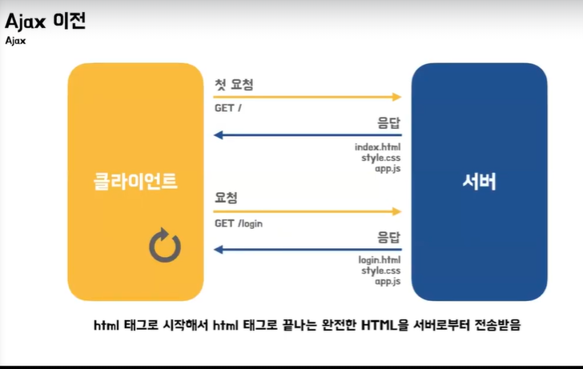
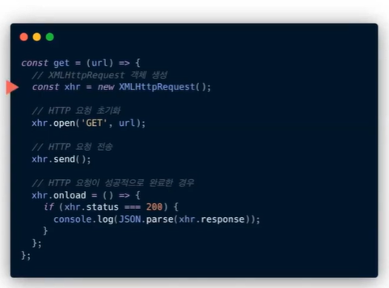
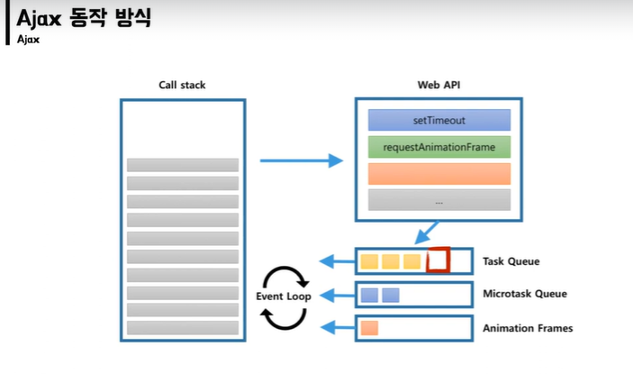
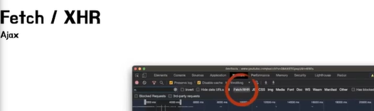

## Ajax?

자바스크립트와 XMLHttpRequest 객체를 사용해서

클라와 서버가 비동기 방식으로 통신하는 것

돔 요소의 기본 동작 중단
event.preventDefault()

### Ajax 이전

불필요한 데이터 통신
이전 웹페이지와 차이가 없어서 변경할 필요가 없는 부분까지 포함된 HTML을 매번 전송받는다.

화면이 순간적으로 깜박임
화면을 전환할 때마다 웹페이지 전체를 다시 렌더링함

클라이언트 블로킹
동기 방식으로 동작함

### XMLHttpRequest

1999년 마소에서 개발
처음에 주목 못받다가 XHR을 가지고 구글이 하다가 가능성 업

### AJAX

웹앱에 접근하는 새로운 방법

### AJAX 동작 방식

자바스크립트 싱글스레드인데 어떻게 비동기? 이벤트루프겠지

브라우저는 이벤트가 발생하면 테스크 큐에 핸들러를 넣음

이벤트가 발생했다고 바로 실행되는건 아니고 다른 큐에 아무것도없고 콜스택이 비면 이제 콜스택에 집어넣는다.

fetch => XHR 과 달리 promise도 제공함

Axios 는 노드 js 와 브라우저를 위한 프로미스 기반 HTTP 클라이언트
서버에서는 네이티브 Node.js의 http 모듈사용

클라이언트에서는 XMLHttpRequest 사용

프로미스 then 과 mutation observer는 마이크로 테스크 큐

테스크 큐는 셋타임아웃 클릭 콜백 등의 이벤트 리스너에있는거
