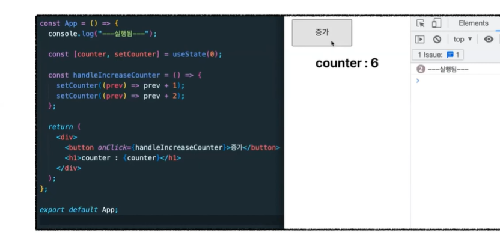

### React 18 버전의 변경점

1. useTransition

어떤 문제를 해결 하는가

블로킹 랜더링 문제 => 한번 렌더링 연산이 시작되면 멈출 수 없음

대형 화면 업데이트의 경우 렌더린 되는 동안 페이지 지연 발생

ex) 입력하나 마다 박스 여러개 생산 나중엔 박스 생산하느라 입력이 지연됨

병목현상 이네

```js

const [boxCount, setBoxCount] = useState(0)

const newItems = makeItems(boxCount)

const handleUpdate = ({target})=>{
    setBoxCount(target.value.length)
}


return (

<div>
 <input type="text" onChange={handleUpdate}>

<ItemList items={newItems}>
</div>

)


박스출력 부분을 startTransition으로 감쌈

startTransition(()=>{
    setBoxCount(target.value.length)
})


박스출력 부분을 감싸서 우선순위를 낮춘것


```

useTransition 은 isPending 이라는 boolean 과 startTransition 이라는 함수를 사용

isPending 을 활용하여 Pending 상태를 나타내기도함 => Transition 이 활용중인지 알 수 있는 정보를 제공함

디바운스와의 차이 ?

=> 입력이 다끝나면 일정시간 뒤에 화면 업데이트

그러나 입력이 계속 된다면 그만큼 지연 된다.

입력하는 동안화면을 그리지 않게 하는 디바운싱 은 미루는것 일 뿐

스로틀링은? => 3초주기로 화면에 그리게 한다고 한다면 3초동안 입력을 안하고 띄엄띄엄한다면 의미없이 기다리는 시간이 생긴다.

startTransition을 사용한다면 화면 업데이트 중 에도 계속 입력을 받고 디바운스 쓰로틀링과 다르게 비어있는 시간이없다

이게 가능한이유? => 리액트 18버젼에서는 랜더링 하면서도 급한 일이있으면 먼저 처리가능 이게 바로 startTransition 방금의 경우 입력을 우선시 시키고 박스를 그리는것을 줄였음

동시성 과도 관련있음 concurrency
2개이상의 작업을 나눠서 동시에 실행되는 것처럼 프로그램을 구조화 하는 방법

2. Suspense and SSR

CSR은 클라이언트에 의해 렌더링되고 브라우저는 페이지에 대한 요청을 받고 고대로 보냄


서버 사이드

브라우저가 페이지에대한 요청을 받으면 서버에서. html 부터

html로 그대로 랜더링하고 js 가 로드 되면 hydrate로 수화됨

로드된 js를 html에 연결하는게 hydrate
하이드레이트란 컴포넌트렌더링과 이벤트를 연결하는 과정

기존의 SSR => data fetch 가 끝나야 보여줄 수 있음

모든 자바스킈립트 코드를 로딩하기전엔 hydration이 안됨

앱이 상호작용하려면 하이드레이션이 끝나야됨


다음으로 넘어가려면 앱 전체가 각각의 단계를 완료해야됨

리액트 18의 서스펜스 는 페이지 의 각 부분을 서스펜스로 묶어서 따로 처리 가능


이렇게 하면 comments 말 고 다른것 부터 보여줌

코멘트에 대한 js 코드가 로드될때까지 클라에서 하이드레이션 할 수없다는 문제는 ? => lazy , suspense

이걸로 선택적 하이드레이션 가능

만일 여러군대 하이드레이트했다면

사용자가 상호작용하는것 먼저 하이드레이트

3. Automatic Batching

Batching 이란?

여러 state 하나로 그룹화


17버전에서는 promise setTimeout에서는 지원을 안했는데

이젠 아님

flushSync를 통해 batching을 원하지않을떄도 사용가능
