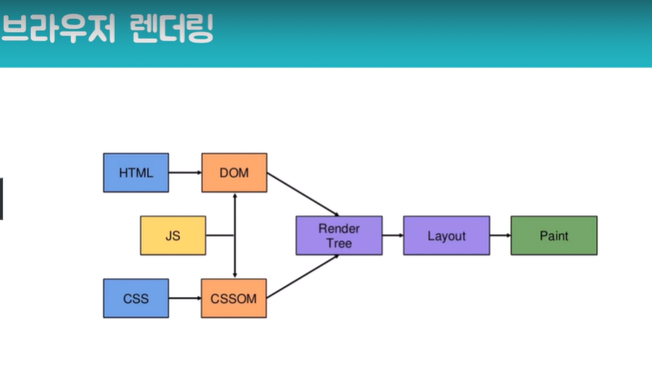
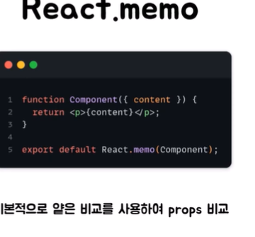
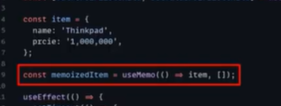
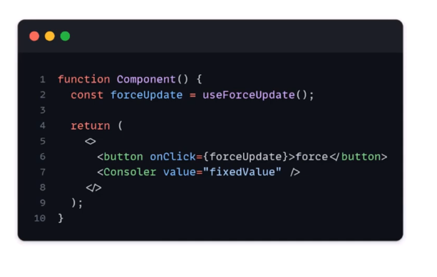
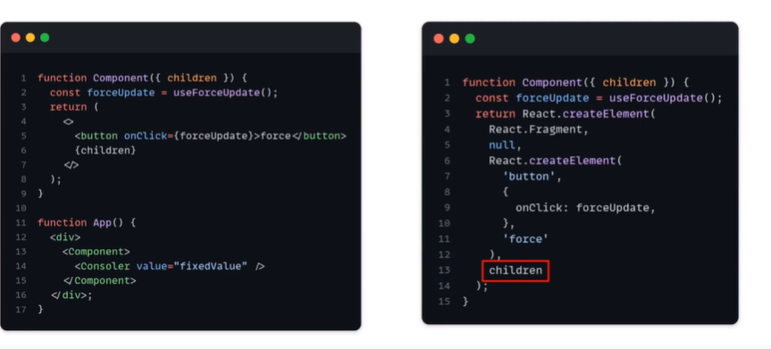

리액트에서의 랜더링? === 리액트가 함수를 호출하는 것

컴포넌트가 랜더링된다는 뜻? => 함수가 호출되서 리액트 엘리먼트를 반환하는것

불필요한 렌더링 발생 확인지표? => console.log / Profiler

Profiler? => React Developer Tools

불 필요한 렌더링 찾는 툴

불 필요한 렌더링을 방지하는 방법?

리 랜더링 되는 조건 => state 변경 / props 변경

부모로 부터 변하지 않은것을 전달받는것 같아도 참조값이 달라져서 리렌더링되기도함

함수가 참조타입이라. 함수의 경우 그럼

useCallback 사용

useCallback사용해도 리렌더링이 된다 이유는 뭘까

createElement가 상관없이 실행되기때문에.

그렇다고 아무 효과가 없는것은아님

1.Render Phase

2.Commit phase

렌더 페이즈에서는 컴포넌트 호출후 가상돔을 만듦

그리고 재조정 (Reconciliation)을 함

커밋 페이지에서는 가상돔에서 변경된게있으면 리얼돔으로.

만약 변경될게없으면 생략함

재조정과 커밋페이즈를 하게될것임

그래서 useCallback을 사용하면 render 페이즈는 실행되지만 commit phase는 실행되지않는다.

그러면 렌더 페이즈까지막는 방법은? => React memo 를 써서 막는법

React memo는 참고로 얕은 비교를 함

두번째 함수를 넣어서 해당함수로 비교하게도 할 수있음

객체를 props로 넘겨준다면 ? 이 역시 리랜더링

useMemo로

요런식으로 활용하면 됨 값을 사용

결국 요는 세개 다 써야된다.

생각해볼것들

최적화도구를 무분별하게 쓰지말자

부모가 리렌더링되서 불필요하게 리랜더링 되는 경우들을 개선하면됨

children을 활용해서 주입

이렇게 하면 부모가 리랜더링되더라도 콘솔로는 리랜더링되지않는다

미리 최적화 하지말자, 필요할 때 하자
