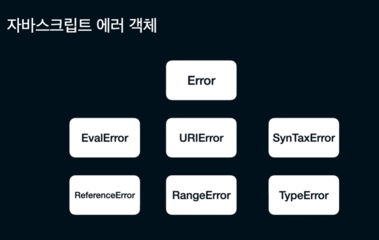
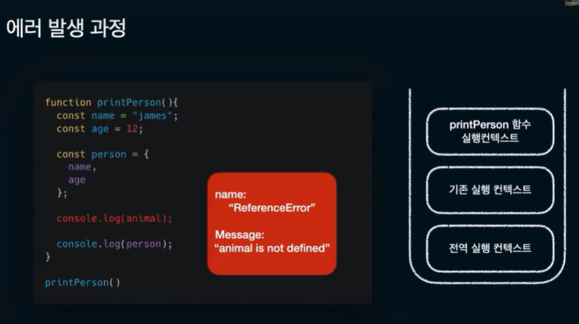
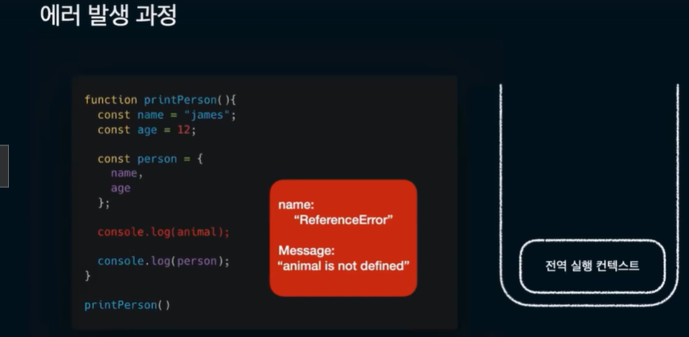
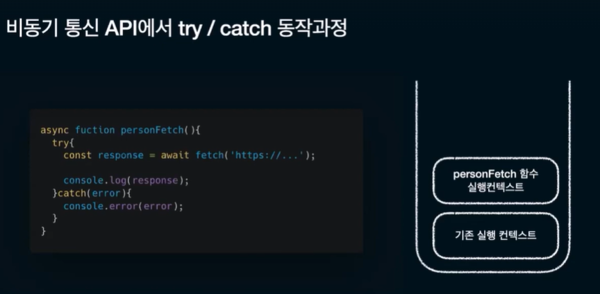

## 에러 핸들링의 중요성

안정적인 서비스

사용자 경험

### 컴파일 에러

자스가 구문 읽으면서 난 에러

잘못된 구문

### 런타임 에러

코드 실행되고 난 다음의 에러

undefined 객체 속성 참조, 무한루프

### 런타임 시점

const a = null;

console.log(a.b)

= cannot read properties of null

const price = 1200

price.forEach(()=>{})

TypeError : price.forEach is not a function

### 자바스크립트 에러 객체

### 에러 발생 과정

### 런타임 에러 핸들 방법

try / catch

비동기에서

비동기에서 주의해야될 점 : await가 없으면 그냥 error 안잡고 지나갔다가 에러

try catch를 많이 사용하면 좋지않을까? => 많이 사용하면 분기처리가 되지않기때문에
어디서 에러가 나는 지 파악하기 힘들며 유지보수에 걸림돌이 될 수있음

상황에 따른 처리법 => 에러페이지, 메세지, 별도처리 없음
