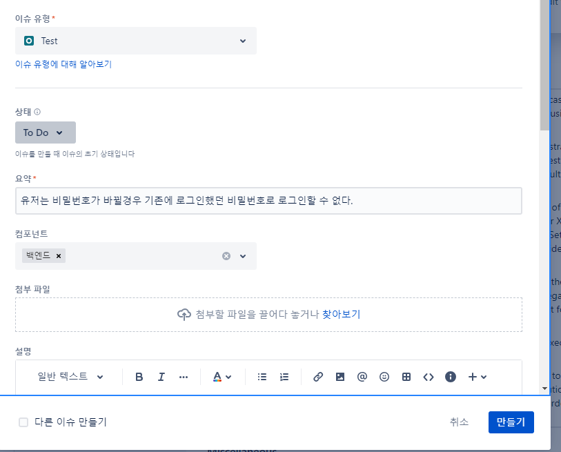

### 테스트 시나리오 / 테스트 케이스/ 테스트 단계/ 전제 조건

'비밀번호 재설정 기능 확인' 암호 재설정 기능이 제대로 작동하는지 확인한다

비밀번호 재설정 링크 클릭 -> 이메일 확인 / 재설정 링크 클릭 -> 새 비밀번호 설정 이 다 포함됨

이런 전반적인 과정을 테스트 시나리오라고함.

이 시나리오로 테스트를 진행하는 것

시나리오를 테스트하는 데는 다양한 방법이 있다.

100% 검증 하기위해서는 여러가지 측면으로 '다양하게' 테스트 해야됨

다양하게 = 다양한 테스트 유형 = 테스트 케이스

긍정적인 경우와 부정적인 경우 모두 확인해야 됨 / 잘못된 경우 ex) 잘못된 이메일 입력

링크 만료 확인 => 이메일을 받을때마다 이전의 이메일은 못 써먹어야 됨

이전 패스워드로 했을때 동일하게 먹는지 도 여전히 테스트.

이런 테스트 케이스를 만들어야 메인 테스트 시나리오를 충족할 수 있다.

다양한 테스트 케이스를 만들어서 검증할 줄 알아야한다.

precondition(전제조건) : 비밀번호 링크 재설정을 누른다.

### JIRA의 Xray

테스트케이스 쓰는곳 클라우드로 하면 한달 무료

로컬로 하면 유료

Xray를 설치시 자동으로 새로운 이슈 타입이 생김

configure를 통해 해당 프로젝트에 Xray 추가

테스트 시나리오 부터 다른 테스트 케이스 등의 이슈 타입을 추가할 수 있음

세부정보로 UI 이인지 Functional 테스트인지 등등을 작성함.

테스트를 만들고 테스트 Detail 에서 조건 입력값 예쌍 결과를 결합한 일련의 단계를 만들 수 있다.

나로써는 jest 느낌

액션과 데이터 그리고 기대값을 적을 수 있음

이건진짜 QA를 위한 것 같네

Test Plans

그냥 테스트 케이스들 묶어서 플랜에 따라 시도 한 단계 더 카테고리화 한다고 이해했음

ex) 그동안 만들것들 릴리즈를 위한것으로 묶음

실패/ 작동을 표시 ? => 여기서 나오는게 create test excution

test exectuion
생긴건 플랜이랑 비슷하게 생김 테스트 실행 을 해서 findings 에 발견한 결함을 적고 바로 이슈로 만들 수도있음

그리고 status 변경도 가능 해짐
